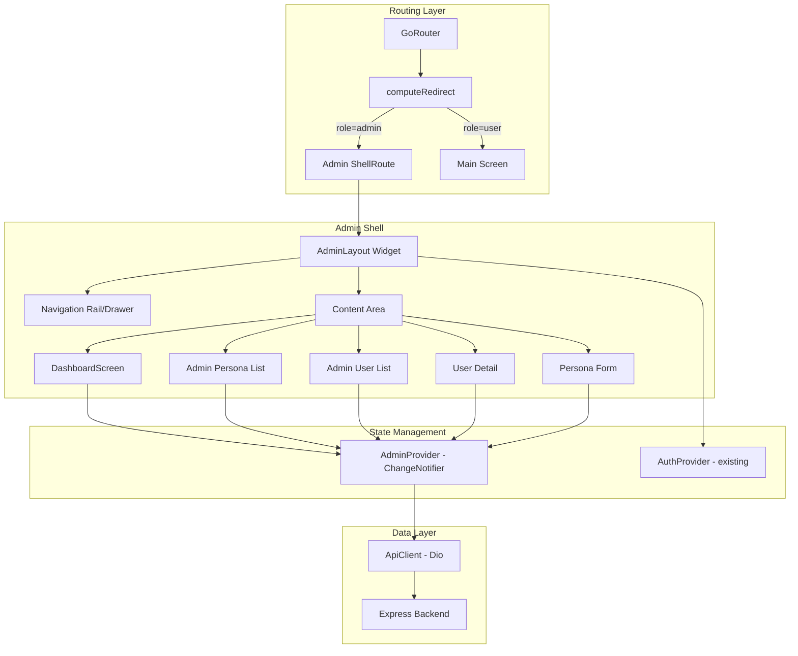
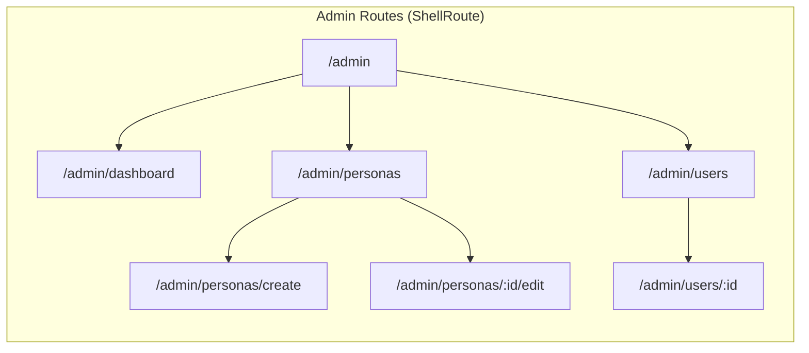
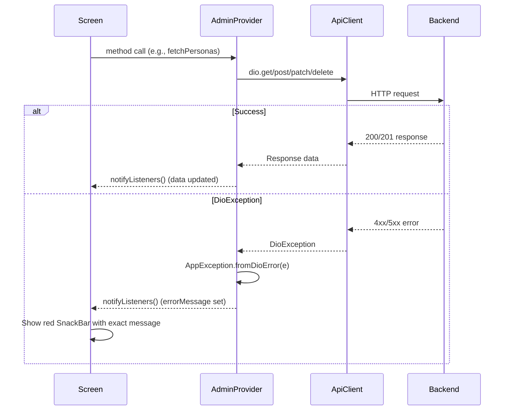

# Design Document: Admin Panel

## Overview

Admin Panel adalah fitur terpisah dalam aplikasi Flutter SiniCerita yang menyediakan antarmuka manajemen bagi pengguna dengan role "admin". Fitur ini mencakup:

- **Route guard** berbasis role yang mengarahkan admin ke layout khusus (`/admin`) dan mencegah user biasa mengakses halaman admin
- **Layout admin** dengan navigasi dedicated (Dashboard, Kelola Persona, Daftar User)
- **CRUD Persona** lengkap (create, read, update, soft-delete) menggunakan endpoint admin backend
- **User management read-only** (list + detail) menggunakan endpoint `/api/admin/users`

Fitur ini menambahkan `AdminProvider` sebagai ChangeNotifier baru, memperluas `computeRedirect` untuk mendukung role-based routing, dan memperkenalkan GoRouter `ShellRoute` untuk layout admin.

## Architecture



### Routing Architecture



GoRouter `ShellRoute` digunakan agar `AdminLayout` (dengan navigation rail) tetap persistent saat navigasi antar sub-page. Hanya content area yang berubah.

## Components and Interfaces

### 1. Redirect Logic (Extended)

File: `lib/core/routing/redirect_logic.dart`

Fungsi `computeRedirect` diperluas dengan parameter `role` untuk mendukung routing berbasis role:

```dart
String? computeRedirect({
  required AuthStatus status,
  required bool firstLaunchCompleted,
  required String location,
  required String? role, // NEW: dari currentUser?.role
}) {
  // Existing splash/auth logic...
  
  // Role-based guards (hanya jika authenticated):
  // 1. Admin di /main → redirect ke /admin
  // 2. User di /admin/* → redirect ke /main
  // 3. Unauthenticated di /admin/* → redirect ke /login
  // 4. Unknown role → treat as "user"
}
```

### 2. AdminProvider

File: `lib/providers/admin_provider.dart`

```dart
class AdminProvider extends ChangeNotifier {
  final ApiClient _apiClient;

  // Persona management state
  List<PersonaModel> _personas = [];
  int _personaPage = 1;
  int _personaTotalPages = 1;
  int _personaTotal = 0;
  bool _isLoadingPersonas = false;
  bool _isLoadingMorePersonas = false;
  bool _isSubmittingPersona = false;
  bool _isDeletingPersona = false;

  // User management state
  List<UserModel> _users = [];
  int _userPage = 1;
  int _userTotalPages = 1;
  bool _isLoadingUsers = false;
  bool _isLoadingMoreUsers = false;
  UserModel? _selectedUser;
  bool _isLoadingUserDetail = false;

  // Dashboard state
  int _totalActivePersonas = 0;
  bool _isLoadingDashboard = false;

  String? _errorMessage;

  // --- Persona Methods ---
  Future<void> fetchPersonas({bool refresh = false});
  Future<void> fetchMorePersonas();
  Future<bool> createPersona(FormData data);
  Future<bool> updatePersona(String id, FormData data);
  Future<bool> deletePersona(String id);

  // --- User Methods ---
  Future<void> fetchUsers({bool refresh = false});
  Future<void> fetchMoreUsers();
  Future<void> fetchUserDetail(String id);

  // --- Dashboard Methods ---
  Future<void> fetchDashboardStats();
}
```

### 3. Admin Screens

| Screen | File | Deskripsi |
|--------|------|-----------|
| AdminLayout | `lib/screens/admin/admin_layout.dart` | Shell dengan NavigationRail + content area |
| AdminDashboard | `lib/screens/admin/admin_dashboard_screen.dart` | Statistik ringkasan |
| AdminPersonaList | `lib/screens/admin/admin_persona_list_screen.dart` | List persona + FAB |
| AdminPersonaForm | `lib/screens/admin/admin_persona_form_screen.dart` | Create/Edit form |
| AdminUserList | `lib/screens/admin/admin_user_list_screen.dart` | List user read-only |
| AdminUserDetail | `lib/screens/admin/admin_user_detail_screen.dart` | Detail user read-only |

### 4. API Endpoints (Extended)

```dart
// Ditambahkan ke ApiEndpoints class:
static const String adminPersonas = '/api/personas';
static String adminPersonaDetail(String id) => '/api/personas/$id';
static const String adminUsers = '/api/admin/users';
static String adminUserDetail(String id) => '/api/admin/users/$id';
```

### 5. GoRouter Configuration (Extended)

```dart
// ShellRoute untuk admin layout
ShellRoute(
  builder: (context, state, child) => AdminLayout(child: child),
  routes: [
    GoRoute(path: '/admin', redirect: (_, _) => '/admin/dashboard'),
    GoRoute(path: '/admin/dashboard', builder: ...),
    GoRoute(path: '/admin/personas', builder: ...),
    GoRoute(path: '/admin/personas/create', builder: ...),
    GoRoute(path: '/admin/personas/:id/edit', builder: ...),
    GoRoute(path: '/admin/users', builder: ...),
    GoRoute(path: '/admin/users/:id', builder: ...),
  ],
)
```

## Data Models

### Existing Models (Reused)

**UserModel** (`lib/models/user_model.dart`) — sudah ada, digunakan untuk:
- Admin's own profile (dari AuthProvider)
- User list dan detail di admin panel

**PersonaModel** (`lib/models/persona_model.dart`) — sudah ada, digunakan untuk:
- Persona list di admin panel (termasuk inactive)
- Pre-fill form edit persona

### PersonaModel.copyWith Extension

`PersonaModel.copyWith` perlu diperluas untuk mendukung update semua field (saat ini hanya votes):

```dart
PersonaModel copyWith({
  String? name,
  String? description,
  String? systemPrompt,
  String? avatarUrl,
  bool? isActive,
  int? upvotes,
  int? downvotes,
  String? userRating,
  bool clearUserRating = false,
  bool clearAvatarUrl = false,
}) {
  return PersonaModel(
    id: id,
    name: name ?? this.name,
    description: description ?? this.description,
    systemPrompt: systemPrompt ?? this.systemPrompt,
    avatarUrl: clearAvatarUrl ? null : (avatarUrl ?? this.avatarUrl),
    isActive: isActive ?? this.isActive,
    upvotes: upvotes ?? this.upvotes,
    downvotes: downvotes ?? this.downvotes,
    userRating: clearUserRating ? null : (userRating ?? this.userRating),
  );
}
```

### API Response Shapes

**GET /api/personas?includeInactive=true&page=1&limit=10**
```json
{
  "success": true,
  "data": [PersonaModel...],
  "meta": { "total": 25, "page": 1, "limit": 10, "totalPages": 3 }
}
```

**POST /api/personas** (multipart/form-data)
- Fields: `name`, `description`, `systemPrompt`, `image` (optional file)
- Response 201: `{ "success": true, "data": PersonaModel }`

**PATCH /api/personas/:id** (multipart/form-data)
- Fields: only changed fields + `image` (optional file)
- Response 200: `{ "success": true, "data": PersonaModel }`

**DELETE /api/personas/:id**
- Response 200: `{ "success": true, "message": "..." }`
- Soft-delete: sets `isActive = false`

**GET /api/admin/users?page=1&limit=10**
```json
{
  "success": true,
  "data": [UserModel...],
  "meta": { "total": 100, "page": 1, "limit": 10, "totalPages": 10 }
}
```

**GET /api/admin/users/:id**
```json
{
  "success": true,
  "data": UserModel
}
```

## Correctness Properties

*A property is a characteristic or behavior that should hold true across all valid executions of a system — essentially, a formal statement about what the system should do. Properties serve as the bridge between human-readable specifications and machine-verifiable correctness guarantees.*

### Property 1: Route redirect correctness

*For any* combination of (authStatus, role, location), the `computeRedirect` function SHALL produce the correct redirect target according to these rules:
- Authenticated admin at any non-admin route (except auth routes) → `/admin`
- Authenticated admin at `/admin/*` → null (stay)
- Authenticated user at `/admin/*` → `/main`
- Authenticated user at `/main` → null (stay)
- Unauthenticated at `/admin/*` → `/login`
- Unknown/invalid role → treated as "user"

**Validates: Requirements 1.1, 1.2, 1.3, 1.4, 1.6**

### Property 2: Admin name truncation

*For any* string used as admin display name, if the string length exceeds 20 characters, the displayed text SHALL be truncated to 20 characters followed by an ellipsis character. If the string length is 20 or fewer characters, it SHALL be displayed in full without modification.

**Validates: Requirements 2.2**

### Property 3: Form validation rejects whitespace-only input

*For any* string composed entirely of whitespace characters (spaces, tabs, newlines), the persona form validation SHALL reject it and report the field as required. *For any* string containing at least one non-whitespace character, the validation SHALL accept it (assuming length constraints are met).

**Validates: Requirements 5.2, 6.3**

### Property 4: Pagination stops at last page

*For any* pagination state where the current page is greater than or equal to `totalPages`, calling `fetchMore` SHALL NOT trigger an additional API request. *For any* state where current page is less than `totalPages`, calling `fetchMore` SHALL request page + 1.

**Validates: Requirements 4.4, 8.4**

### Property 5: Edit form sends only changed fields

*For any* original persona data and modified persona data, the PATCH request FormData SHALL contain only the fields whose values differ between original and modified. Unchanged fields SHALL NOT be included in the request payload.

**Validates: Requirements 6.4**

### Property 6: Delete action visibility matches isActive status

*For any* persona in the admin list, the delete/deactivate action SHALL be visible if and only if the persona's `isActive` field is `true`. Personas with `isActive = false` SHALL NOT display the delete action.

**Validates: Requirements 7.7**

### Property 7: Parameterized endpoint path correctness

*For any* non-empty string `id`, `adminPersonaDetail(id)` SHALL return the string `/api/personas/$id` and `adminUserDetail(id)` SHALL return `/api/admin/users/$id`. The returned paths SHALL always start with `/api/` and contain the exact id without modification.

**Validates: Requirements 10.2, 10.4**

## Error Handling

### Error Flow



### Error Handling Rules

1. **Semua error dari backend ditampilkan apa adanya** — tidak diterjemahkan atau dimodifikasi
2. **Error SnackBar berwarna merah**, success SnackBar berwarna hijau
3. **Error pada pagination (page > 1)** tidak menghapus data yang sudah loaded — hanya menampilkan SnackBar
4. **Error pada refresh** menampilkan SnackBar tapi mempertahankan data lama jika ada
5. **Network error** (no connection) menggunakan pesan dari `AppException.fromDioError`
6. **401 pada non-auth endpoint** ditangani oleh JWT interceptor (auto-refresh) — jika refresh gagal, redirect ke login

### Specific Error Scenarios

| Scenario | Handling |
|----------|----------|
| Create persona gagal (400/500) | SnackBar merah, form tetap terbuka, button re-enabled |
| Edit persona gagal (400/404/500) | SnackBar merah, form tetap terbuka, button re-enabled |
| Delete persona gagal (404/500) | SnackBar merah, dialog dismissed, list unchanged |
| Fetch users gagal (403/500) | SnackBar merah, empty state atau data lama tetap tampil |
| User detail gagal (404/500) | SnackBar merah, shimmer tetap atau back navigation |

## Testing Strategy

### Unit Tests

Unit tests fokus pada logika bisnis di provider dan utility functions:

- **`computeRedirect` tests**: Semua kombinasi role × status × location
- **AdminProvider tests**: Mock ApiClient, verify state transitions
- **Form validation tests**: Boundary cases (empty, whitespace, max length)
- **Endpoint constant tests**: Verify exact string values

### Property-Based Tests

Property-based testing menggunakan library `dart_quickcheck` atau `glados` untuk Dart:

- **Minimum 100 iterasi** per property test
- Setiap test di-tag dengan referensi ke property di design document
- Format tag: `// Feature: admin-panel, Property {N}: {title}`

**Properties to implement:**
1. Route redirect correctness — generate random (role, status, location) tuples
2. Admin name truncation — generate random strings of varying length
3. Form validation whitespace rejection — generate random whitespace/non-whitespace strings
4. Pagination boundary — generate random page/totalPages combinations
5. Edit form differential update — generate random original/modified persona pairs
6. Delete action visibility — generate random personas with varying isActive
7. Endpoint path interpolation — generate random id strings

### Widget Tests

Widget tests untuk UI behavior:

- Admin layout renders correct navigation items
- Shimmer shown during loading states
- SnackBar shown on errors with correct message
- Form pre-fills correctly in edit mode
- Confirmation dialogs appear with correct text
- FAB navigates to create form
- Pull-to-refresh triggers data reload

### Integration Tests

Integration tests untuk end-to-end flows:

- Login as admin → redirected to /admin
- Create persona → appears in list
- Edit persona → changes reflected
- Deactivate persona → status badge updates
- Navigate user list → tap item → detail shown
