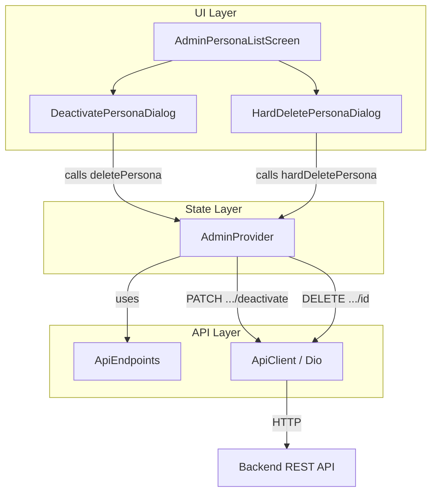

# Design Document: Admin Persona Hard Delete

## Overview

This feature introduces two distinct persona management actions in the admin panel:

1. **Deactivation (soft delete)** — migrated from `DELETE /api/personas/:id` to `PATCH /api/personas/:id/deactivate`. Sets `isActive=false` locally without removing data.
2. **Hard delete (permanent removal)** — new `DELETE /api/personas/:id` endpoint that irreversibly removes the persona from the database.

The UI is updated to show both actions clearly: deactivation only on active personas, hard delete on all personas. Each action has its own confirmation dialog with appropriate messaging.

### Design Decisions

- **Separate provider methods**: `deletePersona(id)` is refactored to use PATCH for deactivation; a new `hardDeletePersona(id)` uses DELETE. This keeps the API surface explicit and avoids confusion.
- **Reuse existing `adminPersonaDetail(id)` for hard delete URL**: Since the backend now uses `DELETE /api/personas/:id` for permanent deletion, the existing endpoint constant is reused rather than creating a redundant one.
- **Separate dialog widgets**: Each action gets its own dialog (`DeactivatePersonaDialog`, `HardDeletePersonaDialog`) to clearly communicate the severity and irreversibility of each operation.
- **Loading state reuse**: The existing `_isDeletingPersona` flag is reused for deactivation; a new `_isHardDeleting` flag is added for hard delete to allow independent loading states.

## Architecture



### Data Flow

1. **Deactivation flow**: User taps deactivate icon → `DeactivatePersonaDialog` shown → User confirms → `AdminProvider.deletePersona(id)` → PATCH to `/api/personas/:id/deactivate` → On success: update local persona `isActive=false` → Dialog returns `true` → Screen shows green SnackBar.

2. **Hard delete flow**: User taps delete icon → `HardDeletePersonaDialog` shown → User confirms → `AdminProvider.hardDeletePersona(id)` → DELETE to `/api/personas/:id` → On success: remove persona from list, decrement `personaTotal` → Dialog returns `true` → Screen shows green SnackBar.

## Components and Interfaces

### ApiEndpoints (modified)

```dart
// New static method in Admin section
static String adminPersonaDeactivate(String id) => '/api/personas/$id/deactivate';

// Existing — unchanged, now used for hard delete
static String adminPersonaDetail(String id) => '/api/personas/$id';
```

### AdminProvider (modified)

```dart
// New state field
bool _isHardDeleting = false;
bool get isHardDeleting => _isHardDeleting;

/// Deactivate persona (soft delete) — MIGRATED from DELETE to PATCH.
/// Returns true on success, false on failure.
Future<bool> deletePersona(String id) async {
  _isDeletingPersona = true;
  _errorMessage = null;
  notifyListeners();

  try {
    await _apiClient.dio.patch(
      ApiEndpoints.adminPersonaDeactivate(id),
    );

    // Update local state: set isActive to false
    final index = _personas.indexWhere((p) => p.id == id);
    if (index != -1) {
      _personas = List.from(_personas)
        ..[index] = _personas[index].copyWith(isActive: false);
    }

    _isDeletingPersona = false;
    notifyListeners();
    return true;
  } on DioException catch (e) {
    final ex = AppException.fromDioError(e);
    _errorMessage = ex.message;
    _isDeletingPersona = false;
    notifyListeners();
    return false;
  }
}

/// Hard delete persona (permanent removal).
/// Returns true on success, false on failure.
Future<bool> hardDeletePersona(String id) async {
  _isHardDeleting = true;
  _errorMessage = null;
  notifyListeners();

  try {
    await _apiClient.dio.delete(
      ApiEndpoints.adminPersonaDetail(id),
    );

    // Remove from local list and decrement total
    _personas = _personas.where((p) => p.id != id).toList();
    _personaTotal -= 1;

    _isHardDeleting = false;
    notifyListeners();
    return true;
  } on DioException catch (e) {
    final ex = AppException.fromDioError(e);
    _errorMessage = ex.message;
    _isHardDeleting = false;
    notifyListeners();
    return false;
  }
}
```

### HardDeletePersonaDialog (new widget)

```dart
/// Dialog konfirmasi hapus permanen persona.
///
/// Returns:
/// - `true` jika berhasil hard delete
/// - `String` (error message) jika gagal
/// - `null` jika user cancel
class HardDeletePersonaDialog extends StatefulWidget {
  final String personaId;
  final String personaName;

  const HardDeletePersonaDialog({
    super.key,
    required this.personaId,
    required this.personaName,
  });

  static Future<Object?> show(
    BuildContext context, {
    required String personaId,
    required String personaName,
  }) {
    return showDialog<Object>(
      context: context,
      barrierDismissible: false,
      builder: (_) => HardDeletePersonaDialog(
        personaId: personaId,
        personaName: personaName,
      ),
    );
  }
}
```

**Dialog content**: Title "Hapus Permanen", message "Apakah Anda yakin ingin menghapus permanen persona ini? Tindakan ini tidak dapat dibatalkan.", confirm button text "Hapus Permanen" with error color.

### AdminPersonaListScreen (modified)

Changes to `_buildPersonaItem`:
- Replace single delete `IconButton` with a `Row` of action buttons at trailing position
- Deactivate button: `Icons.toggle_off_outlined`, tooltip "Nonaktifkan", only shown when `persona.isActive == true`
- Hard delete button: `Icons.delete_outline`, tooltip "Hapus Permanen", error color, shown on ALL personas
- Button order: deactivate first, hard delete second (when both visible)
- Each button has minimum 48x48dp tap target via `IconButton` constraints

## Data Models

No new data models are introduced. The existing `PersonaModel` is sufficient:

```dart
class PersonaModel extends Equatable {
  final String id;
  final String name;
  final String description;
  final String? systemPrompt;
  final String? avatarUrl;
  final bool isActive;  // Used to determine deactivate button visibility
  final int upvotes;
  final int downvotes;
  final String? userRating;
  // ... copyWith, fromJson, props unchanged
}
```

### State Changes Summary

| Operation | Local State Change |
|-----------|-------------------|
| Deactivate (success) | `persona.isActive` → `false` |
| Hard delete (success) | Persona removed from `_personas` list, `_personaTotal` decremented by 1 |
| Either (failure) | `_errorMessage` set to backend message |

## Correctness Properties

*A property is a characteristic or behavior that should hold true across all valid executions of a system — essentially, a formal statement about what the system should do. Properties serve as the bridge between human-readable specifications and machine-verifiable correctness guarantees.*

### Property 1: Deactivation preserves list integrity

*For any* persona list containing a target persona with `isActive=true`, after a successful deactivation of that persona, the list length SHALL remain unchanged, only the target persona's `isActive` field SHALL be `false`, and all other personas SHALL remain identical to their pre-deactivation state.

**Validates: Requirements 1.2**

### Property 2: Hard delete removes exactly one persona and decrements count

*For any* persona list of length N containing a target persona, after a successful hard delete of that persona, the list length SHALL be N-1, the target persona SHALL NOT appear in the list, all other personas SHALL remain identical, and `personaTotal` SHALL equal its previous value minus 1.

**Validates: Requirements 2.2**

### Property 3: Error messages propagate exactly from backend response

*For any* backend error response containing a `message` field, when either `deletePersona` or `hardDeletePersona` fails, the provider's `errorMessage` SHALL equal the exact `message` string from the response envelope.

**Validates: Requirements 1.3, 2.3**

### Property 4: Endpoint URL construction

*For any* non-empty string ID, `ApiEndpoints.adminPersonaDeactivate(id)` SHALL return the string `/api/personas/$id/deactivate`, and `ApiEndpoints.adminPersonaDetail(id)` SHALL return `/api/personas/$id`.

**Validates: Requirements 1.4, 6.1, 6.2**

### Property 5: Loading state lifecycle

*For any* call to `deletePersona` or `hardDeletePersona` (regardless of success or failure), the corresponding loading flag SHALL be `true` immediately after the call begins and SHALL be `false` after the call completes.

**Validates: Requirements 2.5, 3.6, 4.6**

## Error Handling

| Scenario | Handler | User Feedback |
|----------|---------|---------------|
| Deactivation PATCH returns non-2xx | `AppException.fromDioError()` → `errorMessage` | Red SnackBar with exact backend message |
| Hard delete DELETE returns non-2xx | `AppException.fromDioError()` → `errorMessage` | Red SnackBar with exact backend message |
| Network timeout / connection error | `AppException.fromDioError()` maps to Indonesian message | Red SnackBar with connection error message |
| Persona not found (404) | Backend returns "Persona tidak ditemukan" | Red SnackBar with that message |
| Persona already inactive (deactivate attempt) | Backend returns appropriate message | Red SnackBar with that message |

### Error Flow in Dialogs

Both dialogs follow the same pattern:
1. User confirms action → loading state begins
2. Provider method called → returns `bool`
3. If `true`: dialog pops with `true`, screen shows green SnackBar
4. If `false`: dialog pops with error message string, screen shows red SnackBar
5. Error message sourced from `AdminProvider.errorMessage`

## Testing Strategy

### Unit Tests (Provider Logic)

| Test | Description |
|------|-------------|
| `deletePersona` success | Mock Dio PATCH 200, verify `isActive=false` on target persona |
| `deletePersona` failure | Mock Dio error, verify `errorMessage` set correctly |
| `hardDeletePersona` success | Mock Dio DELETE 200, verify persona removed, total decremented |
| `hardDeletePersona` failure | Mock Dio error, verify `errorMessage` set correctly |
| `adminPersonaDeactivate` | Verify URL pattern for various IDs |
| Loading state transitions | Verify flags toggle correctly during async operations |

### Widget Tests (UI)

| Test | Description |
|------|-------------|
| Active persona shows both buttons | Verify deactivate + hard delete buttons visible |
| Inactive persona shows only hard delete | Verify only hard delete button visible |
| Deactivate button tooltip | Verify "Nonaktifkan" tooltip |
| Hard delete button tooltip | Verify "Hapus Permanen" tooltip |
| DeactivatePersonaDialog content | Verify correct title, message, persona name |
| HardDeletePersonaDialog content | Verify correct title, irreversibility message, persona name |
| Dialog loading state | Verify spinner shown, buttons disabled during request |
| Dialog cancel | Verify dialog dismissed, no provider calls made |
| Success SnackBar (deactivate) | Verify green SnackBar "Persona berhasil dinonaktifkan" |
| Success SnackBar (hard delete) | Verify green SnackBar "Persona berhasil dihapus permanen" |
| Error SnackBar | Verify red SnackBar with exact error message |

### Property-Based Tests

Property-based testing is applicable for the provider state management logic. The properties above (1-5) can be tested using `dart_quickcheck` or `glados` package.

**Configuration:**
- Library: `glados` (Dart property-based testing library)
- Minimum iterations: 100 per property
- Each test tagged with: `// Feature: admin-persona-hard-delete, Property N: <property_text>`

| Property Test | Generator Strategy |
|---------------|-------------------|
| Property 1 (deactivation integrity) | Generate random `List<PersonaModel>` with random `isActive` values, pick random active persona |
| Property 2 (hard delete removal) | Generate random `List<PersonaModel>`, pick random persona to delete |
| Property 3 (error propagation) | Generate random non-empty strings as error messages |
| Property 4 (URL construction) | Generate random non-empty strings as IDs |
| Property 5 (loading lifecycle) | Generate random success/failure scenarios |

### Integration Tests

| Test | Description |
|------|-------------|
| Full deactivation flow | Tap deactivate → confirm dialog → verify UI updates |
| Full hard delete flow | Tap hard delete → confirm dialog → verify persona removed from list |
| Cancel flows | Verify both dialogs can be cancelled without side effects |
