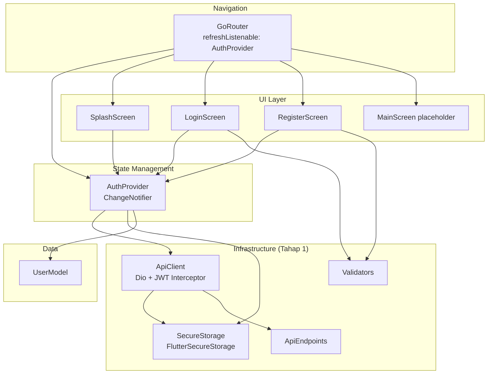
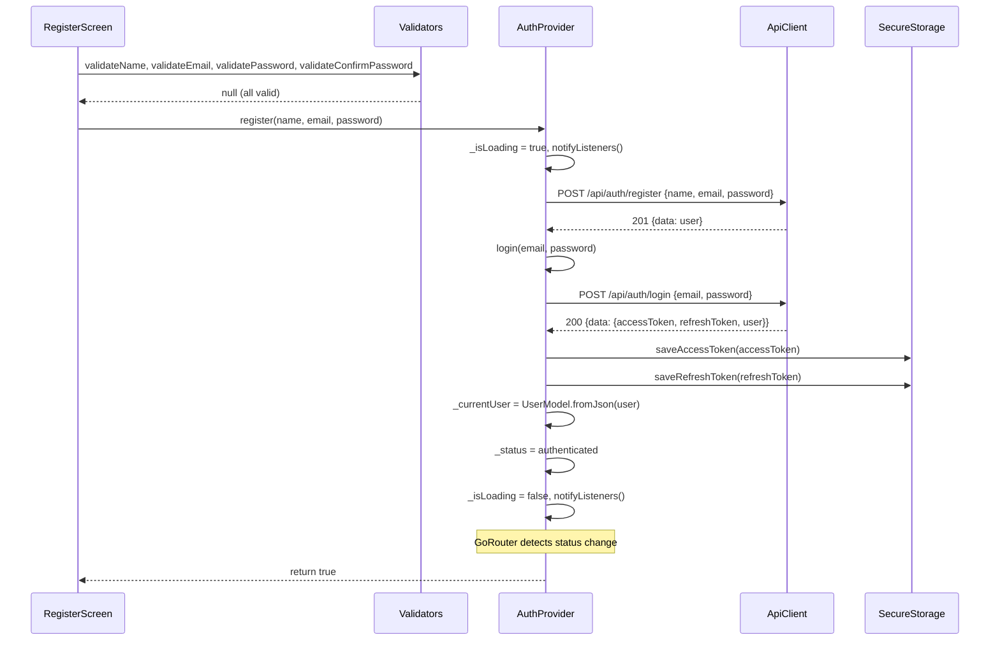
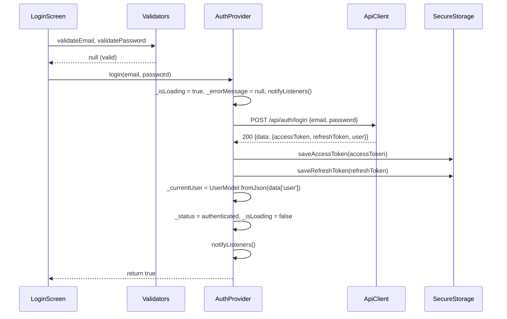
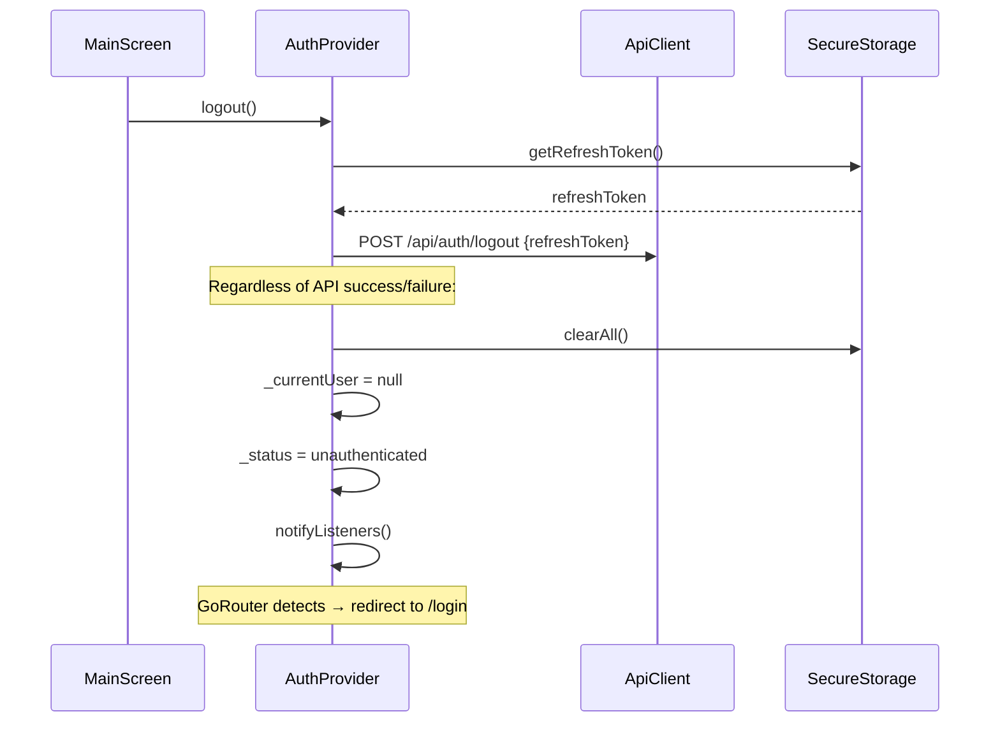
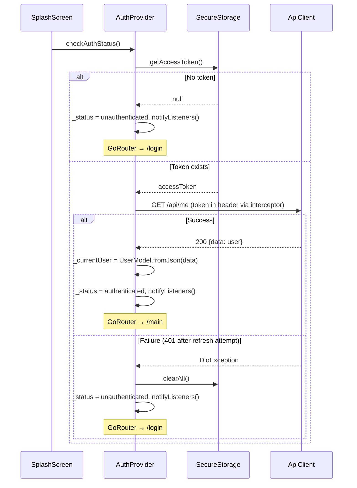

# Design Document: Auth Register & Login

## Overview

This feature implements the complete authentication flow for SiniCerita Flutter app (Tahap 2): user registration, login, session persistence via JWT tokens, and declarative navigation with auth-based route guards. It builds on the Tahap 1 foundation (ApiClient, SecureStorage, Validators) and introduces AuthProvider as the central state manager, GoRouter for navigation, and three screens (Splash, Login, Register).

The architecture follows the Provider pattern where AuthProvider encapsulates all auth logic, exposes reactive state, and GoRouter listens to auth status changes via `refreshListenable` to automatically redirect users.

## Architecture



### Component Responsibilities

| Component | Responsibility |
|-----------|---------------|
| **AuthProvider** | Manages AuthStatus, currentUser, isLoading, errorMessage. Exposes register(), login(), logout(), checkAuthStatus() methods. |
| **UserModel** | Immutable data class with fromJson/toJson for backend user schema. |
| **GoRouter** | Declarative route configuration with redirect guards based on AuthStatus. |
| **SplashScreen** | Calls checkAuthStatus on init, shows branding while resolving. |
| **LoginScreen** | Form with email/password, client-side validation, calls AuthProvider.login(). |
| **RegisterScreen** | Form with name/email/password/confirmPassword, calls AuthProvider.register(). |
| **MainScreen** | Placeholder for Tahap 4 (shows user name + logout button). |
| **Validators** | Static utility methods for client-side form validation (already exists, needs update). |

## Components and Interfaces

### UserModel (`lib/models/user_model.dart`)

```dart
class UserModel {
  final String id;
  final String name;
  final String email;
  final String role;
  final int points;
  final String? avatarUrl;
  final DateTime createdAt;

  const UserModel({
    required this.id,
    required this.name,
    required this.email,
    required this.role,
    required this.points,
    this.avatarUrl,
    required this.createdAt,
  });

  factory UserModel.fromJson(Map<String, dynamic> json);
  Map<String, dynamic> toJson();
}
```

### AuthProvider (`lib/providers/auth_provider.dart`)

```dart
enum AuthStatus { unknown, authenticated, unauthenticated }

class AuthProvider extends ChangeNotifier {
  final ApiClient _apiClient;

  // State
  AuthStatus _status = AuthStatus.unknown;
  UserModel? _currentUser;
  bool _isLoading = false;
  String? _errorMessage;

  // Getters
  AuthStatus get status => _status;
  UserModel? get currentUser => _currentUser;
  bool get isLoading => _isLoading;
  String? get errorMessage => _errorMessage;

  // Methods
  Future<bool> register(String name, String email, String password);
  Future<bool> login(String email, String password);
  Future<void> logout();
  Future<void> checkAuthStatus();
}
```

### GoRouter Configuration (`lib/main.dart`)

```dart
GoRouter _createRouter(AuthProvider authProvider) {
  return GoRouter(
    initialLocation: '/splash',
    refreshListenable: authProvider,
    redirect: (context, state) {
      final status = authProvider.status;
      final isOnAuth = state.matchedLocation == '/login' ||
          state.matchedLocation == '/register';
      final isOnMain = state.matchedLocation == '/main';

      if (status == AuthStatus.authenticated && isOnAuth) return '/main';
      if (status == AuthStatus.unauthenticated && isOnMain) return '/login';
      return null; // no redirect
    },
    routes: [
      GoRoute(path: '/splash', builder: (_, __) => const SplashScreen()),
      GoRoute(path: '/login', builder: (_, __) => const LoginScreen()),
      GoRoute(path: '/register', builder: (_, __) => const RegisterScreen()),
      GoRoute(path: '/main', builder: (_, __) => const MainScreen()),
    ],
  );
}
```

## Data Models

### UserModel Fields (from backend `/api/me` and `/api/auth/login` response)

| Field | Type | Source JSON Key | Notes |
|-------|------|-----------------|-------|
| id | String | `id` | UUID from backend |
| name | String | `name` | User display name |
| email | String | `email` | Lowercased by backend |
| role | String | `role` | "user" or "admin" |
| points | int | `points` | Health score 0-100 |
| avatarUrl | String? | `avatarUrl` | Cloudinary URL, nullable |
| createdAt | DateTime | `createdAt` | ISO 8601 string from backend |

### AuthStatus Enum

```dart
enum AuthStatus {
  unknown,        // App just launched, haven't checked tokens yet
  authenticated,  // Valid token + user profile loaded
  unauthenticated // No token or token invalid/expired
}
```

## Data Flow

### Register Flow



### Login Flow



### Logout Flow



### CheckAuthStatus Flow (Splash)



## Correctness Properties

*A property is a characteristic or behavior that should hold true across all valid executions of a system — essentially, a formal statement about what the system should do. Properties serve as the bridge between human-readable specifications and machine-verifiable correctness guarantees.*

### Property 1: UserModel serialization round-trip

*For any* valid UserModel instance, serializing with `toJson()` then deserializing with `UserModel.fromJson()` SHALL produce a UserModel with all fields equivalent to the original (including null avatarUrl).

**Validates: Requirements 1.2, 1.3, 1.4**

### Property 2: AuthProvider state invariant

*For any* sequence of operations on AuthProvider, when status is `authenticated` then `currentUser` SHALL be non-null, and when status is `unauthenticated` then `currentUser` SHALL be null.

**Validates: Requirements 2.1, 2.2**

### Property 3: Error message passthrough

*For any* API error response (400, 401, 409) containing a `message` field, the AuthProvider SHALL expose that exact message string as `errorMessage` without modification.

**Validates: Requirements 3.3, 3.4, 4.5**

### Property 4: Login persists tokens

*For any* successful login response containing `accessToken` and `refreshToken`, both tokens SHALL be retrievable from SecureStorage immediately after login completes.

**Validates: Requirements 4.2**

### Property 5: Logout always clears state

*For any* logout call (regardless of whether the API call succeeds or fails), SecureStorage SHALL contain no tokens, `currentUser` SHALL be null, and `status` SHALL be `unauthenticated`.

**Validates: Requirements 5.2, 5.3**

### Property 6: Validators correctly classify inputs

*For any* string input:
- `validateEmail` returns null if and only if the input is non-empty and matches email format
- `validatePassword` returns null if and only if the input is non-empty and has 8+ characters
- `validateName` returns null if and only if the trimmed input is non-empty
- `validateConfirmPassword` returns null if and only if the input matches the password parameter

**Validates: Requirements 6.1, 6.2, 6.3, 6.4**

### Property 7: Router redirect guards

*For any* navigation attempt: when AuthStatus is `authenticated` and the target is `/login` or `/register`, the redirect SHALL produce `/main`. When AuthStatus is `unauthenticated` and the target is `/main`, the redirect SHALL produce `/login`.

**Validates: Requirements 10.2, 10.3**

## Error Handling

### Strategy

All errors follow the project convention: `DioException` → `AppException.fromDioError()` → expose `message` to UI via `errorMessage` getter.

| Layer | Responsibility |
|-------|---------------|
| **ApiClient (Interceptor)** | Auto-refresh on 401 from non-auth endpoints. If refresh fails, clear tokens. |
| **AuthProvider** | Catch `DioException`, convert to `AppException`, set `_errorMessage`, return `false`. |
| **Screen (Widget)** | Check return value, show red SnackBar with `authProvider.errorMessage`. |

### Error Scenarios

| Scenario | Status Code | User-Facing Message | Action |
|----------|-------------|---------------------|--------|
| Email already registered | 409 | "Email already registered" | Show SnackBar |
| Wrong credentials | 401 | "User tidak ditemukan" / "Password salah" | Show SnackBar |
| Validation error | 400 | Backend message | Show SnackBar |
| Rate limited | 429 | "Too many requests, please try again later" | Show SnackBar |
| Network error | — | "Tidak dapat terhubung ke server." | Show SnackBar |
| Timeout | — | "Koneksi timeout. Periksa jaringan Anda." | Show SnackBar |
| Token expired (non-auth) | 401 | Auto-refresh (transparent to user) | Interceptor handles |
| Refresh fails | 401 | Redirect to login | Clear tokens, set unauthenticated |

### Error Handling Pattern in Provider

```dart
Future<bool> login(String email, String password) async {
  _isLoading = true;
  _errorMessage = null;
  notifyListeners();

  try {
    final response = await _apiClient.dio.post(
      ApiEndpoints.login,
      data: {'email': email, 'password': password},
    );
    // ... success handling
    _isLoading = false;
    notifyListeners();
    return true;
  } on DioException catch (e) {
    final ex = AppException.fromDioError(e);
    _errorMessage = ex.message;
    _isLoading = false;
    notifyListeners();
    return false;
  }
}
```

## Testing Strategy

### Unit Tests (Example-Based)

| Component | Test Focus |
|-----------|-----------|
| UserModel | fromJson with valid data, null avatarUrl, missing fields |
| AuthProvider | checkAuthStatus scenarios (token exists/not, API success/fail) |
| AuthProvider | register success → auto-login chain |
| AuthProvider | login success → state transitions |
| AuthProvider | logout → always clears regardless of API result |
| Validators | Edge cases: empty string, whitespace-only, boundary lengths |

### Property-Based Tests

Property-based testing is appropriate for this feature because:
- UserModel serialization has clear round-trip properties
- Validators are pure functions with large input spaces
- AuthProvider state transitions have invariants that should hold universally
- Router redirect logic is a pure function of (status, location) → redirect

**Library**: `dart_quickcheck` or manual property testing with randomized inputs in `flutter_test`

**Configuration**: Minimum 100 iterations per property test.

**Tag format**: `// Feature: auth-register-login, Property N: <property_text>`

| Property | Component | Iterations |
|----------|-----------|-----------|
| Property 1: Serialization round-trip | UserModel | 100+ |
| Property 2: State invariant | AuthProvider | 100+ |
| Property 3: Error message passthrough | AuthProvider | 100+ |
| Property 4: Login persists tokens | AuthProvider | 100+ |
| Property 5: Logout clears state | AuthProvider | 100+ |
| Property 6: Validator classification | Validators | 100+ |
| Property 7: Router redirect guards | GoRouter config | 100+ |

### Widget Tests (Example-Based)

| Screen | Test Focus |
|--------|-----------|
| SplashScreen | Calls checkAuthStatus, shows branding |
| LoginScreen | Form validation, button disabled while loading, SnackBar on error |
| RegisterScreen | All 4 fields validated, button disabled while loading, navigation link |

### Integration Tests

Manual emulator testing per project convention (Tahap 2 test checklist).
