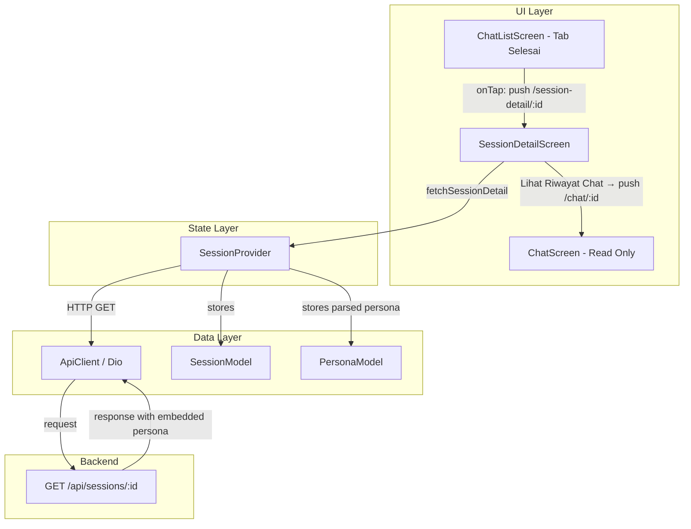
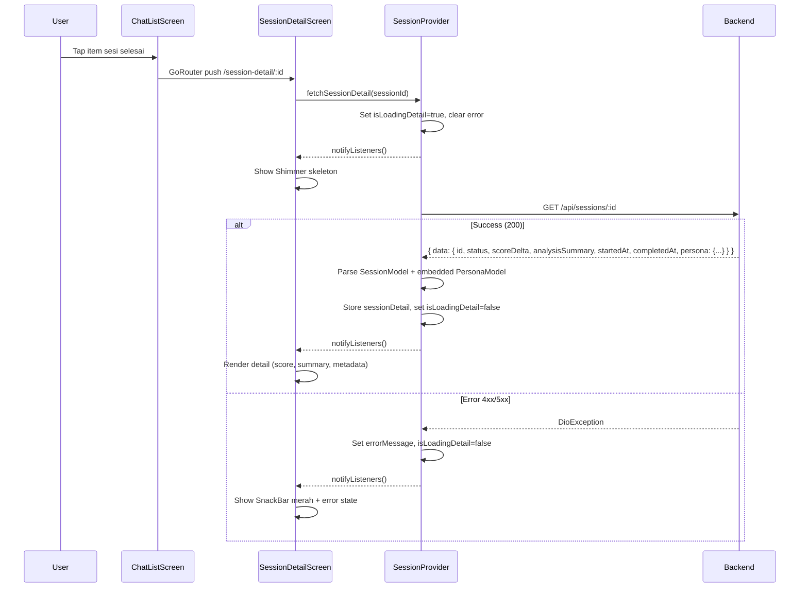
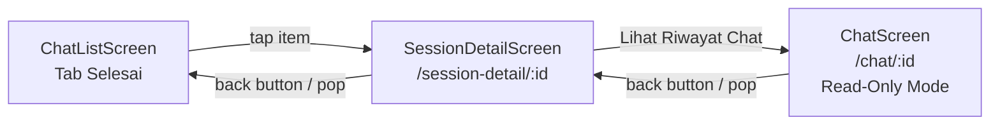
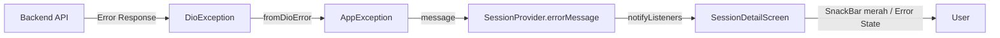

# Design Document: Session Detail Completed

## Overview

Fitur ini menambahkan screen detail untuk sesi chat yang sudah selesai (completed), diakses dari tab "Selesai" di ChatListScreen. Screen menampilkan:

- **Score Delta** — Perubahan skor kesehatan mental dengan color coding dan prefix tanda
- **Analysis Summary** — Ringkasan analisis AI dalam Card scrollable
- **Metadata** — Nama persona (dari embedded object), waktu mulai dan selesai (format Indonesia)
- **Navigation** — Tombol "Lihat Riwayat Chat" ke ChatScreen dalam mode read-only

Arsitektur mengikuti pola Provider yang sudah established: SessionProvider mendapat method baru `fetchSessionDetail(sessionId)` yang memanggil `GET /api/sessions/:id` dan menyimpan hasilnya. SessionDetailScreen membaca state dari provider dan merender UI sesuai kondisi data.

## Architecture

### Component Relationship Diagram



### Data Flow: Fetch Session Detail



### Navigation Flow



## Components and Interfaces

### 1. SessionProvider — New Method & State

```dart
// New state fields for session detail
SessionModel? _sessionDetail;
PersonaModel? _detailPersona;
bool _isLoadingDetail = false;

// New getters
SessionModel? get sessionDetail;
PersonaModel? get detailPersona;
bool get isLoadingDetail;

// New method
Future<void> fetchSessionDetail(String sessionId);
void clearDetailState();
```

**`fetchSessionDetail(sessionId)`** behavior:
1. Set `_isLoadingDetail = true`, clear `_errorMessage`
2. `GET /api/sessions/:id`
3. Parse `response.data['data']` → `SessionModel`
4. Parse embedded `data['persona']` → `PersonaModel`
5. Store both, set `_isLoadingDetail = false`
6. On error: set `_errorMessage` from `AppException.fromDioError(e)`

### 2. SessionDetailScreen (`lib/screens/session/session_detail_screen.dart`)

StatefulWidget yang menerima `sessionId` via constructor (dari GoRouter path parameter).

**Responsibilities:**
- Call `fetchSessionDetail(sessionId)` on init
- Display shimmer skeleton while loading
- Display score delta section (color coded, with prefix)
- Display analysis summary in scrollable Card
- Display metadata (persona name, timestamps formatted id_ID)
- Display "Lihat Riwayat Chat" button
- Handle error states (retry, navigate back)

**Design Decision — Points Comparison:**

Requirement 2.3-2.4 specifies displaying "{previousPoints} poin → {newPoints} poin". However, `GET /api/sessions/:id` only returns `scoreDelta` — it does NOT return `newPoints`. The `newPoints` value is only available at completion time (`PATCH /sessions/:id/complete` response). Since the user's current points may have changed after subsequent sessions, we cannot reliably compute `previousPoints` from the detail endpoint alone.

**Decision:** Display only `scoreDelta` prominently on this screen. The full points comparison was already shown on `SessionSummaryScreen` at completion time. If the backend is updated to include `newPoints` in the session detail response, this feature can be added later.

### 3. Updated SessionListTile for Completed Sessions

The existing `SessionListTile` already handles `showScoreDelta` and `analysisSummary` preview. Per Requirement 7, we need to add:
- Chevron icon (arrow_forward_ios) in trailing position
- Ensure preview truncation at 50 chars with ellipsis
- Ensure placeholder "Analisis tidak tersedia" for null/empty summary

The existing implementation already does truncation and placeholder. We need to add the chevron icon.

### 4. ChatScreen — Read-Only Mode Enhancement

The existing ChatScreen already checks `isSessionActive` to show/hide the "Akhiri Sesi" button. For read-only mode on completed sessions, we need to:
- Hide the entire input area (text field + send button) when session is completed
- Show a banner/info text indicating the session is read-only

### 5. GoRouter — New Route

```dart
GoRoute(
  path: '/session-detail/:sessionId',
  builder: (_, state) {
    final sessionId = state.pathParameters['sessionId']!;
    return SessionDetailScreen(sessionId: sessionId);
  },
),
```

## Data Models

### SessionModel (existing — no changes needed)

The existing `SessionModel` already has all required fields:
- `id`, `userId`, `personaId`, `status`
- `scoreDelta` (nullable int)
- `analysisSummary` (nullable String)
- `createdAt`, `startedAt`, `completedAt`

### PersonaModel (existing — used for embedded persona)

The `GET /api/sessions/:id` response includes an embedded `persona` object that matches the `PersonaModel` structure. We parse it using `PersonaModel.fromJson()`.

### API Response Shape

**GET /api/sessions/:id** (status 200):
```json
{
  "success": true,
  "message": "...",
  "data": {
    "id": "uuid",
    "status": "completed",
    "scoreDelta": 5,
    "analysisSummary": "Ringkasan analisis AI...",
    "startedAt": "2024-01-15T10:00:00.000Z",
    "completedAt": "2024-01-15T11:00:00.000Z",
    "createdAt": "2024-01-15T09:55:00.000Z",
    "persona": {
      "id": "uuid",
      "name": "Persona Name",
      "avatarUrl": "https://...",
      "description": "...",
      "isActive": true,
      "upvotes": 10,
      "downvotes": 2
    }
  }
}
```

### SessionProvider Extended State

| Field | Type | Default | Description |
|-------|------|---------|-------------|
| _sessionDetail | `SessionModel?` | `null` | Detail sesi yang sedang dilihat |
| _detailPersona | `PersonaModel?` | `null` | Persona embedded dari response detail |
| _isLoadingDetail | `bool` | `false` | True saat fetching session detail |

### Helper Functions

```dart
/// Format scoreDelta dengan prefix tanda.
/// Positive: "+5", Negative: "-3" (natural), Zero: "0"
String formatScoreDelta(int delta) {
  if (delta > 0) return '+$delta';
  if (delta < 0) return '$delta';
  return '0';
}

/// Determine color for scoreDelta.
/// Positive: green, Negative: red, Zero: grey
Color getScoreDeltaColor(int delta) {
  if (delta > 0) return Colors.green;
  if (delta < 0) return Colors.red;
  return Colors.grey;
}

/// Check if analysis summary is effectively empty.
/// Returns true for null, empty string, or whitespace-only.
bool isAnalysisSummaryEmpty(String? summary) {
  return summary == null || summary.trim().isEmpty;
}

/// Truncate text to maxLength with ellipsis.
String truncateWithEllipsis(String text, int maxLength) {
  if (text.length <= maxLength) return text;
  return '${text.substring(0, maxLength)}...';
}

/// Format DateTime to Indonesian locale string.
/// Example: "1 Januari 2024, 14:30"
String formatDateTimeIndonesian(DateTime dateTime) {
  return DateFormat('d MMMM yyyy, HH:mm', 'id_ID').format(dateTime);
}
```

## Correctness Properties

*A property is a characteristic or behavior that should hold true across all valid executions of a system — essentially, a formal statement about what the system should do. Properties serve as the bridge between human-readable specifications and machine-verifiable correctness guarantees.*

### Property 1: Session detail response parsing preserves all fields

*For any* valid session detail JSON response containing id, status, scoreDelta, analysisSummary, startedAt, completedAt, and an embedded persona object, parsing via `SessionModel.fromJson` and `PersonaModel.fromJson` shall produce models where every field matches the original JSON values.

**Validates: Requirements 1.3**

### Property 2: ScoreDelta display formatting correctness

*For any* integer scoreDelta in the range [-20, +20], the formatted display string shall have prefix "+" for positive values, no additional prefix for negative values (the minus sign is inherent), and display "0" for zero. The associated color shall be green for positive, red for negative, and grey for zero.

**Validates: Requirements 2.1, 2.2, 7.3**

### Property 3: Empty summary detection

*For any* string that is null, empty, or composed entirely of whitespace characters, the `isAnalysisSummaryEmpty` function shall return true. For any string containing at least one non-whitespace character, it shall return false.

**Validates: Requirements 3.3, 7.2**

### Property 4: Analysis summary truncation

*For any* non-empty string, if its length exceeds 50 characters, `truncateWithEllipsis(text, 50)` shall return the first 50 characters followed by "...". If its length is 50 or fewer, the original string shall be returned unchanged.

**Validates: Requirements 7.1**

### Property 5: Date formatting produces valid Indonesian locale output

*For any* valid DateTime, `formatDateTimeIndonesian` shall produce a string matching the pattern "d MMMM yyyy, HH:mm" using Indonesian month names (Januari, Februari, ..., Desember) and 24-hour time format.

**Validates: Requirements 4.2**

### Property 6: Error message passthrough integrity

*For any* DioException with a badResponse containing a `message` field, `AppException.fromDioError` shall preserve the exact backend message string without modification, and the provider shall expose this exact string via `errorMessage`.

**Validates: Requirements 6.1**

## Error Handling

### Error Flow Architecture



### Error Scenarios

| Scenario | HTTP Status | Backend Message | UI Action |
|----------|-------------|-----------------|-----------|
| Sesi tidak ditemukan | 404 | "Sesi tidak ditemukan" | SnackBar merah + error state + tombol "Kembali" |
| Akses ditolak | 403 | "Akses ditolak: sesi bukan milik Anda" | SnackBar merah + error state + tombol "Kembali" |
| Network timeout | - | "Koneksi timeout. Periksa jaringan Anda." | SnackBar merah + error state + tombol "Coba Lagi" |
| Connection error | - | "Tidak dapat terhubung ke server." | SnackBar merah + error state + tombol "Coba Lagi" |
| Server error | 500 | "Terjadi kesalahan pada server." | SnackBar merah + error state + tombol "Coba Lagi" |

### Error State UI Behavior

```dart
// Determine which button to show based on error type
Widget _buildErrorState(String errorMessage, int? statusCode) {
  final isAccessError = statusCode == 403 || statusCode == 404;
  
  if (isAccessError) {
    // Show "Kembali" button → pop to session list
    return _buildErrorWithBackButton(errorMessage);
  } else {
    // Show "Coba Lagi" button → retry fetchSessionDetail
    return _buildErrorWithRetryButton(errorMessage);
  }
}
```

### SnackBar Configuration

- Background: `Colors.red`
- Duration: 4 detik (`Duration(seconds: 4)`)
- Content: Pesan error eksak dari backend (as-is, tidak dimodifikasi)

### Provider Error State Management

```dart
Future<void> fetchSessionDetail(String sessionId) async {
  _isLoadingDetail = true;
  _errorMessage = null;
  _sessionDetail = null;
  _detailPersona = null;
  notifyListeners();

  try {
    final response = await _apiClient.dio.get(
      ApiEndpoints.sessionDetail(sessionId),
    );

    final data = response.data['data'] as Map<String, dynamic>;
    _sessionDetail = SessionModel.fromJson(data);
    
    // Parse embedded persona
    if (data['persona'] != null) {
      _detailPersona = PersonaModel.fromJson(
        data['persona'] as Map<String, dynamic>,
      );
    }

    _isLoadingDetail = false;
    notifyListeners();
  } on DioException catch (e) {
    final ex = AppException.fromDioError(e);
    _errorMessage = ex.message;
    _isLoadingDetail = false;
    notifyListeners();
  } catch (e) {
    _errorMessage = 'Terjadi kesalahan: $e';
    _isLoadingDetail = false;
    notifyListeners();
  }
}
```

## Testing Strategy

### Unit Tests (Example-Based)

Unit tests fokus pada skenario spesifik dan edge cases:

1. **SessionProvider — fetchSessionDetail**
   - Berhasil: sessionDetail dan detailPersona terisi, isLoadingDetail false
   - Gagal 404: errorMessage = "Sesi tidak ditemukan", isLoadingDetail false
   - Gagal 403: errorMessage = "Akses ditolak: sesi bukan milik Anda", isLoadingDetail false
   - Gagal network: errorMessage generik, isLoadingDetail false
   - Response tanpa persona object: detailPersona null, sessionDetail tetap terisi

2. **SessionDetailScreen Widget Tests**
   - Shimmer ditampilkan saat isLoadingDetail true
   - Score delta ditampilkan dengan warna dan prefix yang benar
   - Analysis summary ditampilkan dalam Card "Analisis AI"
   - Placeholder "Analisis tidak tersedia" saat summary null/empty
   - Persona name ditampilkan dari embedded persona
   - Fallback text saat persona null
   - Timestamp diformat dengan locale Indonesia
   - Tombol "Lihat Riwayat Chat" navigasi ke /chat/:id
   - Tombol back memanggil pop()
   - Error state: SnackBar merah + tombol "Coba Lagi" untuk network error
   - Error state: SnackBar merah + tombol "Kembali" untuk 404/403
   - Score section hidden saat scoreDelta null

3. **ChatScreen — Read-Only Mode**
   - Input area hidden saat session status completed
   - Messages tetap ditampilkan normal
   - Tidak ada "Akhiri Sesi" button

4. **SessionListTile — Completed Session Enhancements**
   - Chevron icon ditampilkan di trailing
   - Navigation ke /session-detail/:id (bukan /chat/:id)
   - Preview truncated di 50 karakter

5. **Helper Functions**
   - `formatScoreDelta`: "+5" untuk 5, "-3" untuk -3, "0" untuk 0
   - `getScoreDeltaColor`: green/red/grey
   - `isAnalysisSummaryEmpty`: true untuk null, "", "   "
   - `truncateWithEllipsis`: truncate + "..." atau unchanged
   - `formatDateTimeIndonesian`: correct format

### Property-Based Tests

Property-based tests menggunakan library **`glados`** untuk Dart, dengan minimum **100 iterasi** per property.

| Property | Test Description | Tag |
|----------|-----------------|-----|
| 1 | Session detail response parsing | Feature: session-detail-completed, Property 1: Session detail response parsing preserves all fields |
| 2 | ScoreDelta formatting + color | Feature: session-detail-completed, Property 2: ScoreDelta display formatting correctness |
| 3 | Empty summary detection | Feature: session-detail-completed, Property 3: Empty summary detection |
| 4 | Summary truncation | Feature: session-detail-completed, Property 4: Analysis summary truncation |
| 5 | Date formatting Indonesian locale | Feature: session-detail-completed, Property 5: Date formatting produces valid Indonesian locale output |
| 6 | Error message passthrough | Feature: session-detail-completed, Property 6: Error message passthrough integrity |

### PBT Library Configuration

```dart
// Contoh property test dengan glados
import 'package:glados/glados.dart';

// Property 2: ScoreDelta formatting
Glados(any.intInRange(-20, 20)).test(
  'scoreDelta formatting correctness',
  (delta) {
    final formatted = formatScoreDelta(delta);
    final color = getScoreDeltaColor(delta);
    
    if (delta > 0) {
      expect(formatted, startsWith('+'));
      expect(color, Colors.green);
    } else if (delta < 0) {
      expect(formatted, startsWith('-'));
      expect(color, Colors.red);
    } else {
      expect(formatted, equals('0'));
      expect(color, Colors.grey);
    }
  },
);

// Property 3: Empty summary detection
Glados(any.choose([
  any.letterOrDigits, // non-empty strings
  any.always(''),     // empty
  any.always('   '),  // whitespace
])).test(
  'empty summary detection',
  (summary) {
    final result = isAnalysisSummaryEmpty(summary);
    expect(result, equals(summary.trim().isEmpty));
  },
);

// Property 4: Truncation
Glados(any.nonEmptyString).test(
  'truncation preserves or shortens',
  (text) {
    final result = truncateWithEllipsis(text, 50);
    if (text.length <= 50) {
      expect(result, equals(text));
    } else {
      expect(result.length, equals(53)); // 50 + "..."
      expect(result, endsWith('...'));
      expect(result.substring(0, 50), equals(text.substring(0, 50)));
    }
  },
);
```

### Integration Tests

- Full flow: ChatListScreen → tap completed session → SessionDetailScreen loads → displays data
- Error recovery: network error → tap "Coba Lagi" → successful load
- Navigation: "Lihat Riwayat Chat" → ChatScreen in read-only mode → back → SessionDetailScreen
