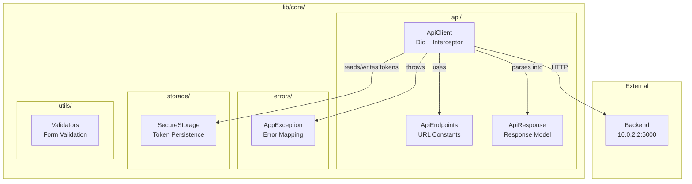
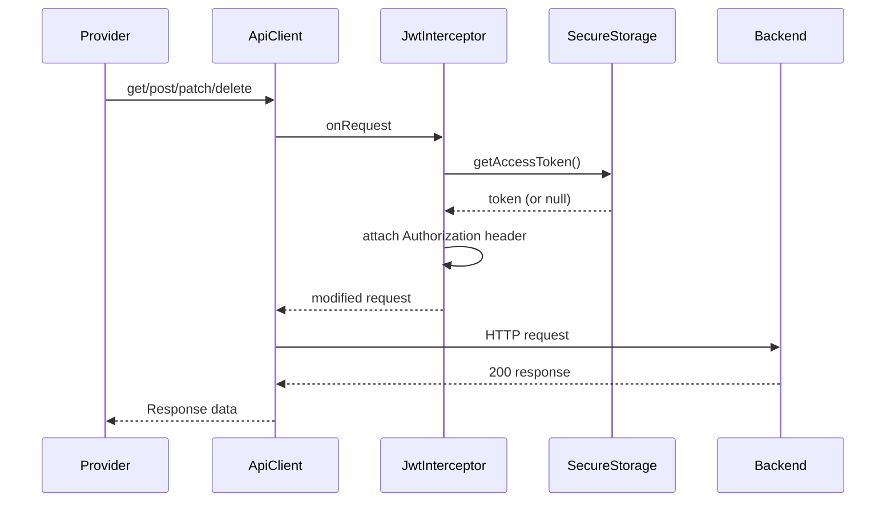
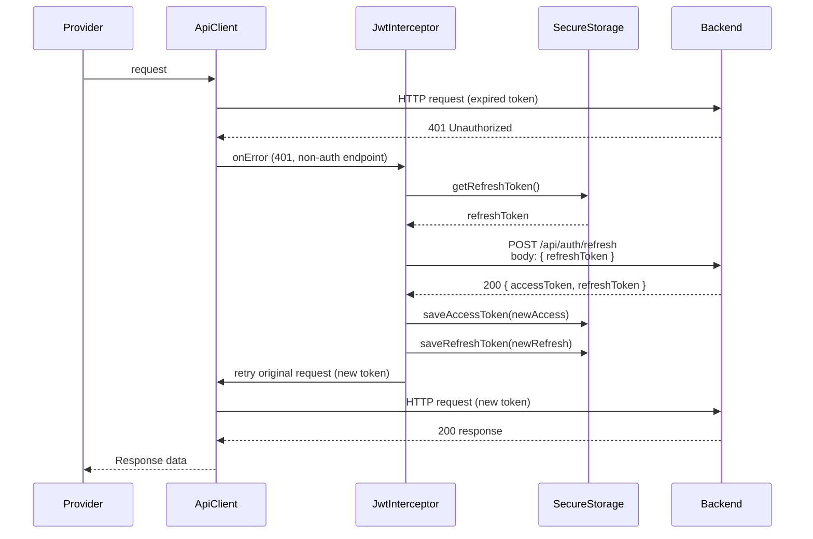
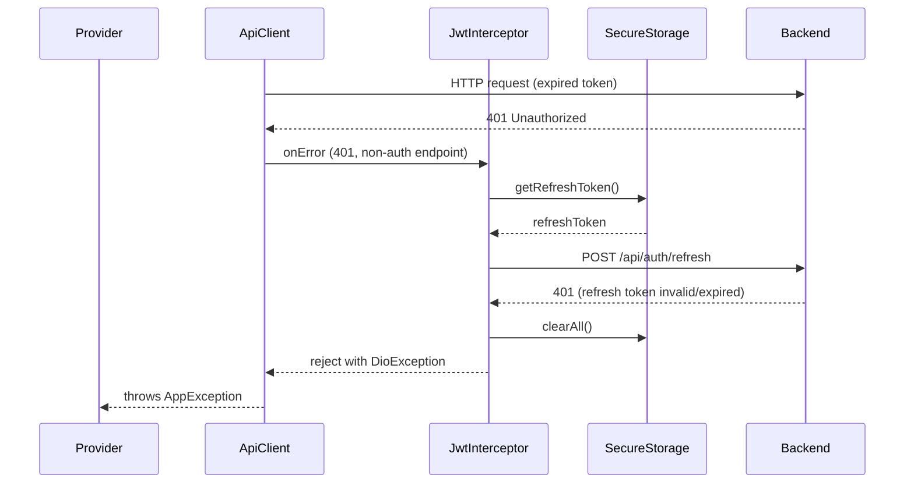

# Design Document: Tahap 1 — Fondasi

## Overview

Tahap 1 membangun infrastruktur teknis inti untuk aplikasi Flutter SiniCerita. Ini mencakup konfigurasi project, HTTP client (Dio) dengan JWT interceptor yang mendukung token rotation via `QueuedInterceptorsWrapper`, secure token storage, centralized error handling, API response parsing, endpoint constants, dan form validators. Semua komponen ini menjadi fondasi yang digunakan oleh tahap-tahap selanjutnya.

Arsitektur mengikuti pola layered: `core/` berisi infrastructure code yang tidak bergantung pada domain bisnis. Setiap komponen memiliki single responsibility dan dapat di-test secara independen.

## Architecture



## Sequence Diagrams

### Normal Request Flow (with token)



### Token Refresh Flow (401 → refresh → retry)



### Token Refresh Failure Flow



## Components and Interfaces

### Component 1: ApiClient (`lib/core/api/api_client.dart`)

**Purpose**: Singleton Dio HTTP client dengan JWT interceptor untuk semua komunikasi ke backend.

**Interface**:

```dart
class ApiClient {
  late final Dio _dio;
  final SecureStorage _storage;

  ApiClient({required SecureStorage storage});

  Dio get dio => _dio;
}
```

**Responsibilities**:
- Inisialisasi Dio dengan base URL `http://10.0.2.2:5000`
- Set default headers (`Content-Type`, `Accept` = `application/json`)
- Set timeout (connect: 30s, receive: 30s)
- Register `QueuedInterceptorsWrapper` untuk JWT handling

**Interceptor Logic (QueuedInterceptorsWrapper)**:

```dart
QueuedInterceptorsWrapper(
  onRequest: (options, handler) async {
    // Attach access token jika ada
    final token = await _storage.getAccessToken();
    if (token != null) {
      options.headers['Authorization'] = 'Bearer $token';
    }
    handler.next(options);
  },

  onError: (error, handler) async {
    // Skip refresh untuk auth endpoints
    final path = error.requestOptions.path;
    final isAuthEndpoint = path.contains('/api/auth/');

    if (error.response?.statusCode == 401 && !isAuthEndpoint) {
      try {
        final refreshToken = await _storage.getRefreshToken();
        if (refreshToken == null) {
          return handler.next(error);
        }

        // Refresh token — kirim di BODY (bukan header)
        final response = await Dio().post(
          'http://10.0.2.2:5000/api/auth/refresh',
          data: {'refreshToken': refreshToken},
        );

        final newAccess = response.data['data']['accessToken'] as String;
        final newRefresh = response.data['data']['refreshToken'] as String;

        // Simpan token baru
        await _storage.saveAccessToken(newAccess);
        await _storage.saveRefreshToken(newRefresh);

        // Retry original request dengan token baru
        final opts = error.requestOptions;
        opts.headers['Authorization'] = 'Bearer $newAccess';
        final retryResponse = await _dio.fetch(opts);
        return handler.resolve(retryResponse);
      } catch (e) {
        // Refresh gagal → clear semua token
        await _storage.clearAll();
        return handler.next(error);
      }
    }

    handler.next(error);
  },
)
```

---

### Component 2: ApiEndpoints (`lib/core/api/api_endpoints.dart`)

**Purpose**: Centralized URL constants untuk semua API endpoints.

**Interface**:

```dart
abstract class ApiEndpoints {
  // System
  static const String ping = '/ping'; // TANPA /api/ prefix!

  // Auth — semua dengan /api/auth/ prefix
  static const String register = '/api/auth/register';
  static const String login = '/api/auth/login';
  static const String refresh = '/api/auth/refresh';
  static const String logout = '/api/auth/logout';
  static const String forgotPassword = '/api/auth/forgot-password';
  static const String verifyOtp = '/api/auth/verify-otp';
  static const String resetPassword = '/api/auth/reset-password';

  // Profile
  static const String me = '/api/me';
  static const String changePassword = '/api/me/password';

  // Persona
  static const String personas = '/api/personas';
  static String personaDetail(String id) => '/api/personas/$id';
  static String personaRate(String id) => '/api/personas/$id/rate';

  // Session
  static const String sessions = '/api/sessions';
  static String sessionDetail(String id) => '/api/sessions/$id';
  static String sessionMessages(String id) => '/api/sessions/$id/messages';
  static String sessionComplete(String id) => '/api/sessions/$id/complete';
}
```

**Responsibilities**:
- Menyediakan semua URL sebagai `static const String`
- Endpoint dengan path parameter menggunakan static method
- `/ping` adalah SATU-SATUNYA endpoint tanpa prefix `/api/`

---

### Component 3: ApiResponse (`lib/core/api/api_response.dart`)

**Purpose**: Typed model untuk parsing response envelope dari backend.

**Interface**:

```dart
class ApiResponse {
  final bool success;
  final String message;
  final dynamic data;
  final ApiMeta? meta;
  final List<ApiFieldError>? errors;

  const ApiResponse({
    required this.success,
    required this.message,
    this.data,
    this.meta,
    this.errors,
  });

  factory ApiResponse.fromJson(Map<String, dynamic> json);
}

class ApiMeta {
  final int total;
  final int page;
  final int limit;
  final int totalPages;

  const ApiMeta({
    required this.total,
    required this.page,
    required this.limit,
    required this.totalPages,
  });

  factory ApiMeta.fromJson(Map<String, dynamic> json);
}

class ApiFieldError {
  final String field;
  final String message;

  const ApiFieldError({
    required this.field,
    required this.message,
  });

  factory ApiFieldError.fromJson(Map<String, dynamic> json);
}
```

**Responsibilities**:
- Parse `success`, `message`, `data` dari response envelope
- Parse optional `meta` untuk pagination
- Parse optional `errors` untuk validation errors

---

### Component 4: AppException (`lib/core/errors/app_exception.dart`)

**Purpose**: Mapping dari `DioException` ke error class dengan pesan user-friendly dalam Bahasa Indonesia.

**Interface**:

```dart
class AppException implements Exception {
  final String message;
  final int? statusCode;
  final dynamic data;

  const AppException({
    required this.message,
    this.statusCode,
    this.data,
  });

  factory AppException.fromDioError(DioException error);

  @override
  String toString() => message;
}
```

**Mapping Rules**:

```dart
factory AppException.fromDioError(DioException error) {
  switch (error.type) {
    case DioExceptionType.connectionTimeout:
      return const AppException(
        message: 'Koneksi timeout. Periksa jaringan Anda.',
      );

    case DioExceptionType.receiveTimeout:
      return const AppException(
        message: 'Server tidak merespons. Coba lagi nanti.',
      );

    case DioExceptionType.connectionError:
      return const AppException(
        message: 'Tidak dapat terhubung ke server.',
      );

    case DioExceptionType.badResponse:
      // Coba ambil message dari response body
      final responseData = error.response?.data;
      if (responseData is Map<String, dynamic> &&
          responseData.containsKey('message')) {
        return AppException(
          message: responseData['message'] as String,
          statusCode: error.response?.statusCode,
          data: responseData,
        );
      }
      // Fallback berdasarkan status code
      return AppException(
        message: _getMessageFromStatusCode(error.response?.statusCode),
        statusCode: error.response?.statusCode,
      );

    default:
      return const AppException(
        message: 'Terjadi kesalahan. Coba lagi nanti.',
      );
  }
}

static String _getMessageFromStatusCode(int? statusCode) {
  switch (statusCode) {
    case 400:
      return 'Permintaan tidak valid.';
    case 401:
      return 'Sesi telah berakhir. Silakan login kembali.';
    case 403:
      return 'Anda tidak memiliki akses.';
    case 404:
      return 'Data tidak ditemukan.';
    case 409:
      return 'Terjadi konflik data.';
    case 429:
      return 'Terlalu banyak permintaan. Coba lagi nanti.';
    case 500:
      return 'Terjadi kesalahan pada server.';
    default:
      return 'Terjadi kesalahan. Coba lagi nanti.';
  }
}
```

---

### Component 5: SecureStorage (`lib/core/storage/secure_storage.dart`)

**Purpose**: Wrapper di atas `FlutterSecureStorage` untuk menyimpan dan mengambil JWT tokens.

**Interface**:

```dart
class SecureStorage {
  final FlutterSecureStorage _storage;

  static const String _accessTokenKey = 'access_token';
  static const String _refreshTokenKey = 'refresh_token';

  SecureStorage({FlutterSecureStorage? storage})
      : _storage = storage ?? const FlutterSecureStorage();

  Future<String?> getAccessToken();
  Future<String?> getRefreshToken();
  Future<void> saveAccessToken(String token);
  Future<void> saveRefreshToken(String token);
  Future<void> clearAll();
}
```

**Responsibilities**:
- Persist access token dengan key `'access_token'`
- Persist refresh token dengan key `'refresh_token'`
- Return `null` jika token tidak ada
- `clearAll()` menghapus kedua token sekaligus

---

### Component 6: Validators (`lib/core/utils/validators.dart`)

**Purpose**: Static utility methods untuk client-side form validation.

**Interface**:

```dart
class Validators {
  Validators._(); // prevent instantiation

  static String? validateEmail(String? value);
  static String? validatePassword(String? value);
  static String? validateName(String? value);
  static String? validateConfirmPassword(String? value, String? password);
}
```

**Validation Rules**:

```dart
static String? validateEmail(String? value) {
  if (value == null || value.trim().isEmpty) {
    return 'Email tidak boleh kosong';
  }
  final emailRegex = RegExp(r'^[\w-\.]+@([\w-]+\.)+[\w-]{2,4}$');
  if (!emailRegex.hasMatch(value.trim())) {
    return 'Format email tidak valid';
  }
  return null; // valid
}

static String? validatePassword(String? value) {
  if (value == null || value.isEmpty) {
    return 'Password tidak boleh kosong';
  }
  if (value.length < 8) {
    return 'Password minimal 8 karakter';
  }
  return null;
}

static String? validateName(String? value) {
  if (value == null || value.trim().isEmpty) {
    return 'Nama tidak boleh kosong';
  }
  return null;
}

static String? validateConfirmPassword(String? value, String? password) {
  if (value == null || value.isEmpty) {
    return 'Konfirmasi password tidak boleh kosong';
  }
  if (value != password) {
    return 'Password tidak cocok';
  }
  return null;
}
```

## Data Models

### ApiResponse Envelope

```dart
// Backend response shape:
// {
//   "success": true,
//   "message": "...",
//   "data": { ... } | [ ... ],
//   "meta": { "total": N, "page": N, "limit": N, "totalPages": N },
//   "errors": [{ "field": "...", "message": "..." }]
// }
```

**Parsing Rule**: Saat menggunakan response di Provider, selalu akses `response.data['data']` untuk mendapatkan payload aktual.

### Token Storage Schema

| Key | Value | Description |
|-----|-------|-------------|
| `access_token` | JWT string | Short-lived (~15 menit) |
| `refresh_token` | JWT string | Single-use, 7 hari TTL |

## Error Handling

### Error Scenario 1: Network Timeout

**Condition**: Dio connect timeout (30s) atau receive timeout (30s) tercapai
**Response**: `AppException(message: 'Koneksi timeout. Periksa jaringan Anda.')` atau `'Server tidak merespons. Coba lagi nanti.'`
**Recovery**: User retry manual

### Error Scenario 2: Connection Error (Server Unreachable)

**Condition**: Backend tidak bisa dijangkau (server mati, network down)
**Response**: `AppException(message: 'Tidak dapat terhubung ke server.')`
**Recovery**: User periksa koneksi, retry

### Error Scenario 3: 401 on Non-Auth Endpoint

**Condition**: Access token expired saat request ke endpoint non-auth
**Response**: Interceptor otomatis refresh token dan retry
**Recovery**: Transparent ke user jika refresh berhasil; redirect ke login jika gagal

### Error Scenario 4: 401 on Auth Endpoint

**Condition**: Request ke `/api/auth/*` mendapat 401 (wrong credentials, invalid refresh token)
**Response**: Langsung throw error tanpa attempt refresh (mencegah infinite loop)
**Recovery**: Tampilkan pesan error dari backend ke user

### Error Scenario 5: Refresh Token Expired/Invalid

**Condition**: `POST /api/auth/refresh` gagal (token expired atau sudah dipakai)
**Response**: Clear semua token dari storage, throw AppException
**Recovery**: User harus login ulang

## Testing Strategy

### Unit Testing Approach

- Test `Validators` methods dengan berbagai input (valid, empty, edge cases)
- Test `ApiResponse.fromJson()` dengan berbagai response shapes
- Test `AppException.fromDioError()` dengan semua `DioExceptionType`
- Test `SecureStorage` read/write/clear operations (mock FlutterSecureStorage)

### Integration Testing Approach

- Test `ApiClient` ping ke backend (`GET /ping`)
- Verify interceptor attaches token pada request
- Verify interceptor handles 401 → refresh → retry flow
- Verify interceptor skips refresh untuk auth endpoints

## Performance Considerations

- `QueuedInterceptorsWrapper` memastikan hanya satu refresh request berjalan pada satu waktu — request lain yang mendapat 401 akan di-queue dan resolved setelah refresh selesai
- Timeout 30 detik cukup untuk koneksi emulator ke host machine
- `SecureStorage` menggunakan platform-native encryption (Keychain di iOS, EncryptedSharedPreferences di Android)

## Security Considerations

- Token disimpan di `FlutterSecureStorage` (encrypted at rest), bukan SharedPreferences
- Refresh token dikirim di request body (bukan header) sesuai backend design
- Token di-clear saat refresh gagal untuk mencegah penggunaan token invalid
- `usesCleartextTraffic` hanya untuk development (HTTP ke 10.0.2.2); production akan menggunakan HTTPS

## Dependencies

| Package | Version | Purpose |
|---------|---------|---------|
| `dio` | ^5.4.0 | HTTP client |
| `flutter_secure_storage` | ^9.0.0 | Encrypted token storage |
| `provider` | ^6.1.0 | State management (dipakai di tahap selanjutnya) |
| `go_router` | ^13.0.0 | Navigation (dipakai di tahap selanjutnya) |
| `equatable` | ^2.0.5 | Value equality untuk model classes |

## Android Manifest Configuration

```xml
<!-- android/app/src/main/AndroidManifest.xml -->
<manifest xmlns:android="http://schemas.android.com/apk/res/android">
    <uses-permission android:name="android.permission.INTERNET"/>
    
    <application
        android:usesCleartextTraffic="true"
        ...>
    </application>
</manifest>
```

## Correctness Properties

*A property is a characteristic or behavior that should hold true across all valid executions of a system — essentially, a formal statement about what the system should do. Properties serve as the bridge between human-readable specifications and machine-verifiable correctness guarantees.*

### Property 1: Validator email rejects all invalid formats

*For any* string that does not match a valid email pattern (missing @, missing domain, empty, whitespace-only), `Validators.validateEmail()` SHALL return a non-null error message.

**Validates: Requirements 9.1**

### Property 2: Validator password enforces minimum length

*For any* string with length less than 8 characters, `Validators.validatePassword()` SHALL return a non-null error message; for any string with length >= 8, it SHALL return null.

**Validates: Requirements 9.2**

### Property 3: Confirm password mismatch detection

*For any* two distinct strings `a` and `b` where `a != b`, `Validators.validateConfirmPassword(a, b)` SHALL return a non-null error message.

**Validates: Requirements 9.4**

### Property 4: ApiResponse round-trip parsing

*For any* valid backend response envelope (containing `success`, `message`, `data`), `ApiResponse.fromJson(json)` SHALL produce an object where `success`, `message`, and `data` match the original JSON values.

**Validates: Requirements 6.1, 6.2, 6.3**

### Property 5: AppException maps all DioExceptionTypes to non-empty messages

*For any* `DioException` instance (regardless of type), `AppException.fromDioError(error)` SHALL produce an `AppException` with a non-empty `message` string in Bahasa Indonesia.

**Validates: Requirements 7.1, 7.2, 7.3, 7.6**

### Property 6: AppException preserves backend error messages

*For any* `DioException` of type `badResponse` whose response body contains a `message` field, `AppException.fromDioError(error).message` SHALL equal that backend message exactly.

**Validates: Requirements 7.4**

### Property 7: SecureStorage token round-trip

*For any* non-null token string, saving it via `saveAccessToken(token)` then reading via `getAccessToken()` SHALL return the same token string.

**Validates: Requirements 4.2, 4.3, 4.4**

### Property 8: Interceptor skips refresh for auth endpoints

*For any* request path containing `/api/auth/`, when a 401 response is received, the JWT interceptor SHALL NOT attempt a token refresh.

**Validates: Requirements 3.5**
