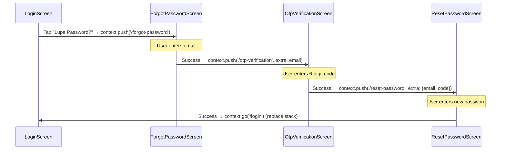
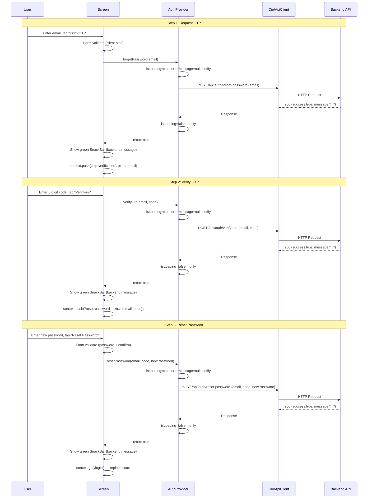
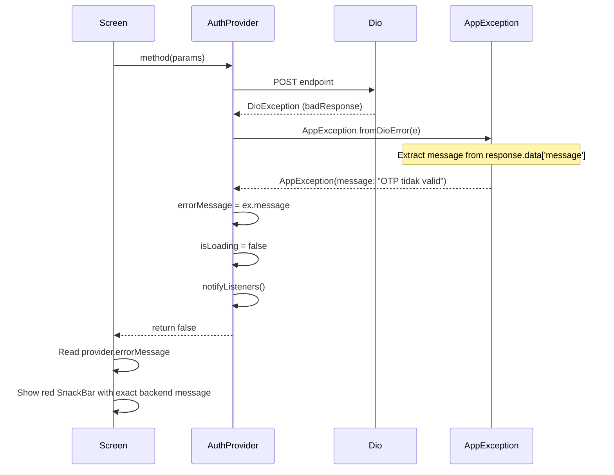

# Design Document: Tahap 3 — Forgot Password & OTP

## Overview

Fitur Forgot Password memungkinkan user yang lupa password untuk melakukan reset melalui 3 langkah: request OTP via email → verifikasi 6-digit OTP → set password baru. Fitur ini menambahkan 3 method baru ke `AuthProvider`, 3 screen baru, dan 3 route publik ke GoRouter.

Semua endpoint bersifat publik (tanpa auth token). Data (email, OTP code) diteruskan antar screen menggunakan GoRouter `extra` parameter. Jika user mengakses screen tanpa data yang diperlukan, app redirect ke `/forgot-password`.

## Architecture

```mermaid
graph TD
    subgraph Screens
        FP[ForgotPasswordScreen]
        OTP[OtpVerificationScreen]
        RP[ResetPasswordScreen]
    end

    subgraph Provider
        AP[AuthProvider]
    end

    subgraph Core
        AC[ApiClient / Dio]
        AE[ApiEndpoints]
        EX[AppException]
    end

    subgraph Backend
        API[REST API /api/auth/*]
    end

    FP -->|forgotPassword(email)| AP
    OTP -->|verifyOtp(email, code)| AP
    RP -->|resetPassword(email, code, newPassword)| AP

    AP -->|POST| AC
    AC -->|URL from| AE
    AC -->|DioException →| EX
    AC -->|HTTP| API
```

## Navigation Flow



## Components and Interfaces

### Component 1: AuthProvider (Additions)

**Purpose**: Menambahkan 3 method publik untuk forgot password flow. Mengikuti pattern yang sama dengan `login()` dan `register()`.

**Interface**:

```dart
/// Tambahan method di AuthProvider (existing class)
abstract class ForgotPasswordMethods {
  /// Request OTP ke email user.
  /// Returns true jika berhasil, false jika gagal (errorMessage di-set).
  Future<bool> forgotPassword(String email);

  /// Verifikasi 6-digit OTP code.
  /// Returns true jika berhasil, false jika gagal (errorMessage di-set).
  Future<bool> verifyOtp(String email, String code);

  /// Reset password dengan email, code, dan password baru.
  /// Returns true jika berhasil, false jika gagal (errorMessage di-set).
  Future<bool> resetPassword(String email, String code, String newPassword);
}
```

**Implementation Pattern** (sama dengan login/register):

```dart
Future<bool> forgotPassword(String email) async {
  _isLoading = true;
  _errorMessage = null;
  notifyListeners();

  try {
    await _apiClient.dio.post(
      ApiEndpoints.forgotPassword,
      data: {'email': email},
    );
    _isLoading = false;
    notifyListeners();
    return true;
  } on DioException catch (e) {
    final ex = AppException.fromDioError(e);
    _errorMessage = ex.message;
    _isLoading = false;
    notifyListeners();
    return false;
  }
}

Future<bool> verifyOtp(String email, String code) async {
  _isLoading = true;
  _errorMessage = null;
  notifyListeners();

  try {
    await _apiClient.dio.post(
      ApiEndpoints.verifyOtp,
      data: {'email': email, 'code': code},
    );
    _isLoading = false;
    notifyListeners();
    return true;
  } on DioException catch (e) {
    final ex = AppException.fromDioError(e);
    _errorMessage = ex.message;
    _isLoading = false;
    notifyListeners();
    return false;
  }
}

Future<bool> resetPassword(String email, String code, String newPassword) async {
  _isLoading = true;
  _errorMessage = null;
  notifyListeners();

  try {
    await _apiClient.dio.post(
      ApiEndpoints.resetPassword,
      data: {'email': email, 'code': code, 'newPassword': newPassword},
    );
    _isLoading = false;
    notifyListeners();
    return true;
  } on DioException catch (e) {
    final ex = AppException.fromDioError(e);
    _errorMessage = ex.message;
    _isLoading = false;
    notifyListeners();
    return false;
  }
}
```

**Responsibilities**:
- Manage `isLoading` state selama API call
- Clear `errorMessage` sebelum setiap call
- Convert `DioException` → `AppException` → set `errorMessage`
- Call `notifyListeners()` di setiap state change
- Return `bool` untuk screen decision (navigate or show error)

### Component 2: GoRouter (Modifications)

**Purpose**: Menambahkan 3 route publik dan memastikan auth guard tidak redirect user dari forgot password flow.

**Interface**:

```dart
// Tambahan routes di _createRouter()
GoRoute(
  path: '/forgot-password',
  builder: (_, __) => const ForgotPasswordScreen(),
),
GoRoute(
  path: '/otp-verification',
  builder: (_, state) {
    final email = state.extra as String?;
    if (email == null) return const ForgotPasswordScreen();
    return OtpVerificationScreen(email: email);
  },
),
GoRoute(
  path: '/reset-password',
  builder: (_, state) {
    final extras = state.extra as Map<String, String>?;
    if (extras == null || !extras.containsKey('email') || !extras.containsKey('code')) {
      return const ForgotPasswordScreen();
    }
    return ResetPasswordScreen(email: extras['email']!, code: extras['code']!);
  },
),
```

**Redirect Logic Update**:

```dart
// Update redirect function — tambahkan forgot password routes ke whitelist
redirect: (context, state) {
  final status = authProvider.status;
  final location = state.matchedLocation;
  final isOnSplash = location == '/splash';
  final isOnAuth = location == '/login' ||
      location == '/register' ||
      location == '/forgot-password' ||
      location == '/otp-verification' ||
      location == '/reset-password';
  final isOnMain = location == '/main';

  if (isOnSplash && status != AuthStatus.unknown) {
    return status == AuthStatus.authenticated ? '/main' : '/login';
  }

  // Auth guard: authenticated users CAN access forgot password routes
  // (hanya redirect dari /login dan /register)
  if (status == AuthStatus.authenticated &&
      (location == '/login' || location == '/register')) {
    return '/main';
  }

  if (status == AuthStatus.unauthenticated && isOnMain) return '/login';

  return null;
},
```

**Responsibilities**:
- Define 3 new public routes
- Validate `extra` parameters on each route
- Redirect to `/forgot-password` if extras missing
- Allow authenticated users to access forgot password routes
- Maintain existing auth guard for login/register/main

### Component 3: ForgotPasswordScreen

**Purpose**: Halaman input email untuk request OTP. Entry point dari "Lupa Password?" link di login screen.

**Interface**:

```dart
class ForgotPasswordScreen extends StatefulWidget {
  const ForgotPasswordScreen({super.key});

  @override
  State<ForgotPasswordScreen> createState() => _ForgotPasswordScreenState();
}
```

**State & Controllers**:

```dart
class _ForgotPasswordScreenState extends State<ForgotPasswordScreen> {
  final _formKey = GlobalKey<FormState>();
  final _emailController = TextEditingController();

  Future<void> _onSubmit() async {
    if (!_formKey.currentState!.validate()) return;

    final email = _emailController.text.trim();
    final success = await context.read<AuthProvider>().forgotPassword(email);
    if (!mounted) return;

    if (success) {
      // Show success SnackBar (green)
      // Navigate to OTP screen with email
      context.push('/otp-verification', extra: email);
    } else {
      // Show error SnackBar (red) with errorMessage from provider
    }
  }
}
```

**UI Layout**:
- AppBar with back button (auto dari Scaffold)
- Title: "Lupa Password"
- Subtitle text: "Masukkan email untuk menerima kode OTP"
- Email TextFormField (with Validators.validateEmail)
- "Kirim OTP" ElevatedButton (disabled saat loading)
- Loading indicator di button saat `isLoading`

### Component 4: OtpVerificationScreen

**Purpose**: Halaman input 6-digit OTP menggunakan `pin_code_fields` package.

**Interface**:

```dart
class OtpVerificationScreen extends StatefulWidget {
  final String email;

  const OtpVerificationScreen({super.key, required this.email});

  @override
  State<OtpVerificationScreen> createState() => _OtpVerificationScreenState();
}
```

**State & Controllers**:

```dart
class _OtpVerificationScreenState extends State<OtpVerificationScreen> {
  final _otpController = TextEditingController();
  bool _isComplete = false; // true when 6 digits entered

  void _onOtpChanged(String value) {
    setState(() {
      _isComplete = value.length == 6;
    });
  }

  Future<void> _onVerify() async {
    final code = _otpController.text;
    final success = await context.read<AuthProvider>().verifyOtp(
      widget.email,
      code,
    );
    if (!mounted) return;

    if (success) {
      // Show success SnackBar (green)
      // Navigate to reset password with email + code
      context.push('/reset-password', extra: {
        'email': widget.email,
        'code': code,
      });
    } else {
      // Show error SnackBar (red) with errorMessage from provider
    }
  }
}
```

**UI Layout**:
- AppBar with back button
- Title: "Verifikasi OTP"
- Subtitle: "Masukkan 6 digit kode yang dikirim ke {email}"
- `PinCodeTextField` (6 fields, numeric keyboard)
- "Verifikasi" ElevatedButton (disabled saat `!_isComplete || isLoading`)
- Loading indicator di button saat `isLoading`

**PinCodeTextField Configuration**:

```dart
PinCodeTextField(
  appContext: context,
  length: 6,
  controller: _otpController,
  keyboardType: TextInputType.number,
  animationType: AnimationType.fade,
  pinTheme: PinTheme(
    shape: PinCodeFieldShape.box,
    borderRadius: BorderRadius.circular(8),
    fieldHeight: 50,
    fieldWidth: 45,
    activeFillColor: Colors.white,
    inactiveFillColor: Colors.white,
    selectedFillColor: Colors.white,
    activeColor: Theme.of(context).colorScheme.primary,
    inactiveColor: Colors.grey[300]!,
    selectedColor: Theme.of(context).colorScheme.primary,
  ),
  enableActiveFill: true,
  onChanged: _onOtpChanged,
  onCompleted: (_) {},
)
```

### Component 5: ResetPasswordScreen

**Purpose**: Halaman input password baru dan konfirmasi password.

**Interface**:

```dart
class ResetPasswordScreen extends StatefulWidget {
  final String email;
  final String code;

  const ResetPasswordScreen({
    super.key,
    required this.email,
    required this.code,
  });

  @override
  State<ResetPasswordScreen> createState() => _ResetPasswordScreenState();
}
```

**State & Controllers**:

```dart
class _ResetPasswordScreenState extends State<ResetPasswordScreen> {
  final _formKey = GlobalKey<FormState>();
  final _passwordController = TextEditingController();
  final _confirmPasswordController = TextEditingController();
  bool _obscurePassword = true;
  bool _obscureConfirmPassword = true;

  Future<void> _onSubmit() async {
    if (!_formKey.currentState!.validate()) return;

    final success = await context.read<AuthProvider>().resetPassword(
      widget.email,
      widget.code,
      _passwordController.text,
    );
    if (!mounted) return;

    if (success) {
      // Show success SnackBar (green)
      // Navigate to login, replacing entire stack
      context.go('/login');
    } else {
      // Show error SnackBar (red) with errorMessage from provider
    }
  }
}
```

**UI Layout**:
- AppBar with back button
- Title: "Reset Password"
- Subtitle: "Masukkan password baru"
- Password TextFormField (with Validators.validatePassword, toggle visibility)
- Confirm Password TextFormField (with Validators.validateConfirmPassword, toggle visibility)
- "Reset Password" ElevatedButton (disabled saat loading)
- Loading indicator di button saat `isLoading`

## Data Models

### Route Extra: OTP Verification

```dart
// Extra passed from ForgotPasswordScreen → OtpVerificationScreen
// Type: String (email address)
final email = state.extra as String?;
```

### Route Extra: Reset Password

```dart
// Extra passed from OtpVerificationScreen → ResetPasswordScreen
// Type: Map<String, String>
final extras = state.extra as Map<String, String>?;
// extras['email'] → email address
// extras['code'] → 6-digit OTP code
```

### API Request Bodies

```dart
// POST /api/auth/forgot-password
{'email': 'user@example.com'}

// POST /api/auth/verify-otp
{'email': 'user@example.com', 'code': '123456'}

// POST /api/auth/reset-password
{'email': 'user@example.com', 'code': '123456', 'newPassword': 'newpass123'}
```

### API Response (semua 3 endpoint)

```dart
// Success response (status 200)
{'success': true, 'message': '...'}
// Tidak ada field 'data' — hanya message yang dipakai untuk SnackBar

// Error response
{'success': false, 'message': '...'}
// message langsung ditampilkan di SnackBar merah
```

## Data Flow



## Error Handling



### Error Scenario 1: Email Tidak Ditemukan

**Condition**: User submit email yang tidak terdaftar di forgot-password
**API Response**: 404 `{"success": false, "message": "Email tidak ditemukan"}`
**Handling**: AppException extracts message → AuthProvider sets errorMessage → Screen shows red SnackBar "Email tidak ditemukan"
**Recovery**: User dapat mengubah email dan submit ulang

### Error Scenario 2: OTP Tidak Valid / Expired

**Condition**: User submit OTP code yang salah atau sudah expired
**API Response**: 400 `{"success": false, "message": "OTP tidak valid"}` atau `"OTP expired"` atau `"OTP sudah digunakan"`
**Handling**: AppException extracts message → AuthProvider sets errorMessage → Screen shows red SnackBar
**Recovery**: User dapat kembali ke forgot-password screen untuk request OTP baru

### Error Scenario 3: Network Error

**Condition**: Tidak ada koneksi internet
**API Response**: DioExceptionType.connectionError
**Handling**: AppException returns "Tidak dapat terhubung ke server." → Screen shows red SnackBar
**Recovery**: User dapat retry setelah koneksi pulih

### Error Scenario 4: Rate Limiting

**Condition**: User terlalu banyak request (>10 per 15 menit)
**API Response**: 429 `{"success": false, "message": "Too many requests, please try again later"}`
**Handling**: AppException extracts message → Screen shows red SnackBar
**Recovery**: User harus menunggu sebelum retry

### Error Scenario 5: Missing Route Extras

**Condition**: User navigasi langsung ke /otp-verification atau /reset-password tanpa extras
**Handling**: GoRouter builder checks `state.extra` → if null, return ForgotPasswordScreen widget
**Recovery**: User memulai flow dari awal

## File Structure

### Files to Create

| File | Purpose |
|------|---------|
| `lib/screens/auth/forgot_password_screen.dart` | Email input screen |
| `lib/screens/auth/otp_verification_screen.dart` | 6-digit OTP input screen |
| `lib/screens/auth/reset_password_screen.dart` | New password input screen |

### Files to Modify

| File | Changes |
|------|---------|
| `lib/providers/auth_provider.dart` | Add `forgotPassword()`, `verifyOtp()`, `resetPassword()` methods |
| `lib/main.dart` | Add 3 routes, update redirect logic, add imports |
| `lib/screens/auth/login_screen.dart` | Add "Lupa Password?" link navigating to `/forgot-password` |

## Testing Strategy

### Unit Testing Approach

- Test each AuthProvider method independently
- Mock Dio responses (success and error cases)
- Verify `isLoading`, `errorMessage`, and `notifyListeners()` behavior
- Verify correct endpoint URLs and request bodies

### Integration Testing Approach

- Test complete navigation flow: login → forgot-password → otp → reset → login
- Test redirect behavior when extras are missing
- Test that authenticated users can still access forgot password routes

### Manual Test Scenarios

1. Happy path: request OTP → verify → reset → login
2. Invalid email format (client-side validation)
3. Email not found (backend error)
4. Wrong OTP code (backend error)
5. Expired OTP (backend error)
6. Password too short (client-side validation)
7. Passwords don't match (client-side validation)
8. Network error during any step
9. Direct navigation to /otp-verification without extras
10. Direct navigation to /reset-password without extras
11. Back button navigation on each screen

## SnackBar Pattern

Semua screen menggunakan pattern yang sama untuk menampilkan SnackBar:

```dart
// Success SnackBar (green)
ScaffoldMessenger.of(context)
  ..hideCurrentSnackBar()
  ..showSnackBar(
    SnackBar(
      content: Text(successMessage),
      backgroundColor: Colors.green,
      behavior: SnackBarBehavior.floating,
      margin: EdgeInsets.only(
        top: 16,
        left: 16,
        right: 16,
        bottom: MediaQuery.of(context).size.height - 150,
      ),
    ),
  );

// Error SnackBar (red)
ScaffoldMessenger.of(context)
  ..hideCurrentSnackBar()
  ..showSnackBar(
    SnackBar(
      content: Text(
        context.read<AuthProvider>().errorMessage ?? 'Terjadi kesalahan',
      ),
      backgroundColor: Colors.red,
      behavior: SnackBarBehavior.floating,
      margin: EdgeInsets.only(
        top: 16,
        left: 16,
        right: 16,
        bottom: MediaQuery.of(context).size.height - 150,
      ),
    ),
  );
```

## Success Message Handling

Ketiga endpoint forgot-password, verify-otp, dan reset-password mengembalikan `message` di response body saat sukses. Untuk menampilkan pesan ini di green SnackBar, AuthProvider perlu menyimpan success message:

```dart
// Tambahan state di AuthProvider
String? _successMessage;
String? get successMessage => _successMessage;

// Di setiap method, simpan message dari response
final response = await _apiClient.dio.post(...);
final responseData = response.data as Map<String, dynamic>;
_successMessage = responseData['message'] as String?;
```

Screen kemudian membaca `successMessage` untuk ditampilkan di green SnackBar sebelum navigasi.

## Dependencies

- `pin_code_fields: ^8.0.1` — Already in pubspec.yaml, used for OTP input
- `go_router` — Existing, for navigation
- `provider` — Existing, for state management
- `dio` — Existing, for HTTP calls

## Correctness Properties

*A property is a characteristic or behavior that should hold true across all valid executions of a system — essentially, a formal statement about what the system should do. Properties serve as the bridge between human-readable specifications and machine-verifiable correctness guarantees.*

### Property 1: Provider state consistency

*For any* AuthProvider method call (forgotPassword, verifyOtp, resetPassword), after the method completes (success or failure), `isLoading` SHALL be `false` and `notifyListeners()` SHALL have been called.

**Validates: Requirements 4.4, 4.5**

### Property 2: Error message propagation

*For any* DioException thrown during an API call, the AuthProvider SHALL set `errorMessage` to the exact message extracted by `AppException.fromDioError()`, and the method SHALL return `false`.

**Validates: Requirements 4.6, 1.6, 2.6, 3.7**

### Property 3: Route extras validation

*For any* navigation to `/otp-verification` or `/reset-password` where the required extras are null or incomplete, the GoRouter SHALL render `ForgotPasswordScreen` instead of the target screen.

**Validates: Requirements 6.3**

### Property 4: Client-side validation prevents API calls

*For any* form submission where client-side validation fails (invalid email, short password, mismatched passwords), the screen SHALL NOT call the corresponding AuthProvider method.

**Validates: Requirements 1.2, 3.2, 3.3**

### Property 5: Button disabled during loading

*For any* screen in the forgot password flow, while `AuthProvider.isLoading` is `true`, the submit button SHALL be disabled (onPressed is null).

**Validates: Requirements 1.4, 2.4, 3.5**

### Property 6: OTP button disabled until complete

*For any* state of OtpVerificationScreen where the entered code has fewer than 6 digits, the "Verifikasi" button SHALL be disabled.

**Validates: Requirements 2.2**
