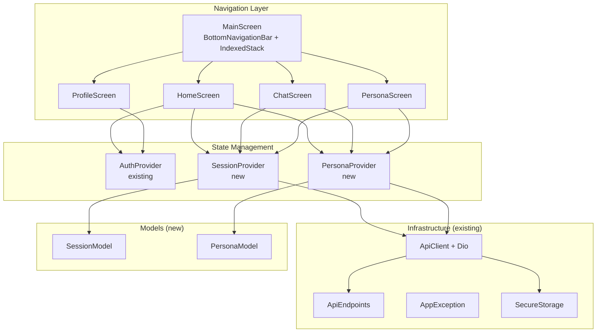
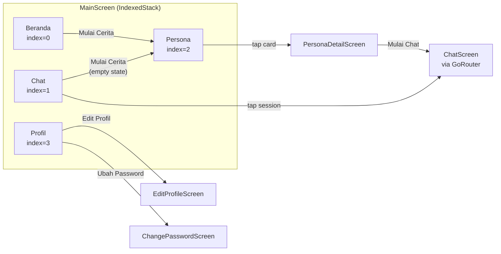

# Design Document: Tahap 4 — Main Navigation & Profile

## Overview

Tahap 4 membangun shell navigasi utama aplikasi SiniCerita setelah login berhasil. Fitur ini menggantikan placeholder `MainScreen` dengan arsitektur navigasi berbasis `BottomNavigationBar` yang menampung 4 tab utama: Beranda (dashboard), Chat (session list), Persona (grid list), dan Profil (user info + edit).

Desain ini mencakup:
- **Navigation Shell**: `IndexedStack` + `BottomNavigationBar` untuk state preservation antar tab
- **Session Provider**: ChangeNotifier untuk CRUD sesi chat (fetch, create, delete)
- **Persona Provider**: ChangeNotifier untuk list persona, detail, dan rating (optimistic update)
- **Home Dashboard**: Greeting time-based, score card, session summary, quick action, daily tips
- **Chat Tab**: TabBar aktif/selesai, swipe-to-delete, empty states
- **Persona Tab**: Grid 2 kolom, infinite scroll pagination, detail screen dengan voting
- **Profile**: Display, edit (multipart), change password, logout

### Design Decisions

1. **IndexedStack untuk tab preservation**: Mempertahankan state (scroll position, loaded data) saat berpindah tab tanpa rebuild widget.
2. **Provider per domain**: `SessionProvider` dan `PersonaProvider` terpisah dari `AuthProvider` — sesuai konvensi satu ChangeNotifier per domain.
3. **Optimistic update untuk rating**: Update UI lokal dulu, revert jika API gagal — memberikan UX responsif.
4. **Pagination cursor-based**: `page` + `limit` query params, tracking `totalPages` dari meta response.
5. **Daily tip dari array lokal**: Tidak perlu API call — gunakan date modulo array length sebagai index.

## Architecture



### Navigation Flow



## Components and Interfaces

### 1. MainScreen (Navigation Shell)

```dart
/// Widget utama setelah login — menampung BottomNavigationBar + IndexedStack.
/// Menggantikan placeholder MainScreen dari tahap sebelumnya.
class MainScreen extends StatefulWidget {
  const MainScreen({super.key});
}

class _MainScreenState extends State<MainScreen> {
  int _currentIndex = 0; // Default: Beranda

  // Expose method untuk child widgets (via callback atau findAncestorState)
  void switchTab(int index);
}
```

**BottomNavigationBar items:**
| Index | Label | Icon |
|-------|-------|------|
| 0 | Beranda | `Icons.home` |
| 1 | Chat | `Icons.chat_bubble` |
| 2 | Persona | `Icons.people` |
| 3 | Profil | `Icons.person` |

### 2. SessionProvider

```dart
class SessionProvider extends ChangeNotifier {
  final ApiClient _apiClient;

  // State
  List<SessionModel> _activeSessions = [];
  List<SessionModel> _completedSessions = [];
  bool _isLoading = false;
  String? _errorMessage;
  int _activeCurrentPage = 1;
  int _activeTotalPages = 1;
  int _completedCurrentPage = 1;
  int _completedTotalPages = 1;

  // Getters
  List<SessionModel> get activeSessions;
  List<SessionModel> get completedSessions;
  bool get isLoading;
  String? get errorMessage;
  bool get hasMoreActive;
  bool get hasMoreCompleted;

  // Methods
  Future<void> fetchSessions({required String status, int page = 1, int limit = 10});
  Future<SessionModel?> createSession(String personaId);
  Future<bool> deleteSession(String sessionId);
  void clearError();
}
```

### 3. PersonaProvider

```dart
class PersonaProvider extends ChangeNotifier {
  final ApiClient _apiClient;

  // State
  List<PersonaModel> _personas = [];
  PersonaModel? _selectedPersona;
  bool _isLoading = false;
  bool _isLoadingDetail = false;
  String? _errorMessage;
  int _currentPage = 1;
  int _totalPages = 1;
  String? _currentUserRating; // 'UP', 'DOWN', or null (NONE)

  // Getters
  List<PersonaModel> get personas;
  PersonaModel? get selectedPersona;
  bool get isLoading;
  bool get isLoadingDetail;
  String? get errorMessage;
  bool get hasMorePages;
  String? get currentUserRating;

  // Methods
  Future<void> fetchPersonas({int page = 1, int limit = 10});
  Future<void> fetchNextPage();
  Future<void> refreshPersonas();
  Future<void> fetchPersonaDetail(String id);
  Future<bool> ratePersona(String id, String type); // 'UP', 'DOWN', 'NONE'
  PersonaModel? getById(String id); // Resolve persona name for session list
  void clearError();
}
```

### 4. Screen Components

| Screen | File Path | Key Responsibilities |
|--------|-----------|---------------------|
| `MainScreen` | `lib/screens/main/main_screen.dart` | Navigation shell, IndexedStack, tab switching |
| `HomeScreen` | `lib/screens/home/home_screen.dart` | Greeting, score card, summary cards, quick action, daily tip |
| `ChatScreen` | `lib/screens/chat/chat_list_screen.dart` | TabBar aktif/selesai, session list, swipe delete, empty state |
| `PersonaScreen` | `lib/screens/persona/persona_list_screen.dart` | Grid 2-col, infinite scroll, pull-to-refresh |
| `PersonaDetailScreen` | `lib/screens/persona/persona_detail_screen.dart` | Detail, voting, start chat |
| `ProfileScreen` | `lib/screens/profile/profile_screen.dart` | Display info, menu items |
| `EditProfileScreen` | `lib/screens/profile/edit_profile_screen.dart` | Form name + image picker |
| `ChangePasswordScreen` | `lib/screens/profile/change_password_screen.dart` | 3 password fields, validation |

### 5. Widget Components

| Widget | File Path | Purpose |
|--------|-----------|---------|
| `ScoreCardWidget` | `lib/widgets/common/score_card_widget.dart` | Circular progress + points + status text |
| `SessionListTile` | `lib/widgets/chat/session_list_tile.dart` | Session item with persona name, preview, time |
| `PersonaGridCard` | `lib/widgets/persona/persona_grid_card.dart` | Avatar, name, description, vote counts |
| `ShimmerPlaceholder` | `lib/widgets/common/shimmer_placeholder.dart` | Reusable shimmer skeleton shapes |

## Data Models

### SessionModel

```dart
class SessionModel extends Equatable {
  final String id;
  final String userId;
  final String personaId;
  final String status; // 'active' | 'completed'
  final int? scoreDelta;
  final String? analysisSummary;
  final DateTime createdAt;
  final DateTime updatedAt;
  final DateTime? completedAt;

  const SessionModel({
    required this.id,
    required this.userId,
    required this.personaId,
    required this.status,
    this.scoreDelta,
    this.analysisSummary,
    required this.createdAt,
    required this.updatedAt,
    this.completedAt,
  });

  factory SessionModel.fromJson(Map<String, dynamic> json) {
    return SessionModel(
      id: json['id'] as String,
      userId: json['userId'] as String,
      personaId: json['personaId'] as String,
      status: json['status'] as String,
      scoreDelta: json['scoreDelta'] as int?,
      analysisSummary: json['analysisSummary'] as String?,
      createdAt: DateTime.parse(json['createdAt'] as String),
      updatedAt: DateTime.parse(json['updatedAt'] as String),
      completedAt: json['completedAt'] != null
          ? DateTime.parse(json['completedAt'] as String)
          : null,
    );
  }

  @override
  List<Object?> get props => [id, userId, personaId, status, scoreDelta, analysisSummary, createdAt, updatedAt, completedAt];
}
```

### PersonaModel

```dart
class PersonaModel extends Equatable {
  final String id;
  final String name;
  final String description;
  final String? systemPrompt;
  final String? avatarUrl;
  final bool isActive;
  final int upvotes;
  final int downvotes;
  final String? userRating; // 'UP', 'DOWN', or null (from detail endpoint)

  const PersonaModel({
    required this.id,
    required this.name,
    required this.description,
    this.systemPrompt,
    this.avatarUrl,
    required this.isActive,
    required this.upvotes,
    required this.downvotes,
    this.userRating,
  });

  factory PersonaModel.fromJson(Map<String, dynamic> json) {
    return PersonaModel(
      id: json['id'] as String,
      name: json['name'] as String,
      description: json['description'] as String,
      systemPrompt: json['systemPrompt'] as String?,
      avatarUrl: json['avatarUrl'] as String?,
      isActive: json['isActive'] as bool,
      upvotes: json['upvotes'] as int,
      downvotes: json['downvotes'] as int,
      userRating: json['userRating'] as String?,
    );
  }

  /// Create a copy with updated vote counts (for optimistic update)
  PersonaModel copyWith({
    int? upvotes,
    int? downvotes,
    String? userRating,
  }) {
    return PersonaModel(
      id: id,
      name: name,
      description: description,
      systemPrompt: systemPrompt,
      avatarUrl: avatarUrl,
      isActive: isActive,
      upvotes: upvotes ?? this.upvotes,
      downvotes: downvotes ?? this.downvotes,
      userRating: userRating,
    );
  }

  @override
  List<Object?> get props => [id, name, description, systemPrompt, avatarUrl, isActive, upvotes, downvotes, userRating];
}
```

### Greeting Logic (Pure Function)

```dart
/// Returns time-based greeting string.
/// Extracted as pure function for testability.
String getGreeting(int hour, String? userName) {
  final String timeGreeting;
  if (hour >= 0 && hour < 11) {
    timeGreeting = 'Selamat pagi';
  } else if (hour >= 11 && hour < 15) {
    timeGreeting = 'Selamat siang';
  } else if (hour >= 15 && hour < 18) {
    timeGreeting = 'Selamat sore';
  } else {
    timeGreeting = 'Selamat malam';
  }

  if (userName == null || userName.isEmpty) {
    return timeGreeting;
  }

  final displayName = userName.length > 30
      ? '${userName.substring(0, 30)}...'
      : userName;
  return '$timeGreeting, $displayName';
}
```

### Daily Tip Logic (Pure Function)

```dart
/// Returns daily tip index based on date.
/// Same tip shown all day, different tip each day.
int getDailyTipIndex(DateTime date, int tipsCount) {
  // Use day-of-year as seed for consistent daily rotation
  final dayOfYear = date.difference(DateTime(date.year, 1, 1)).inDays;
  return dayOfYear % tipsCount;
}
```

### Score Status Logic (Pure Function)

```dart
/// Returns status text and color category based on points.
({String text, String colorCategory}) getScoreStatus(int points) {
  if (points <= 39) {
    return (text: 'Kamu butuh perhatian lebih, yuk cerita', colorCategory: 'red');
  } else if (points <= 69) {
    return (text: 'Keadaanmu cukup stabil, tetap semangat', colorCategory: 'yellow');
  } else {
    return (text: 'Keadaanmu baik, pertahankan ya!', colorCategory: 'green');
  }
}
```

### Relative Time Formatting (Pure Function)

```dart
/// Formats a DateTime as relative time string in Bahasa Indonesia.
/// Returns "X menit lalu", "X jam lalu", or formatted date if > 24h.
String formatRelativeTime(DateTime dateTime, DateTime now) {
  final diff = now.difference(dateTime);

  if (diff.inMinutes < 1) return 'Baru saja';
  if (diff.inMinutes < 60) return '${diff.inMinutes} menit lalu';
  if (diff.inHours < 24) return '${diff.inHours} jam lalu';

  // Older than 24h: show date
  return DateFormat('dd MMM yyyy', 'id').format(dateTime);
}
```

## Correctness Properties

*A property is a characteristic or behavior that should hold true across all valid executions of a system — essentially, a formal statement about what the system should do. Properties serve as the bridge between human-readable specifications and machine-verifiable correctness guarantees.*

### Property 1: Greeting function produces correct time-based greeting with proper name handling

*For any* hour value (0–23) and any user name (including null, empty string, or strings of arbitrary length), the `getGreeting` function SHALL return a string that:
- Starts with "Selamat pagi" if hour is 0–10
- Starts with "Selamat siang" if hour is 11–14
- Starts with "Selamat sore" if hour is 15–17
- Starts with "Selamat malam" if hour is 18–23
- Contains no name suffix if name is null or empty
- Truncates the name to 30 characters followed by "..." if name length exceeds 30

**Validates: Requirements 2.1, 2.2, 2.3, 2.4, 2.5, 2.7**

### Property 2: Score status mapping returns correct text and color category for all point values

*For any* integer points value in the range [0, 100], the `getScoreStatus` function SHALL return:
- text "Kamu butuh perhatian lebih, yuk cerita" and colorCategory "red" if points is 0–39
- text "Keadaanmu cukup stabil, tetap semangat" and colorCategory "yellow" if points is 40–69
- text "Keadaanmu baik, pertahankan ya!" and colorCategory "green" if points is 70–100

And the progress value SHALL equal points / 100.

**Validates: Requirements 3.2, 3.3, 3.4, 3.5**

### Property 3: Daily tip index is deterministic and bounded

*For any* date and any tips array length > 0, the `getDailyTipIndex` function SHALL:
- Return the same index for the same date (deterministic)
- Return an index in the range [0, tipsCount)
- Return a different index for consecutive days (when tipsCount > 1)

**Validates: Requirements 5.4**

### Property 4: Session lists are correctly ordered by their respective timestamp fields

*For any* list of active sessions, sorting by `updatedAt` descending SHALL produce a list where each session's `updatedAt` is greater than or equal to the next session's `updatedAt`. *For any* list of completed sessions, sorting by `completedAt` descending SHALL produce a list where each session's `completedAt` is greater than or equal to the next session's `completedAt`.

**Validates: Requirements 6.2, 6.3**

### Property 5: Pagination hasMorePages is correctly computed from page metadata

*For any* currentPage and totalPages values (both positive integers), `hasMorePages` SHALL be true if and only if currentPage < totalPages.

**Validates: Requirements 9.5, 16.2**

### Property 6: Vote state machine produces correct count transitions

*For any* persona with initial state (upvotes, downvotes, currentRating) and any vote action (UP, DOWN, NONE), the optimistic update SHALL:
- If currentRating is NONE and action is UP: increment upvotes by 1, set rating to UP
- If currentRating is NONE and action is DOWN: increment downvotes by 1, set rating to DOWN
- If currentRating is UP and action is DOWN: decrement upvotes by 1, increment downvotes by 1, set rating to DOWN
- If currentRating is DOWN and action is UP: decrement downvotes by 1, increment upvotes by 1, set rating to UP
- If currentRating is UP and action is UP (toggle off): decrement upvotes by 1, set rating to NONE
- If currentRating is DOWN and action is DOWN (toggle off): decrement downvotes by 1, set rating to NONE
- If currentRating equals action: send NONE to API (toggle off behavior)

**Validates: Requirements 10.6, 10.7, 17.3**

### Property 7: Failed vote reverts optimistic update to previous state

*For any* persona with initial state (upvotes, downvotes, currentRating), if an optimistic vote update is applied and the API call subsequently fails, the persona state SHALL be reverted to exactly the original (upvotes, downvotes, currentRating) values.

**Validates: Requirements 10.8, 17.4**

### Property 8: Session count per persona is correctly computed by filtering

*For any* list of sessions and any target personaId, the session count for that persona SHALL equal the number of sessions in the list whose `personaId` field matches the target.

**Validates: Requirements 10.9**

### Property 9: Session CRUD maintains list invariants

*For any* active sessions list:
- After a successful `createSession`, the active sessions list SHALL contain the newly created session
- After a successful `deleteSession`, the active sessions list SHALL NOT contain the deleted session
- The length of the list SHALL change by exactly +1 after create and -1 after delete

**Validates: Requirements 16.3, 16.4**

### Property 10: Session deletion optimistic revert restores original list on failure

*For any* active sessions list and any session within that list, if the session is optimistically removed and the DELETE API call fails, the active sessions list SHALL be restored to its exact original state (same items, same order).

**Validates: Requirements 7.4**

### Property 11: Image file validation correctly accepts/rejects based on size and format

*For any* file with a given size (in bytes) and format (extension/MIME type), the image validation function SHALL:
- Accept files that are JPEG or PNG AND size ≤ 5 MB
- Reject files that are not JPEG or PNG regardless of size
- Reject files that exceed 5 MB regardless of format

**Validates: Requirements 13.3**

### Property 12: Name validation rejects empty and whitespace-only strings

*For any* string composed entirely of whitespace characters (spaces, tabs, newlines) or the empty string, the name validation function SHALL return an error. *For any* non-empty string that contains at least one non-whitespace character and is at most 50 characters, the validation SHALL pass.

**Validates: Requirements 13.8**

### Property 13: Password validation enforces all rules correctly

*For any* combination of (oldPassword, newPassword, confirmPassword):
- Validation SHALL fail if oldPassword is empty
- Validation SHALL fail if newPassword length is less than 8 or greater than 128
- Validation SHALL fail if confirmPassword does not equal newPassword
- Validation SHALL pass only when all three conditions are satisfied simultaneously

**Validates: Requirements 14.2**

## Error Handling

### Strategy

All error handling follows the established project pattern:

1. **Provider layer**: Catch `DioException` → convert via `AppException.fromDioError()` → expose `errorMessage`
2. **UI layer**: Read `errorMessage` from provider → display in red `SnackBar` with exact backend message
3. **Loading state**: `isLoading` flag prevents double-submission and shows shimmer/disabled buttons

### Error Scenarios by Domain

| Domain | Error Source | Handling |
|--------|-------------|----------|
| Session fetch | Network/server error | Show SnackBar, retain previous data, display zero counts on home |
| Session create | 400 "Persona tidak aktif" / 404 "Persona tidak ditemukan" | Show SnackBar, re-enable button |
| Session delete | 400 "Sesi yang sudah selesai..." | Show SnackBar, restore session to list (optimistic revert) |
| Persona fetch | Network/server error | Show SnackBar, retain previous data |
| Persona rate | Network/server error | Show SnackBar, revert optimistic update |
| Profile update | Network/server error | Show SnackBar, re-enable form |
| Password change | 401 "Password lama salah" | Show SnackBar with exact message |
| Logout | Network error | Ignore error, still clear tokens and navigate to login |

### Optimistic Update Pattern

```dart
// 1. Save previous state
final previousState = _currentState;

// 2. Apply optimistic update
_currentState = newState;
notifyListeners();

// 3. Call API
try {
  await _apiClient.dio.post(...);
} on DioException catch (e) {
  // 4. Revert on failure
  _currentState = previousState;
  _errorMessage = AppException.fromDioError(e).message;
  notifyListeners();
}
```

## Testing Strategy

### Unit Tests (Provider Logic)

| Test Target | What to Verify |
|-------------|---------------|
| `SessionProvider.fetchSessions` | Correct API call, response parsing, pagination tracking |
| `SessionProvider.createSession` | Adds to active list, correct request body |
| `SessionProvider.deleteSession` | Optimistic removal, revert on failure |
| `PersonaProvider.fetchPersonas` | Pagination, correct parsing from `response.data['data']` |
| `PersonaProvider.ratePersona` | Optimistic update logic, revert on failure |
| `getGreeting()` | All time ranges, null/empty name, truncation |
| `getScoreStatus()` | All point ranges, correct text and color |
| `getDailyTipIndex()` | Determinism, bounds, daily rotation |
| `formatRelativeTime()` | Minutes, hours, date fallback |

### Property-Based Tests

**Library**: `dart_quickcheck` or custom property test harness using `dart:math` Random with 100+ iterations per property.

**Configuration**:
- Minimum 100 iterations per property
- Each test tagged with: `Feature: tahap-4-main-navigation-profile, Property {N}: {title}`

| Property | Generator Strategy |
|----------|-------------------|
| P1: Greeting | Random hour (0-23), random nullable string (0-100 chars) |
| P2: Score status | Random int (0-100) |
| P3: Daily tip | Random DateTime, random array length (1-30) |
| P4: Session ordering | Random list of SessionModel with random timestamps |
| P5: Pagination | Random positive int pairs (page, totalPages) |
| P6: Vote transitions | Random (upvotes, downvotes, currentRating, action) tuples |
| P7: Vote revert | Same as P6 + simulated failure |
| P8: Session count | Random session list + random personaId |
| P9: CRUD invariants | Random session list + create/delete operations |
| P10: Delete revert | Random session list + simulated failure |
| P11: Image validation | Random file size (0-20MB), random format enum |
| P12: Name validation | Random whitespace strings, random valid strings |
| P13: Password validation | Random string triples with varying lengths |

### Widget Tests

- MainScreen tab switching and state preservation
- HomeScreen greeting display, score card, summary cards
- ChatScreen TabBar, session list rendering, empty states, swipe-to-delete
- PersonaScreen grid layout, pagination scroll
- PersonaDetailScreen voting UI, start chat button
- ProfileScreen display, menu navigation
- EditProfileScreen form validation, image picker
- ChangePasswordScreen form validation

### Integration Tests

- Full navigation flow: login → main → switch tabs → persona detail → start chat
- Pull-to-refresh data reload across all list screens
- Logout flow with token clearing and redirect

