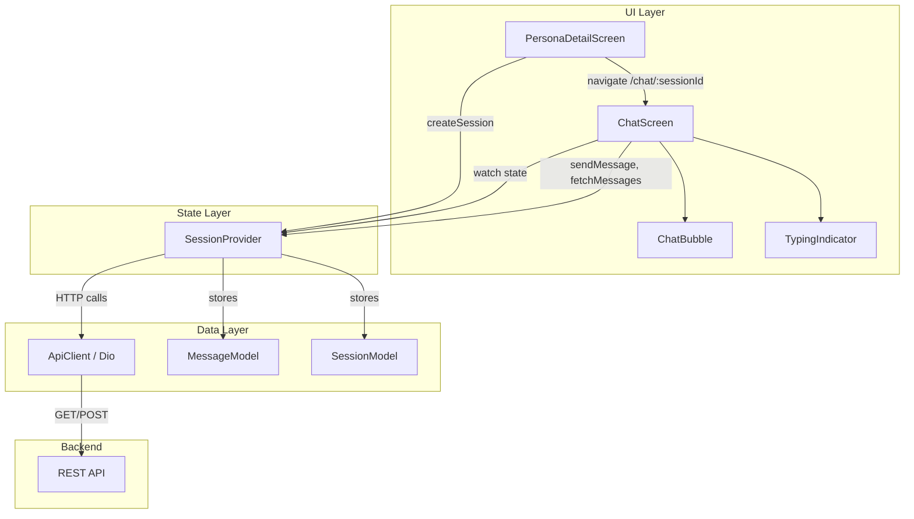
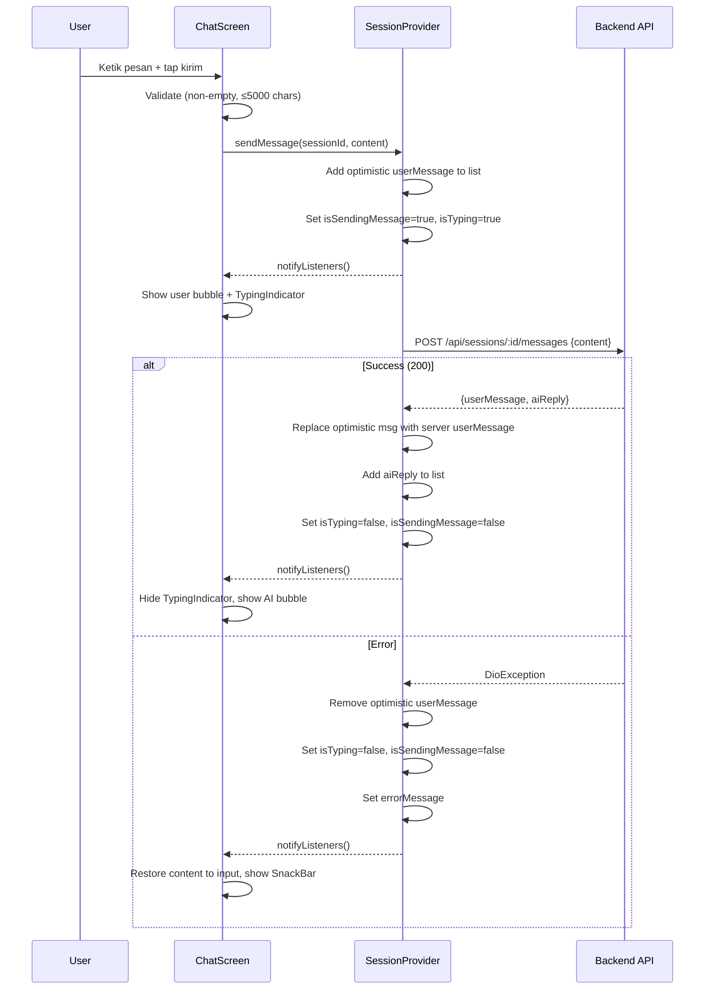
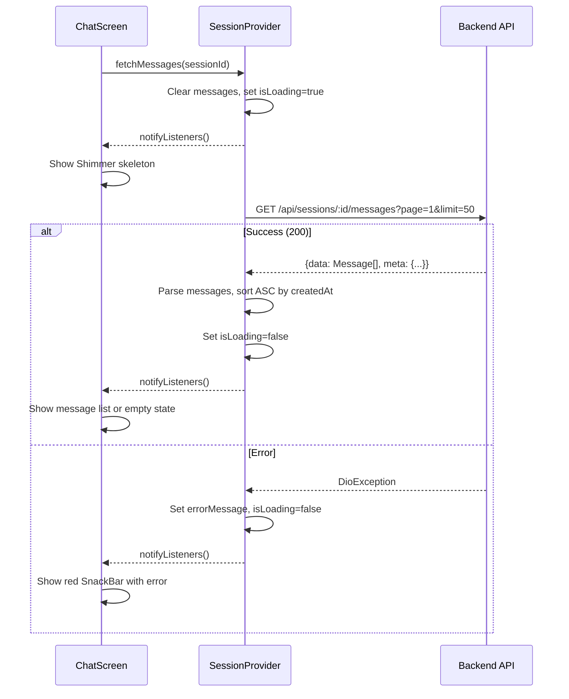
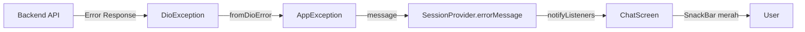

# Design Document: Tahap 6 — Chat Room

## Overview

Tahap 6 mengimplementasikan fitur inti chat room pada aplikasi SiniCerita. Fitur ini memungkinkan pengguna melakukan percakapan real-time dengan persona AI melalui antarmuka chat yang intuitif. Implementasi mencakup:

- **MessageModel** — Data class immutable untuk merepresentasikan pesan
- **SessionProvider extension** — Penambahan state management untuk pesan dan typing indicator
- **ChatScreen** — Full-page widget dengan bubble layout, input field, dan auto-scroll
- **ChatBubble & TypingIndicator** — Reusable widget untuk tampilan pesan dan animasi loading

Arsitektur mengikuti pola Provider yang sudah established di project: widget tidak memanggil API langsung, semua komunikasi melalui SessionProvider, dan error handling menggunakan pipeline DioException → AppException → errorMessage.

## Architecture

### Component Relationship Diagram



### Data Flow: Send Message



### Data Flow: Fetch Messages



## Components and Interfaces

### 1. MessageModel (`lib/models/message_model.dart`)

```dart
class MessageModel extends Equatable {
  final String id;
  final String sessionId;
  final String role;       // 'user' | 'model'
  final String content;
  final DateTime createdAt;

  // Convenience getters
  bool get isUser => role == 'user';
  bool get isModel => role == 'model';

  factory MessageModel.fromJson(Map<String, dynamic> json);
}
```

### 2. SessionProvider Extension (new fields & methods)

```dart
// New state fields
List<MessageModel> _messages = [];
bool _isTyping = false;
bool _isSendingMessage = false;
String? _currentChatSessionId;

// New getters
List<MessageModel> get messages;
bool get isTyping;
bool get isSendingMessage;

// New methods
Future<void> fetchMessages(String sessionId);
Future<bool> sendMessage(String sessionId, String content);
void clearChatState();
```

### 3. ChatScreen (`lib/screens/chat/chat_screen.dart`)

StatefulWidget yang menerima `sessionId` via constructor. Menggunakan:
- `ScrollController` untuk auto-scroll ke pesan terbaru
- `TextEditingController` untuk input field
- `context.watch<SessionProvider>()` untuk reactive rebuild

### 4. ChatBubble (`lib/widgets/chat/chat_bubble.dart`)

Stateless widget yang menerima:
- `message` (MessageModel) — konten dan metadata pesan
- `isUser` (bool) — menentukan alignment dan warna

### 5. TypingIndicator (`lib/widgets/chat/typing_indicator.dart`)

Stateful widget dengan animasi tiga titik berkedip yang menunjukkan AI sedang memproses respons.

## Data Models

### MessageModel

| Field | Type | Source | Description |
|-------|------|--------|-------------|
| id | String | `json['id']` | UUID dari backend |
| sessionId | String | `json['sessionId']` | UUID sesi terkait |
| role | String | `json['role']` | `'user'` atau `'model'` |
| content | String | `json['content']` | Isi pesan (min 1 char) |
| createdAt | DateTime | `json['createdAt']` | ISO 8601 → DateTime.parse |

**Equatable props**: `[id, sessionId, role, content, createdAt]`

**Constraints**:
- `role` hanya boleh bernilai `'user'` atau `'model'` (BUKAN `'assistant'`)
- `content` minimal 1 karakter
- `createdAt` dalam format ISO 8601 string dari backend

### SessionProvider Extended State

| Field | Type | Default | Description |
|-------|------|---------|-------------|
| _messages | `List<MessageModel>` | `[]` | Daftar pesan sesi aktif |
| _isTyping | `bool` | `false` | True saat menunggu AI reply |
| _isSendingMessage | `bool` | `false` | True saat proses kirim |
| _currentChatSessionId | `String?` | `null` | Session ID yang sedang ditampilkan |

### API Response Shapes

**POST /api/sessions/:id/messages** (status 200):
```json
{
  "success": true,
  "message": "...",
  "data": {
    "userMessage": {
      "id": "uuid",
      "sessionId": "uuid",
      "role": "user",
      "content": "...",
      "createdAt": "2024-01-15T10:30:00.000Z"
    },
    "aiReply": {
      "id": "uuid",
      "sessionId": "uuid",
      "role": "model",
      "content": "...",
      "createdAt": "2024-01-15T10:30:01.000Z"
    }
  }
}
```

**GET /api/sessions/:id/messages** (status 200):
```json
{
  "success": true,
  "message": "...",
  "data": [
    { "id": "...", "sessionId": "...", "role": "user", "content": "...", "createdAt": "..." },
    { "id": "...", "sessionId": "...", "role": "model", "content": "...", "createdAt": "..." }
  ],
  "meta": { "total": 10, "page": 1, "limit": 50, "totalPages": 1 }
}
```

## Correctness Properties

*A property is a characteristic or behavior that should hold true across all valid executions of a system — essentially, a formal statement about what the system should do. Properties serve as the bridge between human-readable specifications and machine-verifiable correctness guarantees.*

### Property 1: MessageModel serialization round-trip

*For any* valid MessageModel instance, converting it to a JSON-compatible Map and then constructing a new instance via `MessageModel.fromJson` should produce an object that is equal to the original.

**Validates: Requirements 1.1, 1.2, 1.5, 9.4**

### Property 2: Role getter mutual exclusivity

*For any* MessageModel with role being either 'user' or 'model', the getters `isUser` and `isModel` shall be mutually exclusive — exactly one returns true and the other returns false, corresponding to the role field value.

**Validates: Requirements 1.3, 1.4**

### Property 3: Missing field rejection

*For any* valid message JSON Map with one or more required fields removed (id, sessionId, role, content, or createdAt), calling `MessageModel.fromJson` shall throw an exception.

**Validates: Requirements 1.6**

### Property 4: Fetch messages produces sorted list

*For any* list of messages returned by the backend API (in any order), after `fetchMessages` completes successfully, the provider's messages list shall be sorted in ascending order by `createdAt`.

**Validates: Requirements 2.4, 3.3**

### Property 5: Send message adds both messages on success

*For any* valid message content and successful API response containing `userMessage` and `aiReply`, after `sendMessage` completes, the provider's messages list shall contain both the parsed userMessage and aiReply as MessageModel instances.

**Validates: Requirements 2.5, 2.7, 9.3**

### Property 6: Error state consistency after failed send

*For any* DioException thrown during `sendMessage`, the provider shall end in a consistent state: `isTyping` is false, `isSendingMessage` is false, `errorMessage` is non-null, and the optimistic user message is removed from the messages list.

**Validates: Requirements 2.8, 4.9**

### Property 7: Error state consistency after failed fetch

*For any* DioException thrown during `fetchMessages`, the provider shall end in a consistent state: `isLoading` is false and `errorMessage` is non-null.

**Validates: Requirements 2.9, 3.5**

### Property 8: Input validation controls send button state

*For any* input string, the send button shall be enabled if and only if the trimmed content has length between 1 and 5000 characters (inclusive). Strings that are empty, whitespace-only, or exceed 5000 characters after trim shall result in a disabled send button.

**Validates: Requirements 8.1, 8.2, 8.4**

### Property 9: Content is trimmed before sending

*For any* input string with leading or trailing whitespace, the content passed to `sendMessage` on the provider shall be the trimmed version of the input (no leading/trailing whitespace).

**Validates: Requirements 8.3**

### Property 10: GET messages response parsing extracts data and meta correctly

*For any* valid paginated response envelope from GET /api/sessions/:id/messages, the provider shall correctly extract the message list from `response.data['data']` and pagination metadata from `response.data['meta']`.

**Validates: Requirements 9.2**

### Property 11: Invalid response data throws AppException

*For any* API response where `response.data['data']` is null or not the expected type (Map for POST, List for GET), the provider shall throw an AppException with a descriptive error message.

**Validates: Requirements 9.5**

## Error Handling

### Error Flow Architecture



### Error Scenarios

| Scenario | HTTP Status | Backend Message | UI Action |
|----------|-------------|-----------------|-----------|
| Sesi sudah selesai | 400 | "Sesi sudah selesai" | SnackBar merah, hapus pesan optimistik |
| Akses ditolak | 403 | "Akses ditolak: sesi bukan milik Anda" | SnackBar merah, hapus pesan optimistik, navigate back |
| Session not found | 404 | "Sesi tidak ditemukan" | SnackBar merah, navigate back |
| Network timeout | - | "Koneksi timeout. Periksa jaringan Anda." | SnackBar merah, restore input |
| Connection error | - | "Tidak dapat terhubung ke server." | SnackBar merah, restore input |
| Server error | 500 | "Terjadi kesalahan pada server." | SnackBar merah, restore input |
| Invalid response format | - | "Format response tidak valid" | SnackBar merah |

### Optimistic Update Rollback Strategy

Saat `sendMessage` gagal:
1. Pesan pengguna yang sudah ditampilkan secara optimistik dihapus dari `_messages`
2. Content pesan dikembalikan ke text field input (via callback/return value)
3. `isTyping` dan `isSendingMessage` di-reset ke false
4. `errorMessage` di-set untuk ditampilkan di SnackBar

Khusus untuk error "Sesi sudah selesai" dan "Akses ditolak":
- Pesan optimistik tetap dihapus
- Content TIDAK dikembalikan ke input (karena sesi memang tidak bisa digunakan lagi)

### Provider Error State Management

```dart
// Pattern: setiap method async di provider
Future<void> someMethod() async {
  _isLoading = true;
  _errorMessage = null;
  notifyListeners();

  try {
    // API call...
    _isLoading = false;
    notifyListeners();
  } on DioException catch (e) {
    final ex = AppException.fromDioError(e);
    _errorMessage = ex.message;
    _isLoading = false;
    notifyListeners();
  } catch (e) {
    _errorMessage = 'Terjadi kesalahan: $e';
    _isLoading = false;
    notifyListeners();
  }
}
```

## Testing Strategy

### Unit Tests (Example-Based)

Unit tests fokus pada skenario spesifik dan edge cases:

1. **MessageModel**
   - fromJson dengan data valid menghasilkan instance yang benar
   - fromJson dengan field null/missing melempar exception
   - isUser/isModel getter untuk role 'user' dan 'model'

2. **SessionProvider — Initial State**
   - messages awal kosong
   - isTyping awal false
   - isSendingMessage awal false

3. **SessionProvider — fetchMessages**
   - Berhasil: messages terisi, isLoading false
   - Gagal: errorMessage terisi, isLoading false
   - Empty response: messages kosong, tidak error

4. **SessionProvider — sendMessage**
   - Berhasil: userMessage + aiReply ditambahkan
   - Gagal network: optimistic message dihapus, error state
   - Gagal "Sesi sudah selesai": optimistic message dihapus
   - Gagal "Akses ditolak": optimistic message dihapus

5. **ChatScreen Widget Tests**
   - Shimmer ditampilkan saat loading
   - Empty state saat messages kosong
   - User bubble di kanan, AI bubble di kiri
   - Tombol kirim disabled saat input kosong
   - Tombol kirim disabled saat isSendingMessage true
   - TypingIndicator muncul saat isTyping true
   - SnackBar merah saat ada error

### Property-Based Tests

Property-based tests menggunakan library `dart_quickcheck` atau `glados` untuk Dart, dengan minimum **100 iterasi** per property.

| Property | Test Description | Tag |
|----------|-----------------|-----|
| 1 | MessageModel round-trip serialization | Feature: tahap-6-chat-room, Property 1: MessageModel serialization round-trip |
| 2 | Role getter mutual exclusivity | Feature: tahap-6-chat-room, Property 2: Role getter mutual exclusivity |
| 3 | Missing field rejection | Feature: tahap-6-chat-room, Property 3: Missing field rejection |
| 4 | Fetch produces sorted messages | Feature: tahap-6-chat-room, Property 4: Fetch messages produces sorted list |
| 5 | Send adds both messages | Feature: tahap-6-chat-room, Property 5: Send message adds both messages on success |
| 6 | Error state after failed send | Feature: tahap-6-chat-room, Property 6: Error state consistency after failed send |
| 7 | Error state after failed fetch | Feature: tahap-6-chat-room, Property 7: Error state consistency after failed fetch |
| 8 | Input validation controls button | Feature: tahap-6-chat-room, Property 8: Input validation controls send button state |
| 9 | Content trimmed before send | Feature: tahap-6-chat-room, Property 9: Content is trimmed before sending |
| 10 | GET response parsing | Feature: tahap-6-chat-room, Property 10: GET messages response parsing |
| 11 | Invalid response throws | Feature: tahap-6-chat-room, Property 11: Invalid response data throws AppException |

### PBT Library Choice

Untuk Dart/Flutter, gunakan package **`glados`** (property-based testing library untuk Dart) yang menyediakan:
- Arbitrary generators untuk tipe primitif dan custom
- Shrinking untuk menemukan minimal failing case
- Konfigurasi jumlah iterasi

```dart
// Contoh penggunaan glados
import 'package:glados/glados.dart';

Glados<String>(any.nonEmptyString).test(
  'MessageModel round-trip',
  (content) {
    final model = MessageModel(
      id: 'test-id',
      sessionId: 'test-session',
      role: 'user',
      content: content,
      createdAt: DateTime.now(),
    );
    final json = model.toJson();
    final restored = MessageModel.fromJson(json);
    expect(restored, equals(model));
  },
);
```

### Integration Tests

Integration tests untuk verifikasi end-to-end flow:
- Navigasi dari PersonaDetailScreen ke ChatScreen
- Full send-receive cycle dengan mock backend
- Error recovery flow (network error → restore input)

