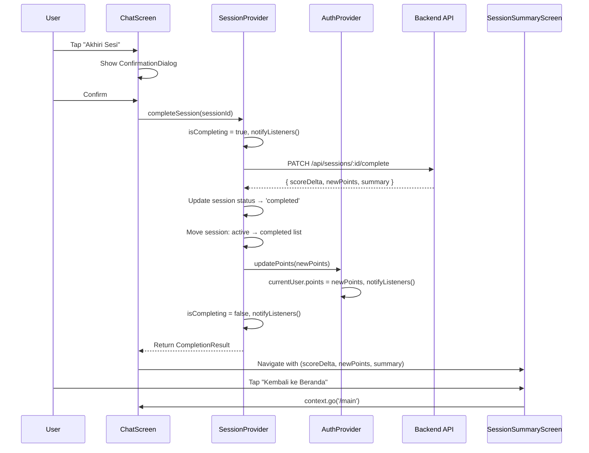
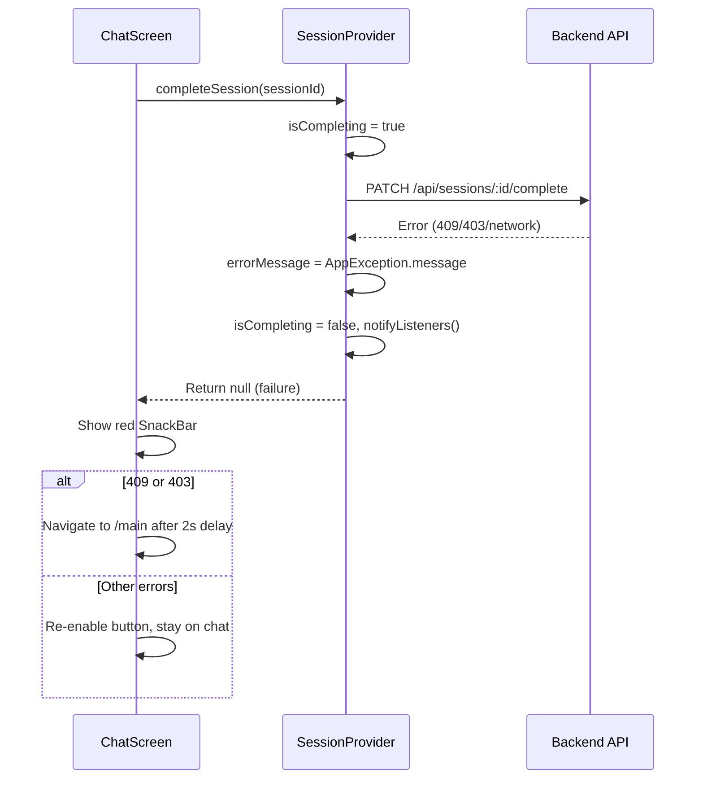

# Design Document: Tahap 7 — Session Completion

## Overview

Fitur session completion memungkinkan user mengakhiri sesi chat aktif, memicu analisis AI di backend, dan menerima hasil berupa score delta dan ringkasan. Implementasi mencakup:

1. **Tombol "Akhiri Sesi"** di AppBar ChatScreen dengan confirmation dialog
2. **API communication** via `PATCH /api/sessions/:id/complete`
3. **Session Summary Screen** untuk menampilkan hasil analisis
4. **Global state update** — sinkronisasi Health Points ke AuthProvider
5. **Error handling** dengan SnackBar dan navigasi kondisional

Flow utama: User tap "Akhiri Sesi" → Confirmation Dialog → API call → Navigate to Summary Screen → Update global points → User tap "Kembali ke Beranda" → Home.

## Architecture



### Error Flow



## Components and Interfaces

### 1. SessionProvider — `completeSession()` method

Tambahan method di `SessionProvider` yang sudah ada:

```dart
/// Result object dari completion API call.
class CompletionResult {
  final int scoreDelta;
  final int newPoints;
  final int previousPoints;
  final String summary;

  const CompletionResult({
    required this.scoreDelta,
    required this.newPoints,
    required this.previousPoints,
    required this.summary,
  });
}
```

```dart
// Tambahan state di SessionProvider
bool _isCompleting = false;
bool get isCompleting => _isCompleting;

/// Complete session dan return result, atau null jika gagal.
/// 
/// - Set isCompleting = true selama API call
/// - Parse response.data['data'] → { scoreDelta, newPoints, summary }
/// - Hitung previousPoints = newPoints - scoreDelta
/// - Update session di local state (active → completed)
/// - Panggil authProvider.updatePoints(newPoints)
/// - Return CompletionResult jika sukses, null jika gagal
Future<CompletionResult?> completeSession(
  String sessionId,
  AuthProvider authProvider,
) async;
```

**Design Decision**: `completeSession` menerima `AuthProvider` sebagai parameter (bukan inject di constructor) karena SessionProvider sudah di-construct tanpa AuthProvider dependency, dan cross-provider communication hanya terjadi di satu method ini. Alternatif (inject via constructor) akan memerlukan refactor di `main.dart` dan berpotensi circular dependency.

### 2. AuthProvider — `updatePoints()` method

Tambahan method di `AuthProvider` yang sudah ada:

```dart
/// Update points di currentUser model secara sinkron.
/// 
/// Dipanggil oleh SessionProvider setelah session completion berhasil.
/// Membuat UserModel baru dengan points yang diupdate (immutable pattern).
void updatePoints(int newPoints);
```

**Design Decision**: Method ini sinkron (bukan async) karena hanya mengubah local state tanpa API call. Backend sudah meng-update points di sisi server saat `/complete` dipanggil.

### 3. ChatScreen — UI Modifications

Perubahan pada `ChatScreen` yang sudah ada:

- **AppBar**: Tambah `TextButton` "Akhiri Sesi" di `actions` (hanya tampil saat session active)
- **Confirmation Dialog**: `showDialog` dengan `AlertDialog` — title "Akhiri Sesi?", content menjelaskan analisis
- **Loading state**: Saat `isCompleting == true`:
  - Disable tombol "Akhiri Sesi"
  - Disable input field dan send button
  - Show `LoadingOverlay` (semi-transparent overlay + CircularProgressIndicator)
- **Navigation**: Setelah sukses, `context.go('/session-summary', extra: completionResult)`
- **Error handling**: SnackBar merah + navigasi kondisional untuk 409/403

### 4. SessionSummaryScreen — New Screen

```dart
class SessionSummaryScreen extends StatelessWidget {
  final int scoreDelta;
  final int newPoints;
  final String summary;

  const SessionSummaryScreen({
    super.key,
    required this.scoreDelta,
    required this.newPoints,
    required this.summary,
  });
}
```

**Layout:**
- AppBar: "Ringkasan Sesi" (no back button — custom navigation)
- Body (scrollable):
  - Score Delta card: Angka besar dengan warna + prefix
  - Points comparison: previousPoints → newPoints (with arrow)
  - Summary card: Teks analisis AI dalam scrollable container
  - "Kembali ke Beranda" button (full-width, bottom)

**Navigation behavior:**
- `PopScope` dengan `canPop: false` — override back button
- Back gesture/button → `context.go('/main')` (replace entire stack)
- "Kembali ke Beranda" button → `context.go('/main')`

### 5. GoRouter — New Route

```dart
GoRoute(
  path: '/session-summary',
  builder: (_, state) {
    final extra = state.extra as Map<String, dynamic>;
    return SessionSummaryScreen(
      scoreDelta: extra['scoreDelta'] as int,
      newPoints: extra['newPoints'] as int,
      summary: extra['summary'] as String,
    );
  },
),
```

**Design Decision**: Menggunakan `context.go('/session-summary')` (bukan `context.push`) agar navigation stack di-replace. Ini mencegah user kembali ke ChatScreen setelah sesi selesai. Dari summary screen, `context.go('/main')` membawa user ke home.

## Data Models

### CompletionResult (New — value object, bukan model dari backend)

```dart
/// Immutable result dari session completion API.
/// Digunakan untuk passing data dari Provider ke UI.
class CompletionResult {
  final int scoreDelta;    // -20 to +20
  final int newPoints;     // 0 to 100
  final int previousPoints; // Calculated: newPoints - scoreDelta
  final String summary;    // AI analysis text

  const CompletionResult({
    required this.scoreDelta,
    required this.newPoints,
    required this.previousPoints,
    required this.summary,
  });
}
```

### SessionModel — No changes needed

`SessionModel` sudah memiliki field `scoreDelta`, `analysisSummary`, dan `status` yang diperlukan. Method `copyWith` tidak ada di model saat ini (menggunakan Equatable), jadi kita akan membuat instance baru:

```dart
// Membuat completed session dari active session
final completedSession = SessionModel(
  id: session.id,
  userId: session.userId,
  personaId: session.personaId,
  status: 'completed',
  scoreDelta: result.scoreDelta,
  analysisSummary: result.summary,
  createdAt: session.createdAt,
  startedAt: session.startedAt,
  completedAt: DateTime.now(),
);
```

### UserModel — No structural changes

`AuthProvider.updatePoints()` akan membuat `UserModel` baru dengan updated points:

```dart
void updatePoints(int newPoints) {
  if (_currentUser == null) return;
  _currentUser = UserModel(
    id: _currentUser!.id,
    name: _currentUser!.name,
    email: _currentUser!.email,
    role: _currentUser!.role,
    points: newPoints,
    avatarUrl: _currentUser!.avatarUrl,
    createdAt: _currentUser!.createdAt,
  );
  notifyListeners();
}
```

### API Response Shape

```json
// PATCH /api/sessions/:id/complete → 200
{
  "success": true,
  "message": "Sesi berhasil diselesaikan",
  "data": {
    "session": { "id": "...", "status": "completed", ... },
    "scoreDelta": 5,
    "newPoints": 55,
    "summary": "Berdasarkan percakapan Anda..."
  }
}
```

Parsing: `response.data['data']['scoreDelta']`, `response.data['data']['newPoints']`, `response.data['data']['summary']`.

## Correctness Properties

*A property is a characteristic or behavior that should hold true across all valid executions of a system — essentially, a formal statement about what the system should do. Properties serve as the bridge between human-readable specifications and machine-verifiable correctness guarantees.*

### Property 1: previousPoints Calculation

*For any* valid `newPoints` (integer 0–100) and `scoreDelta` (integer -20 to +20), the calculated `previousPoints` SHALL always equal `newPoints - scoreDelta`.

**Validates: Requirements 2.3, 3.3**

### Property 2: isCompleting Lifecycle Invariant

*For any* call to `completeSession()` — regardless of whether the API returns success, error, or network failure — `isCompleting` SHALL be `true` during execution and `false` after completion.

**Validates: Requirements 2.8, 2.9**

### Property 3: Session State Transition on Success

*For any* active session that is successfully completed, the session SHALL be removed from the active sessions list and added to the beginning of the completed sessions list with `status` set to `'completed'`, `scoreDelta` set to the response value, and `analysisSummary` set to the response summary.

**Validates: Requirements 2.4, 4.3**

### Property 4: Global Points Update on Success

*For any* successful session completion returning `newPoints` (integer 0–100), the `AuthProvider.currentUser.points` SHALL be updated to exactly `newPoints` within the same synchronous execution frame.

**Validates: Requirements 4.1, 4.2**

### Property 5: Error Preservation Invariant

*For any* failed session completion (network error or non-2xx status), the session SHALL remain in the active sessions list unchanged, `AuthProvider.currentUser.points` SHALL remain at its previous value, and `errorMessage` SHALL be non-null.

**Validates: Requirements 4.4**

### Property 6: ScoreDelta Display Formatting

*For any* `scoreDelta` value (integer -20 to +20), the display SHALL use green color when `scoreDelta > 0`, red color when `scoreDelta < 0`, grey color when `scoreDelta == 0`, and SHALL prefix with "+" for positive values, no prefix for negative (sign inherent) or zero values.

**Validates: Requirements 3.2, 3.7**

### Property 7: DioException to AppException Mapping

*For any* `DioException` encountered during the completion API call, the `AppException.fromDioError()` factory SHALL produce a non-empty error message string that is then exposed via `SessionProvider.errorMessage`.

**Validates: Requirements 2.7**

## Error Handling

### Error Categories and Behavior

| Status Code | Backend Message | UI Behavior |
|-------------|----------------|-------------|
| 409 | "Sesi sudah selesai" | Red SnackBar → navigate to `/main` after 2s |
| 403 | "Akses ditolak: sesi bukan milik Anda" | Red SnackBar → navigate to `/main` after 2s |
| Network error | AppException message (e.g., "Tidak dapat terhubung ke server.") | Red SnackBar 4s → stay on chat, re-enable button |
| Other (500, etc.) | Backend message or fallback | Red SnackBar 4s → stay on chat, re-enable button |

### Error Flow in Provider

```dart
Future<CompletionResult?> completeSession(...) async {
  _isCompleting = true;
  _errorMessage = null;
  notifyListeners();

  try {
    final response = await _apiClient.dio.patch(
      ApiEndpoints.sessionComplete(sessionId),
    );
    // ... parse and return result
  } on DioException catch (e) {
    final ex = AppException.fromDioError(e);
    _errorMessage = ex.message;
    _isCompleting = false;
    notifyListeners();
    return null;
  } finally {
    // Ensure isCompleting is always reset (belt-and-suspenders)
    if (_isCompleting) {
      _isCompleting = false;
      notifyListeners();
    }
  }
}
```

### Error Flow in ChatScreen

```dart
Future<void> _onCompleteConfirmed() async {
  final result = await context.read<SessionProvider>().completeSession(
    widget.sessionId,
    context.read<AuthProvider>(),
  );
  if (!mounted) return;

  if (result != null) {
    // Success → navigate to summary
    context.go('/session-summary', extra: {
      'scoreDelta': result.scoreDelta,
      'newPoints': result.newPoints,
      'summary': result.summary,
    });
  } else {
    // Error → show SnackBar
    final error = context.read<SessionProvider>().errorMessage;
    _showErrorSnackBar(error);

    // 409 or 403 → navigate home after delay
    if (error == 'Sesi sudah selesai' ||
        error == 'Akses ditolak: sesi bukan milik Anda') {
      Future.delayed(const Duration(seconds: 2), () {
        if (mounted) context.go('/main');
      });
    }
  }
}
```

### Preventing Duplicate Submissions

- `isCompleting` flag disables the "Akhiri Sesi" button
- `LoadingOverlay` widget blocks all user interaction (absorbs pointer events)
- Input field disabled saat `isCompleting == true`

## Testing Strategy

### Unit Tests (Example-Based)

| Test Case | What's Verified |
|-----------|----------------|
| `completeSession` success path | API called correctly, result parsed, state updated |
| `completeSession` 409 error | errorMessage set to exact backend message |
| `completeSession` 403 error | errorMessage set to exact backend message |
| `completeSession` network error | errorMessage from AppException |
| `updatePoints` with valid value | currentUser.points updated, notifyListeners called |
| `updatePoints` with null currentUser | No crash, no-op |
| ScoreDelta color: positive → green | Color mapping correct |
| ScoreDelta color: negative → red | Color mapping correct |
| ScoreDelta color: zero → grey | Color mapping correct |
| ScoreDelta prefix: +5 → "+5" | Formatting correct |
| ScoreDelta prefix: -3 → "-3" | Formatting correct |
| ScoreDelta prefix: 0 → "0" | Formatting correct |

### Widget Tests (Example-Based)

| Test Case | What's Verified |
|-----------|----------------|
| ChatScreen shows "Akhiri Sesi" button for active session | Button visible in AppBar |
| Tap "Akhiri Sesi" shows confirmation dialog | Dialog with correct text appears |
| Cancel dialog → no state change | Dialog closes, session unchanged |
| isCompleting=true → button disabled + overlay shown | UI reflects loading state |
| isCompleting=true → input field disabled | Cannot type or send |
| SessionSummaryScreen renders all data | scoreDelta, points, summary displayed |
| "Kembali ke Beranda" navigates to /main | Navigation works correctly |
| Back button on summary → goes to /main | PopScope override works |

### Property-Based Tests

**Library**: `dart_quickcheck` (or `glados` — Dart PBT library)

Each property test runs minimum 100 iterations with generated inputs.

| Property | Generator | Assertion |
|----------|-----------|-----------|
| P1: previousPoints calculation | `newPoints ∈ [0,100]`, `scoreDelta ∈ [-20,+20]` | `previousPoints == newPoints - scoreDelta` |
| P2: isCompleting lifecycle | Random success/failure outcomes | `isCompleting` true during, false after |
| P3: Session state transition | Random active sessions + random completion results | Session moved correctly between lists |
| P4: Global points update | Random `newPoints ∈ [0,100]` | `authProvider.currentUser.points == newPoints` |
| P5: Error preservation | Random sessions + random error types | Session unchanged in active list, points unchanged |
| P6: ScoreDelta formatting | `scoreDelta ∈ [-20,+20]` | Color and prefix match sign rules |
| P7: DioException mapping | Random DioExceptionType values | `errorMessage` is non-null, non-empty string |

**Tag format**: `// Feature: tahap-7-session-completion, Property {N}: {title}`

### Integration Tests

| Test Case | What's Verified |
|-----------|----------------|
| Full completion flow (happy path) | End-to-end: tap → confirm → API → summary screen |
| Completion with real backend | Actual PATCH call returns expected shape |
| 409 flow with navigation | Error → SnackBar → delayed navigation to home |
