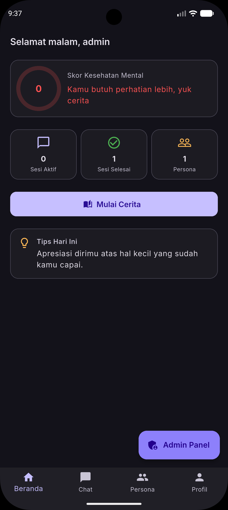
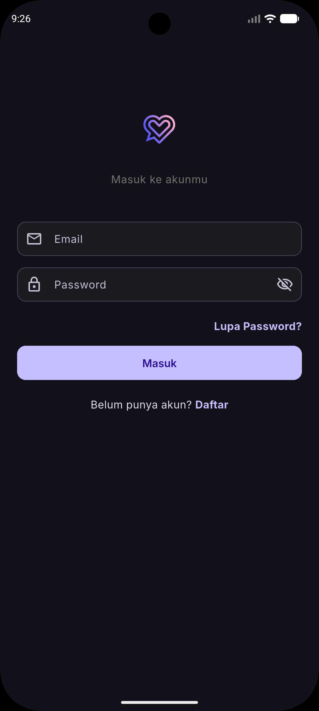
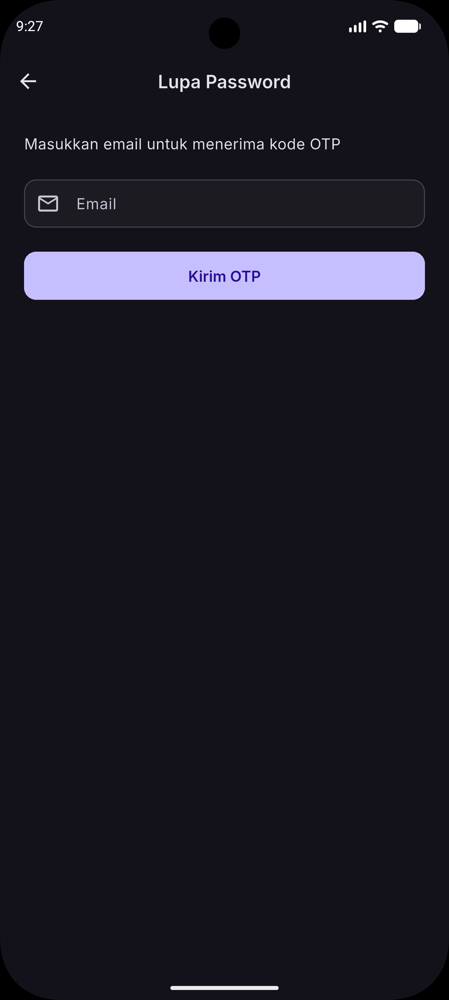
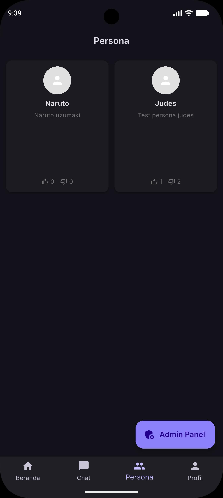
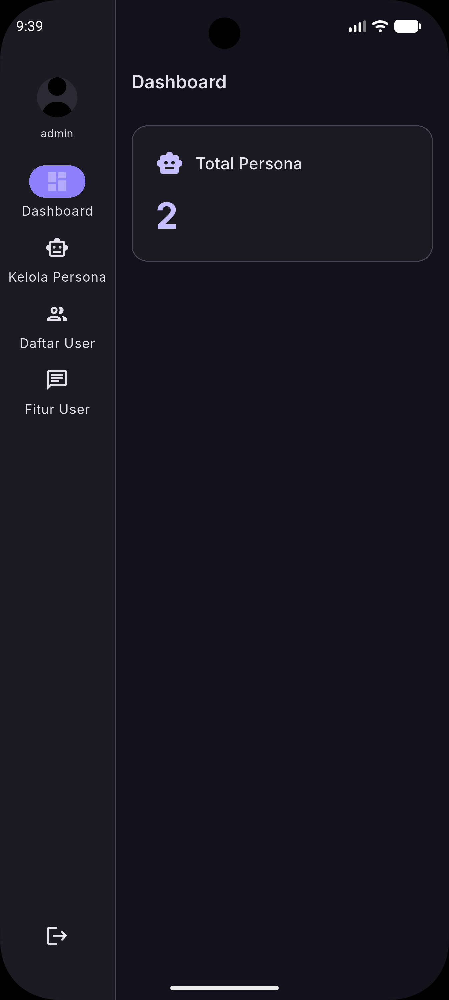

<p align="center">
  
</p>

<h1 align="center">SiniCerita</h1>

<p align="center">
  <strong>Platform Kesehatan Mental Berbasis Chatbot AI</strong>
</p>

<p align="center">
  
  
  
  
</p>

---

## 📖 Tentang

**SiniCerita** adalah aplikasi mobile untuk kesehatan mental yang memungkinkan pengguna bercerita dan curhat dengan persona AI. Setiap sesi percakapan dianalisis untuk mengukur perubahan emosional pengguna, dan skor kesehatan mental (Health Points) di-track secara berkelanjutan.

### ✨ Fitur Utama

- 🤖 **Chat dengan Persona AI** — Pilih persona dengan kepribadian berbeda untuk diajak ngobrol
- 📊 **Skor Kesehatan Mental** — Tracking poin kesehatan mental (0–100) berdasarkan analisis percakapan
- 🔐 **Autentikasi Lengkap** — Register, login, forgot password dengan OTP
- 👤 **Profil Pengguna** — Edit profil dan upload avatar
- ⭐ **Rating Persona** — Beri rating (upvote/downvote) pada persona favorit
- 📝 **Riwayat Sesi** — Lihat semua sesi aktif dan yang sudah selesai
- 🛡️ **Admin Panel** — Dashboard admin untuk kelola persona dan user

---

## 📱 Screenshots

<p align="center">
  
  &nbsp;&nbsp;
  
  &nbsp;&nbsp;
  
</p>

<p align="center">
  
  &nbsp;&nbsp;
  
</p>

---

## 🏗️ Arsitektur & Tech Stack

| Layer | Teknologi |
|-------|-----------|
| Framework | Flutter 3.x |
| State Management | Provider (ChangeNotifier) |
| HTTP Client | Dio + JWT Interceptor |
| Navigation | GoRouter |
| Token Storage | Flutter Secure Storage |
| Backend | Express 5 REST API |
| AI Engine | Google Gemini |
| Database | PostgreSQL + Prisma ORM |

### Struktur Project

```
lib/
├── core/
│   ├── api/          # Dio client, endpoints, response wrapper
│   ├── errors/       # Exception handling
│   ├── storage/      # Secure token storage
│   └── utils/        # Validators & helpers
├── models/           # Data models (User, Persona, Session, Message)
├── providers/        # Business logic (Auth, Persona, Session)
├── screens/          # UI pages (Auth, Home, Chat, Profile, Admin)
└── widgets/          # Reusable components
```

---

## 🚀 Getting Started

### Prerequisites

- Flutter SDK 3.x
- Dart SDK ^3.11.5
- Android Studio / VS Code
- Backend server running ([lihat dokumentasi backend](dokumentasi-backend/))

### Instalasi

1. **Clone repository**
   ```bash
   git clone https://github.com/your-username/sinicerita.git
   cd sinicerita
   ```

2. **Install dependencies**
   ```bash
   flutter pub get
   ```

3. **Jalankan backend server**
   
   Pastikan backend Express berjalan di port 5000. Lihat folder `dokumentasi-backend/` untuk setup.

4. **Run aplikasi**
   ```bash
   flutter run
   ```

### Konfigurasi Network

| Platform | Base URL |
|----------|----------|
| Android Emulator | `http://10.0.2.2:5000` |
| iOS Simulator | `http://localhost:5000` |
| Physical Device | `http://<IP-LAN>:5000` |

---

## 📦 Dependencies

| Package | Kegunaan |
|---------|----------|
| `dio` | HTTP client |
| `flutter_secure_storage` | Penyimpanan token terenkripsi |
| `provider` | State management |
| `go_router` | Routing & navigation |
| `cached_network_image` | Caching gambar |
| `shimmer` | Loading skeleton |
| `image_picker` | Upload avatar |
| `pin_code_fields` | Input OTP 6 digit |
| `intl` | Format tanggal |
| `equatable` | Value equality |

---

## 🔐 Fitur Keamanan

- JWT access token (15 menit) + refresh token (7 hari) dengan single-use rotation
- Token disimpan di encrypted storage (bukan SharedPreferences)
- Auto-refresh token saat expired
- Rate limiting pada endpoint autentikasi (10 req / 15 menit)
- Password minimum 8 karakter
- OTP 6 digit untuk reset password

---

## 🎨 Design

- **Theme**: Dark mode dengan aksen ungu/lavender
- **Font**: Inter (Variable)
- **Loading State**: Shimmer skeleton placeholder
- **Bahasa UI**: Bahasa Indonesia

---

## 👥 Role Pengguna

| Role | Akses |
|------|-------|
| **User** | Chat dengan persona, lihat riwayat, kelola profil |
| **Admin** | Semua fitur user + kelola persona, lihat daftar user, dashboard admin |

---

## 📄 Dokumentasi

- [`dokumentasi-backend/`](dokumentasi-backend/) — Dokumentasi lengkap backend API
- [`flutter-implementation.md`](flutter-implementation.md) — Panduan implementasi tahap per tahap

---

## 🤝 Contributing

1. Fork repository ini
2. Buat branch fitur (`git checkout -b feature/fitur-baru`)
3. Commit perubahan (`git commit -m 'Tambah fitur baru'`)
4. Push ke branch (`git push origin feature/fitur-baru`)
5. Buat Pull Request

---

## 📝 License

Project ini dibuat untuk keperluan edukasi dan pengembangan.

---

<p align="center">
  Dibuat dengan ❤️ menggunakan Flutter
</p>
