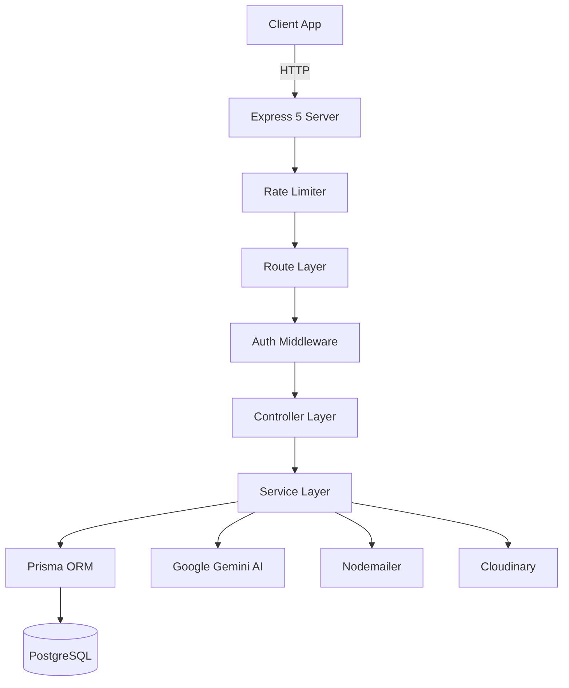
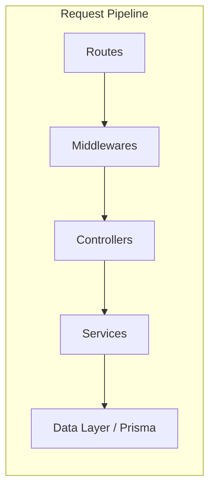
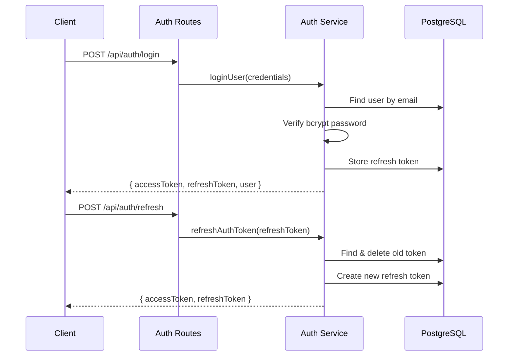
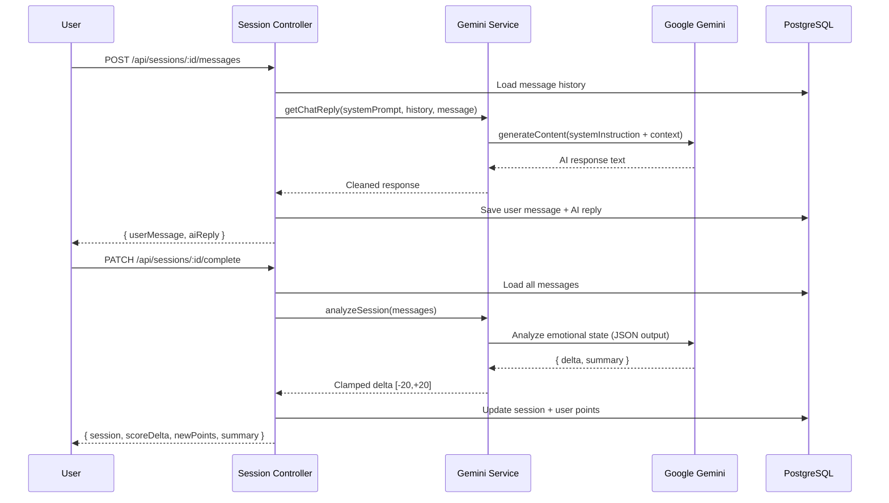

# Architecture

## System Overview



## Layered Architecture



### Layer Responsibilities

| Layer | Location | Responsibility |
|-------|----------|---------------|
| Routes | `src/routes/` | HTTP method binding, Swagger annotations, middleware chaining |
| Middlewares | `src/middlewares/` | Auth, role checks, rate limiting, file upload, error handling |
| Controllers | `src/controllers/` | Request parsing, Zod validation, response formatting |
| Services | `src/services/` | Business logic, DB operations, external API calls |
| Config | `src/config/` | Singleton clients (Prisma, Gemini, Email, Swagger) |
| Utils | `src/utils/` | JWT helpers, OTP generation, response formatters |
| Validators | `src/validators/` | Zod schemas for request validation |

## Design Patterns

- **Error-as-object**: Services throw `{ statusCode, message }` objects; the global error handler catches them
- **Soft delete**: Personas use `isActive` flag instead of hard delete
- **Token rotation**: Refresh tokens are single-use; each refresh issues a new pair
- **Transaction-heavy**: Critical operations (scoring, rating, token rotation) use `prisma.$transaction`
- **Pagination**: All list endpoints support `page`/`limit` with metadata response

## Authentication Flow



## AI Integration Flow



## Directory Structure

```
backend_sinicerita/
├── src/
│   ├── app.js                 # Entry point
│   ├── config/                # Singleton configs
│   │   ├── db.js              # Prisma client
│   │   ├── gemini.js          # Gemini AI client
│   │   ├── email.js           # Nodemailer transporter
│   │   └── swagger.js         # Swagger spec
│   ├── controllers/           # Request handlers
│   ├── middlewares/           # Auth, role, upload, errors
│   ├── routes/                # Express routers + Swagger docs
│   ├── services/              # Business logic
│   ├── utils/                 # JWT, OTP, response helpers
│   └── validators/            # Zod schemas
├── prisma/
│   ├── schema.prisma          # Database schema
│   └── migrations/            # Migration history
├── package.json
└── swagger_output.json        # Generated Swagger spec
```
