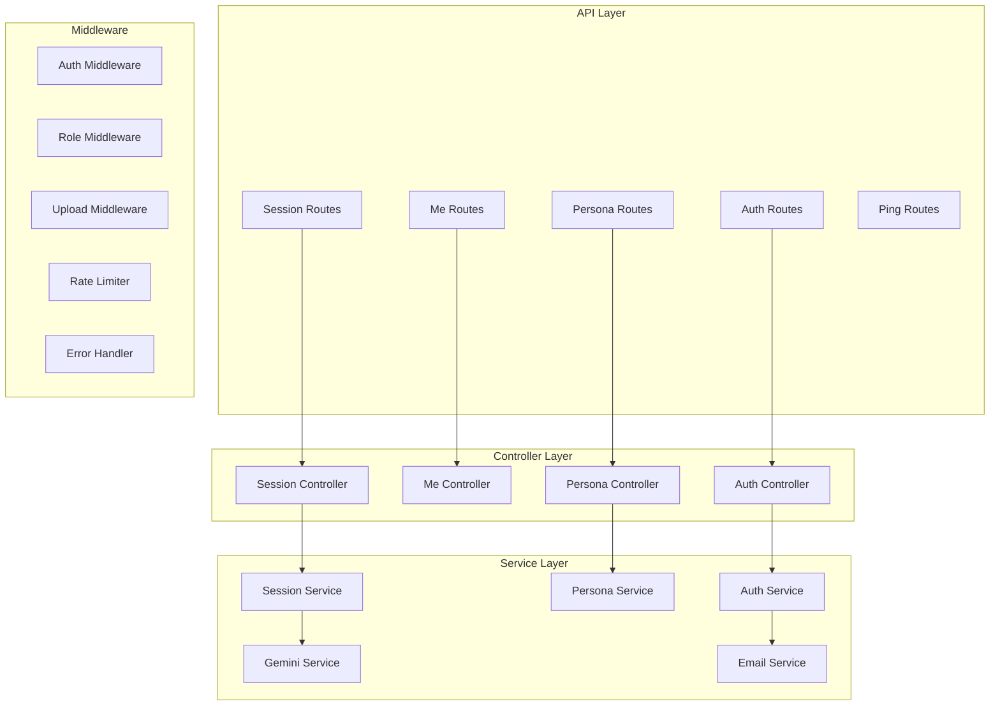

# Components

## Component Map

## Auth Component

**Purpose**: User registration, login, token management, password reset via OTP.

| File | Responsibility |
|------|---------------|
| `routes/auth.routes.js` | Route definitions + Swagger annotations |
| `controllers/auth.controller.js` | Zod validation, response formatting |
| `services/auth.service.js` | Bcrypt hashing, token generation, OTP flow |
| `validators/auth.schema.js` | Zod schemas (register, login, refresh, OTP, reset, changePassword, updateProfile) |

**Key behaviors**:
- Registration: bcrypt hash (12 rounds), default role=user, points=0
- Login: returns access token + refresh token pair
- Refresh: single-use rotation (old token deleted, new one created)
- Logout: deletes specific refresh token, validates ownership
- Forgot password: generates 6-digit OTP, sends via email, 10-min expiry
- Reset password: validates OTP, marks as used, updates password in transaction

## Session Component

**Purpose**: Chat session lifecycle — create, message, complete with AI analysis.

| File | Responsibility |
|------|---------------|
| `routes/session.routes.js` | Route definitions + Swagger annotations |
| `controllers/session.controller.js` | Validation, response formatting |
| `services/session.service.js` | Session CRUD, message handling, completion logic |

**Key behaviors**:
- Create: validates persona exists and is active (`POST /api/sessions`)
- Send message: loads history, calls Gemini, saves both messages atomically (`POST /api/sessions/:id/messages`)
- Complete: analyzes full conversation via Gemini, returns delta score, updates user points (clamped 0–100). **Method: `PATCH /api/sessions/:id/complete`**. Returns 409 if already completed.
- Delete: only active sessions can be deleted (completed sessions are protected with 400)
- List: supports pagination (`page`, `limit`) and status filter (`?status=active|completed`)

## Persona Component

**Purpose**: AI persona management (CRUD + rating system).

| File | Responsibility |
|------|---------------|
| `routes/persona.routes.js` | Route definitions + Swagger annotations |
| `controllers/persona.controller.js` | Validation, response formatting |
| `services/persona.service.js` | Persona CRUD, rating logic |

**Key behaviors**:
- Create/Update: admin-only operations (`POST /api/personas`, **`PATCH /api/personas/:id`** — both `multipart/form-data` for image upload)
- Delete: admin-only soft-delete (sets `isActive=false`)
- List: only returns active personas, paginated (`page`, `limit`)
- Rating (`POST /api/personas/:id/rate`): UP/DOWN/NONE per user per persona, aggregate counters maintained in transaction. `NONE` removes the user's rating row; the Prisma enum stores only `UP`/`DOWN`.

## Me (Profile) Component

**Purpose**: Authenticated user profile management.

| File | Responsibility |
|------|---------------|
| `routes/me.routes.js` | Route definitions |
| `controllers/me.controller.js` | Profile get/update/change-password |

**Key behaviors**:
- Get profile (`GET /api/me`): returns public user fields including `points` and `avatarUrl`
- Update profile (**`PATCH /api/me`**, `multipart/form-data`): name and/or avatar (via Cloudinary upload)
- Change password (**`PATCH /api/me/password`**): verifies old password before updating; returns 401 if old password is wrong

## Gemini AI Component

**Purpose**: AI response generation and session analysis.

| File | Responsibility |
|------|---------------|
| `config/gemini.js` | Client initialization, model config |
| `services/gemini.service.js` | Chat reply + session analysis |

**Key behaviors**:
- Chat: builds system instruction from persona prompt, includes conversation history as context
- Analysis: acts as AI psychologist, returns JSON `{ delta, summary }`, delta clamped to [-20, +20]
- Graceful fallback: returns neutral score (0) if analysis fails

## Email Component

**Purpose**: Transactional emails (OTP, welcome).

| File | Responsibility |
|------|---------------|
| `config/email.js` | Nodemailer transporter (Gmail SMTP) |
| `services/email.service.js` | OTP email + welcome email templates |

**Key behaviors**:
- OTP email: HTML + plaintext, styled template, 10-min expiry warning
- Welcome email: non-critical (failure doesn't throw)

## Middleware Components

| Middleware | File | Purpose |
|-----------|------|---------|
| Auth | `middlewares/auth.js` | JWT verification, sets `req.user` |
| Role | `middlewares/role.js` | Role-based access control (`requireRole("admin")`) |
| Upload | `middlewares/upload.js` | Multer + multer-storage-cloudinary single-file upload (field name `image`) |
| Rate Limiter | `middlewares/rate-limiter.js` | `authLimiter`: 10 requests / 15 min per IP on `/api/auth/*` (returns 429) |
| Error Handler | `middlewares/error-handler.js` | Global error catch, formats `{ statusCode, message }` throws into the response envelope |
