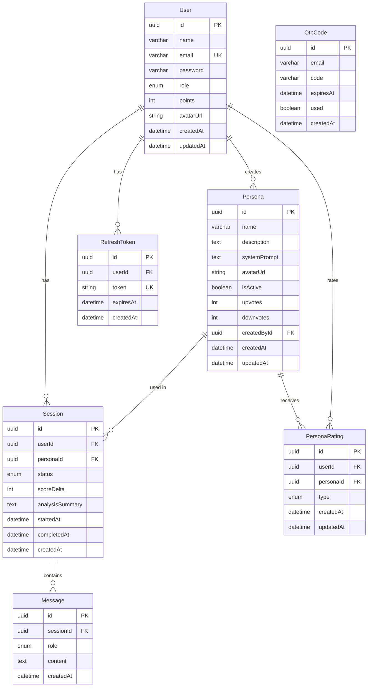

# Data Models

## Entity Relationship Diagram

## Enums

| Enum | Values (Prisma) | Usage |
|------|-----------------|-------|
| `Role` | `user`, `admin` | User access level |
| `SessionStatus` | `active`, `completed` | Session lifecycle state |
| `MessageRole` | `user`, `model` | Message sender type (Gemini SDK uses `model` for AI replies) |
| `RatingType` | `UP`, `DOWN` | Persona rating direction (stored values only) |

> **API note**: The `POST /api/personas/:id/rate` endpoint also accepts `NONE` as a `type` value, but `NONE` is **not** a Prisma enum value — the service interprets it as "remove this user's rating row".

## Model Details

### User
- Points range: 0–100 (clamped on update)
- Default avatar: Cloudinary-hosted generic profile image
- Cascade: deleting user cascades to sessions, refresh tokens, ratings

### Persona
- Soft-deleted via `isActive` flag
- `systemPrompt`: injected as Gemini system instruction
- `upvotes`/`downvotes`: denormalized counters updated in transaction
- Default avatar: Cloudinary-hosted psychologist image
- Unique constraint: one rating per user per persona (`@@unique([userId, personaId])`)

### Session
- Owned by a single user (enforced at service layer; 403 on mismatch)
- `scoreDelta`: set on completion, clamped to `[-20, +20]` by the analysis service
- `analysisSummary`: Gemini-generated emotional analysis text
- Completed sessions cannot be deleted (DELETE returns 400) and cannot be re-completed (PATCH `/complete` returns **409**)
- Cascade: deleting session cascades to messages

### Message
- Ordered by `createdAt ASC`
- AI replies created 1ms after user message (ensures ordering)
- No edit/delete capability

### RefreshToken
- Single-use: deleted on refresh or logout
- 7-day expiry
- Cascade: deleted when user is deleted

### OtpCode
- 6-digit numeric code
- 10-minute expiry
- `used` flag prevents reuse
- Not linked by FK to User (uses email match)

### PersonaRating
- Unique per user-persona pair (`@@unique([userId, personaId])`)
- `type` is `RatingType` (`UP` or `DOWN` only)
- API supports a `NONE` action that **deletes** the row instead of storing it
- Aggregate counters (`upvotes`, `downvotes`) on `Persona` are updated in the same transaction

## Database Configuration

- Provider: PostgreSQL
- ORM: Prisma 5.22
- Connection: `DATABASE_URL` (pooled), `DIRECT_URL` (direct)
- Table naming: snake_case via `@@map()`
- Column naming: snake_case via `@map()`
