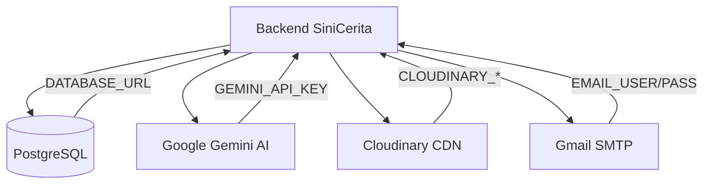

# Dependencies

## Production Dependencies

| Package | Version | Purpose |
|---------|---------|---------|
| `express` | ^5.2.1 | HTTP framework (v5 with async error support) |
| `@prisma/client` | ^5.22.0 | Database ORM client |
| `prisma` | ^5.22.0 | Prisma CLI for migrations |
| `@google/genai` | ^2.2.0 | Google Gemini AI SDK (primary, new API) |
| `@google/generative-ai` | ^0.24.1 | Google Generative AI SDK (legacy, may be unused) |
| `bcryptjs` | ^3.0.3 | Password hashing (12 salt rounds) |
| `jsonwebtoken` | ^9.0.3 | JWT access token generation/verification |
| `zod` | ^4.4.3 | Request body validation schemas |
| `cors` | ^2.8.6 | Cross-origin resource sharing |
| `dotenv` | ^17.4.2 | Environment variable loading |
| `multer` | ^2.1.1 | Multipart file upload handling |
| `multer-storage-cloudinary` | ^4.0.0 | Cloudinary storage engine for Multer |
| `cloudinary` | ^1.41.3 | Image hosting service SDK |
| `nodemailer` | ^8.0.7 | Email sending (Gmail SMTP) |
| `express-rate-limit` | ^8.5.1 | API rate limiting |
| `swagger-jsdoc` | ^6.2.8 | Swagger spec generation from JSDoc |
| `swagger-ui-express` | ^5.0.1 | Swagger UI serving |
| `axios` | ^1.16.1 | HTTP client (used in test scripts) |

## Dev Dependencies

| Package | Version | Purpose |
|---------|---------|---------|
| `nodemon` | ^3.1.14 | Auto-restart on file changes |

## External Services

## Environment Variables

| Variable | Required | Purpose |
|----------|----------|---------|
| `PORT` | No (default: 3000) | Server port |
| `DATABASE_URL` | Yes | PostgreSQL connection (pooled) |
| `DIRECT_URL` | Yes | PostgreSQL direct connection |
| `JWT_SECRET` | Yes | Access token signing key |
| `JWT_EXPIRES_IN` | No | Access token TTL |
| `GEMINI_API_KEY` | Yes | Google Gemini API key |
| `GEMINI_MODEL` | No (default: gemini-2.5-flash) | Gemini model name |
| `EMAIL_USER` | Yes | Gmail SMTP username |
| `EMAIL_PASS` | Yes | Gmail app password |
| `EMAIL_FROM` | No | Sender address override |
| `CLOUDINARY_CLOUD_NAME` | Yes | Cloudinary cloud name |
| `CLOUDINARY_API_KEY` | Yes | Cloudinary API key |
| `CLOUDINARY_API_SECRET` | Yes | Cloudinary API secret |

## Dependency Notes

- **Dual Gemini SDKs**: Both `@google/genai` and `@google/generative-ai` are installed. The codebase uses `@google/genai` (newer SDK). The legacy package may be removable.
- **Express 5**: Uses the latest Express with native async error handling support.
- **Zod 4**: Latest major version with improved TypeScript inference.
- **No test framework**: `package.json` test script is a placeholder. Test files at root use raw `axios` calls.
- **Rate limiting**: `authLimiter` (`src/middlewares/rate-limiter.js`) is applied to `/api/auth/*` only — **10 requests per 15 minutes per IP**, returns 429 on excess. No global limiter is configured.
- **CORS**: `cors()` is registered with default options (allows all origins). Production deployments should configure an allowlist.
