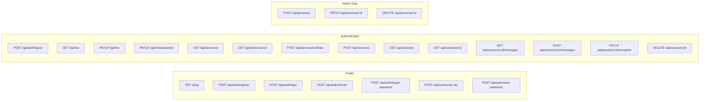

# Interfaces & APIs

> Source of truth: live Swagger/OpenAPI spec at `GET /api/docs` (UI) and `GET /api/docs.json` (raw JSON). Server base URL in dev: `http://localhost:3000/api`.

## API Route Map



## System Endpoints

| Method | Path | Auth | Description |
|--------|------|------|-------------|
| GET | `/ping` | No | Health check (returns `{ success: true, message: "pong" }`) |

> Note: `/ping` is mounted at the **root**, not under `/api` (see `src/app.js`).

## Auth Endpoints (`/api/auth`)

All `/api/auth/*` requests pass through `authLimiter` (express-rate-limit: **10 requests per 15 minutes per IP**, 429 on excess).

| Method | Path | Auth | Description |
|--------|------|------|-------------|
| POST | `/api/auth/register` | No | Create new user account (`name`, `email`, `password`) |
| POST | `/api/auth/login` | No | Login, returns `{ accessToken, refreshToken, user }` |
| POST | `/api/auth/refresh` | No | Rotate refresh token; returns `{ accessToken, refreshToken }` |
| POST | `/api/auth/logout` | Yes | Revoke a specific refresh token (body: `refreshToken`) |
| POST | `/api/auth/forgot-password` | No | Send 6-digit OTP to email (10-min expiry) |
| POST | `/api/auth/verify-otp` | No | Validate OTP code (`email`, `code`) |
| POST | `/api/auth/reset-password` | No | Reset password using OTP (`email`, `code`, `newPassword`) |

### Auth Status Codes

| Endpoint | Status | Meaning |
|----------|--------|---------|
| register | 201 / 400 / 409 | Created / validation error / email exists |
| login | 200 / 400 / 401 / 429 | OK / validation / wrong creds / rate limited |
| refresh | 200 / 400 / 401 | OK / validation / invalid or expired token |
| logout | 200 / 400 / 401 / 403 | OK / no token / invalid auth / token not owned by user |
| forgot-password | 200 / 400 / 404 | OK / validation / email not found |
| verify-otp | 200 / 400 | OK / OTP invalid, expired, or used |
| reset-password | 200 / 400 | OK / validation, OTP invalid/expired/used |

## Profile Endpoints (`/api/me`)

| Method | Path | Auth | Body | Description |
|--------|------|------|------|-------------|
| GET | `/api/me` | Yes | — | Get current user profile (`id`, `name`, `email`, `role`, `points`, `avatarUrl`, `createdAt`) |
| PATCH | `/api/me` | Yes | `multipart/form-data` (`name?`, `image?`) | Update name and/or upload avatar (Cloudinary) |
| PATCH | `/api/me/password` | Yes | JSON (`oldPassword`, `newPassword` min 8) | Change password (verifies old first) |

> ⚠️ Implementation note: `PATCH /api/me/password` returns **401** (not 400) when `oldPassword` is wrong, even though the Swagger doc shows 400. The Swagger doc reflects validation errors; the controller distinguishes wrong-old-password as 401.

## Persona Endpoints (`/api/personas`)

| Method | Path | Auth | Role | Description |
|--------|------|------|------|-------------|
| GET | `/api/personas` | Yes | any | List active personas (`?page=1&limit=10`) |
| GET | `/api/personas/:id` | Yes | any | Get persona detail (incl. `systemPrompt`, `upvotes`, `downvotes`) |
| POST | `/api/personas` | Yes | admin | Create persona — `multipart/form-data` (`name`, `description`, `systemPrompt`, `image?`) |
| PATCH | `/api/personas/:id` | Yes | admin | Update persona — `multipart/form-data` (any of `name`, `description`, `systemPrompt`, `image`, `isActive`) |
| DELETE | `/api/personas/:id` | Yes | admin | Soft-delete persona (sets `isActive = false`) |
| POST | `/api/personas/:id/rate` | Yes | any | Rate persona — JSON `{ type: "UP" \| "DOWN" \| "NONE" }` |

### Rating Type Semantics
- `UP` — record upvote (replaces existing rating, increments `upvotes`)
- `DOWN` — record downvote (replaces existing rating, increments `downvotes`)
- `NONE` — remove the user's rating (decrements the previously stored counter)

> The Prisma enum `RatingType` only has `UP`/`DOWN`. `NONE` is an API-level signal that triggers a delete of the `PersonaRating` row. Counter aggregates on `Persona` are updated atomically inside `prisma.$transaction`.

## Session Endpoints (`/api/sessions`)

| Method | Path | Auth | Description |
|--------|------|------|-------------|
| POST | `/api/sessions` | Yes | Create new session — JSON `{ personaId }` |
| GET | `/api/sessions` | Yes | List user's sessions (`?status=active\|completed`, `?page=1&limit=10`) |
| GET | `/api/sessions/:id` | Yes | Get session detail (includes embedded `persona` + `scoreDelta`, `analysisSummary`) |
| GET | `/api/sessions/:id/messages` | Yes | List messages in session (`?page=1&limit=50`, ordered ascending by `createdAt`) |
| POST | `/api/sessions/:id/messages` | Yes | Send message — JSON `{ content }`; returns `{ userMessage, aiReply }` |
| PATCH | `/api/sessions/:id/complete` | Yes | Complete session and run Gemini analysis; returns `{ session, scoreDelta, newPoints, summary }` |
| DELETE | `/api/sessions/:id` | Yes | Delete an **active** session (cascades to messages) |

### Session Status Codes

| Endpoint | Status | Meaning |
|----------|--------|---------|
| POST `/sessions` | 201 / 400 / 401 / 404 | Created / persona inactive / no auth / persona not found |
| POST `/sessions/:id/messages` | 200 / 400 / 401 / 403 / 404 | OK / session completed or empty content / no auth / not owner / not found |
| PATCH `/sessions/:id/complete` | 200 / 400 / 401 / 403 / 404 / **409** | OK / not enough messages / no auth / not owner / not found / **already completed** |
| DELETE `/sessions/:id` | 200 / **400** / 401 / 403 / 404 | OK / **session already completed (cannot delete)** / no auth / not owner / not found |

### Message Roles
- `user` — message sent by the human user
- `model` — reply generated by Gemini AI

> The Prisma `MessageRole` enum is exactly `user` / `model` (not `assistant`).

## Response Format

All endpoints use a consistent response envelope (`src/utils/response.js`):

```json
// Success
{
  "success": true,
  "message": "Description in Bahasa Indonesia",
  "data": { ... }
}

// Error
{
  "success": false,
  "message": "Error description in Bahasa Indonesia"
}
```

## Pagination Response

List endpoints (`/personas`, `/sessions`, `/sessions/:id/messages`) return pagination metadata:

```json
{
  "success": true,
  "message": "...",
  "data": [ ... ],
  "meta": {
    "total": 50,
    "page": 1,
    "limit": 10,
    "totalPages": 5
  }
}
```

| Endpoint | Default `limit` |
|----------|-----------------|
| GET `/api/personas` | 10 |
| GET `/api/sessions` | 10 |
| GET `/api/sessions/:id/messages` | 50 |

## Authentication

Bearer JWT in `Authorization: Bearer <accessToken>` header (HTTP scheme `bearerAuth` in OpenAPI). Access tokens are short-lived (~15 min). Refresh tokens are single-use, 7-day TTL, rotated on every `/auth/refresh`.

## External Integrations

| Service | Purpose | Config |
|---------|---------|--------|
| Google Gemini | AI chat + session emotional analysis | `GEMINI_API_KEY`, `GEMINI_MODEL` |
| PostgreSQL | Primary database | `DATABASE_URL`, `DIRECT_URL` |
| Cloudinary | Avatar image storage | `CLOUDINARY_CLOUD_NAME`, `CLOUDINARY_API_KEY`, `CLOUDINARY_API_SECRET` |
| Gmail SMTP | OTP + welcome emails | `EMAIL_USER`, `EMAIL_PASS`, `EMAIL_FROM` |

## Swagger Documentation

- Raw OpenAPI 3.0 JSON: `GET /api/docs.json`
- Swagger UI: `GET /api/docs`
- Spec is generated by `swagger-jsdoc` from JSDoc comments on route files (`src/routes/*.js`).
