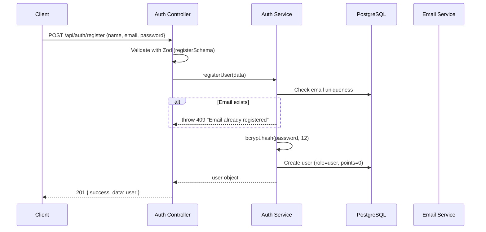
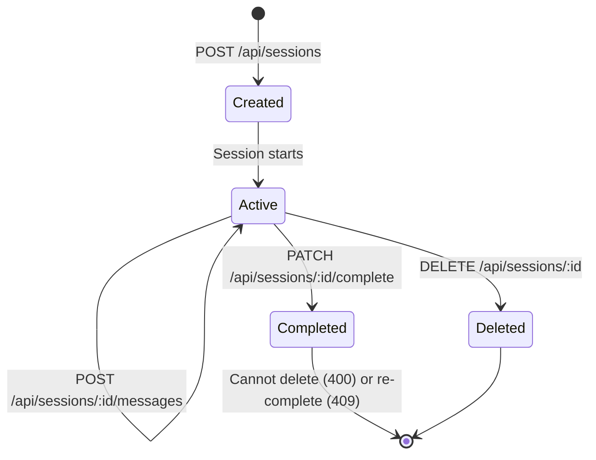
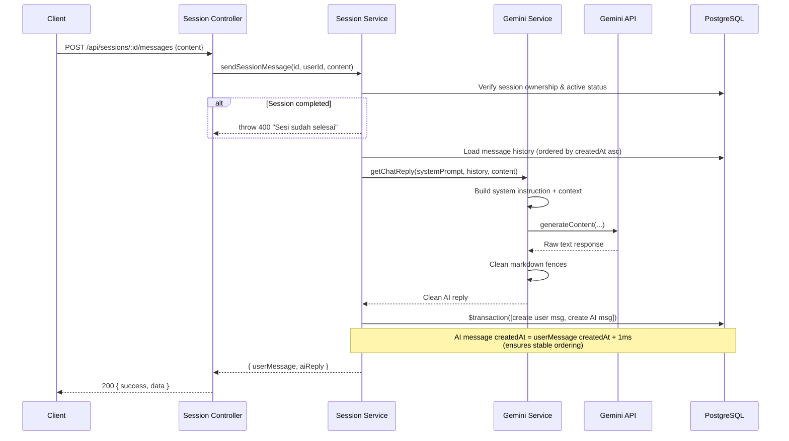
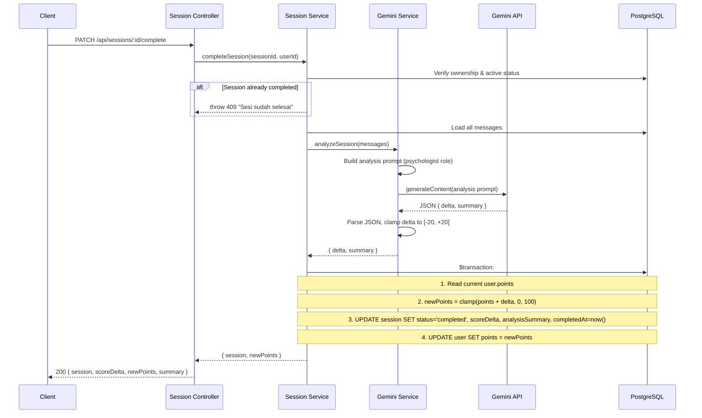
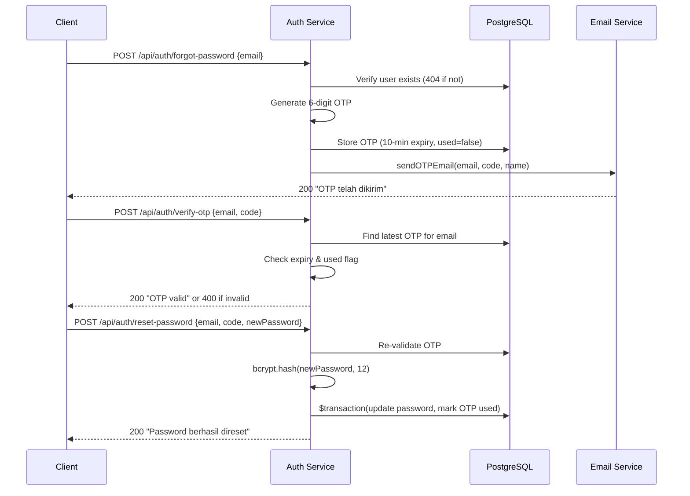
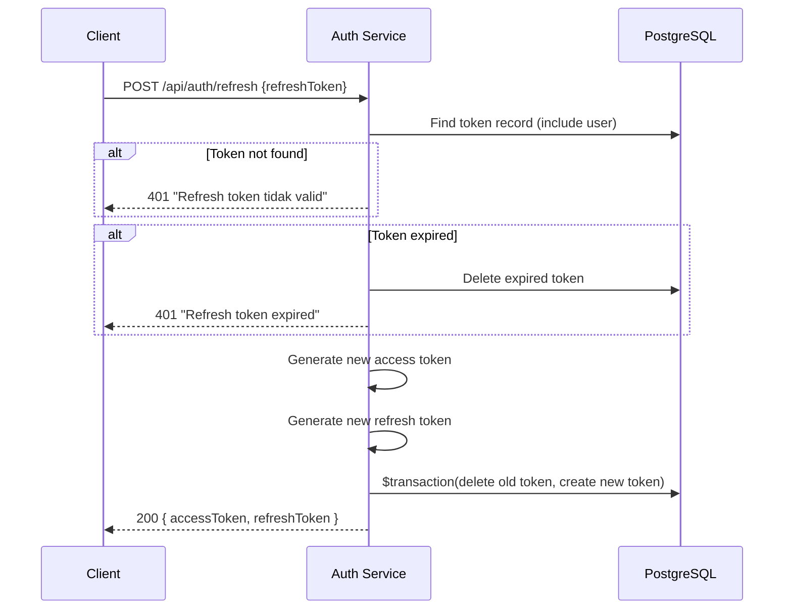
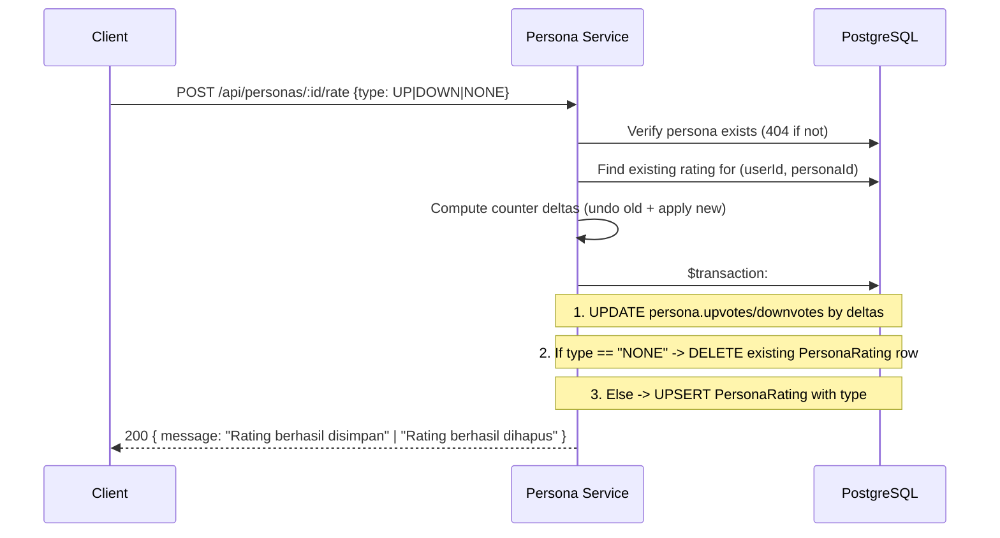
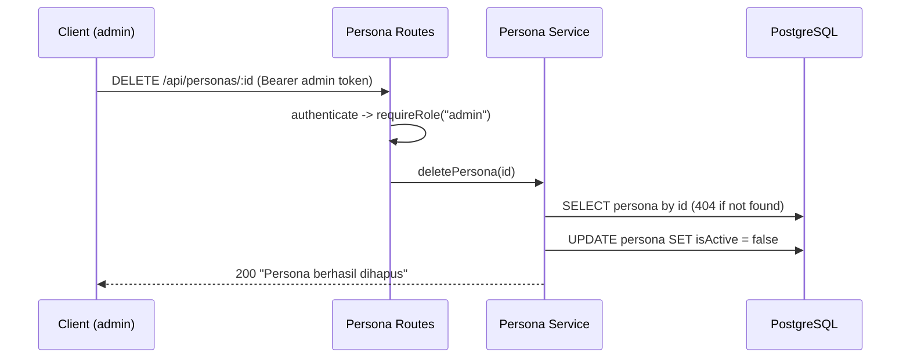

# Workflows

> All HTTP methods below match the live Swagger spec at `/api/docs`.

## User Registration Flow

## Chat Session Lifecycle

## Send Message Workflow

## Session Completion & Scoring

## Password Reset (OTP) Flow

## Token Refresh Flow

## Persona Rating Flow

## Persona Soft-Delete Flow

> Existing sessions referencing a soft-deleted persona remain accessible, but `GET /api/personas` only returns rows where `isActive = true`.
